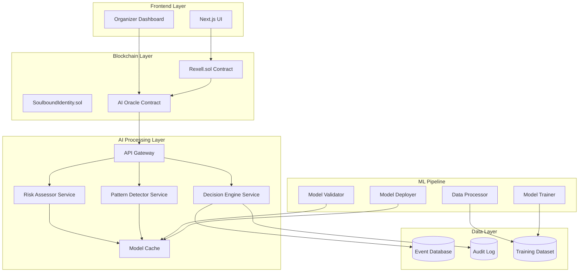

# Design Document: AI-Powered Anti-Scalping Module

## Overview

The AI-powered anti-scalping module enhances the Rexell blockchain ticketing system by integrating machine learning capabilities for real-time fraud detection and automated decision-making. The system operates as a hybrid architecture where AI components provide intelligent recommendations while blockchain smart contracts maintain final enforcement authority.

The design leverages behavioral pattern analysis, real-time risk assessment, and adaptive enforcement mechanisms to identify and prevent scalping activities. Key innovations include sub-200ms inference times through optimized model deployment, seamless integration with existing smart contracts via oracle patterns, and continuous learning capabilities that improve detection accuracy over time.

Research indicates that modern ML fraud detection systems achieve 60-95% fraud reduction rates when combining behavioral intelligence with real-time analysis. The system architecture follows proven patterns for blockchain-ML integration, using oracle services to bridge off-chain AI computations with on-chain enforcement.

## Architecture

### High-Level Architecture



### Integration Points

**Smart Contract Integration:**
- **Oracle Pattern**: AI services communicate with smart contracts through a dedicated oracle contract that handles request/response cycles
- **Fallback Mechanisms**: Smart contracts maintain fallback logic when AI services are unavailable
- **Gas Optimization**: AI recommendations are batched and cached to minimize on-chain operations

**Real-time Processing:**
- **Edge Deployment**: ML models deployed on edge infrastructure for sub-200ms response times
- **Model Caching**: Frequently used models cached in memory with automatic refresh cycles
- **Horizontal Scaling**: Auto-scaling infrastructure handles up to 1000 concurrent requests

## Components and Interfaces

### Risk Assessor Service

**Purpose**: Evaluates purchase requests in real-time and assigns confidence scores

**Interface**:
```typescript
interface RiskAssessment {
  walletAddress: string;
  eventId: string;
  purchaseAmount: number;
  timestamp: number;
}

interface RiskResult {
  confidenceScore: number; // 0.0 to 1.0
  riskFactors: string[];
  reasoning: string;
  processingTime: number;
}

class RiskAssessor {
  async assessPurchase(request: RiskAssessment): Promise<RiskResult>
  async batchAssess(requests: RiskAssessment[]): Promise<RiskResult[]>
}
```

**Key Features**:
- Behavioral analysis using wallet transaction history
- Timing pattern detection for coordinated purchases
- Price behavior analysis for systematic exploitation
- Real-time feature extraction and model inference

### Pattern Detector Service

**Purpose**: Identifies bot activity and scalping patterns using advanced ML techniques

**Interface**:
```typescript
interface BehaviorPattern {
  patternType: 'RAPID_SEQUENTIAL' | 'COORDINATED_BURST' | 'PRICE_EXPLOITATION' | 'RESALE_PATTERN';
  confidence: number;
  evidence: PatternEvidence[];
  affectedWallets: string[];
}

interface PatternEvidence {
  type: string;
  description: string;
  severity: 'LOW' | 'MEDIUM' | 'HIGH';
  timestamp: number;
}

class PatternDetector {
  async detectPatterns(eventId: string, timeWindow: number): Promise<BehaviorPattern[]>
  async analyzeWalletBehavior(walletAddress: string): Promise<BehaviorPattern[]>
  async updateDetectionRules(feedback: PatternFeedback[]): Promise<void>
}
```

**Detection Algorithms**:
- **Graph Analysis**: Identifies connected wallet networks through transaction patterns
- **Time Series Analysis**: Detects coordinated timing patterns in purchase behaviors
- **Anomaly Detection**: Uses unsupervised learning to identify unusual behavioral patterns
- **Sequential Pattern Mining**: Discovers frequent patterns in purchase-resale sequences

### Decision Engine Service

**Purpose**: Processes AI recommendations and makes automated decisions

**Interface**:
```typescript
interface DecisionRequest {
  requestType: 'PURCHASE' | 'RESALE';
  walletAddress: string;
  eventId: string;
  riskAssessment: RiskResult;
  patterns: BehaviorPattern[];
  contextData: ContextData;
}

interface DecisionResult {
  decision: 'APPROVE' | 'REJECT' | 'MANUAL_REVIEW';
  confidence: number;
  reasoning: string;
  recommendedActions: string[];
  auditTrail: AuditEntry;
}

class DecisionEngine {
  async makeDecision(request: DecisionRequest): Promise<DecisionResult>
  async processManualOverride(decisionId: string, override: ManualOverride): Promise<void>
  async getDecisionHistory(walletAddress: string): Promise<DecisionResult[]>
}
```

**Decision Logic**:
- **Threshold-based Rules**: Automatic approval/rejection based on confidence scores
- **Multi-factor Analysis**: Combines risk assessment, pattern detection, and contextual data
- **Adaptive Thresholds**: Dynamic adjustment based on event characteristics and historical performance
- **Explainable Decisions**: Provides clear reasoning for all automated decisions

### AI Oracle Contract

**Purpose**: Bridges off-chain AI services with on-chain smart contract enforcement

**Interface**:
```solidity
contract AIOracle {
    struct AIRequest {
        bytes32 requestId;
        address requester;
        uint256 eventId;
        bytes requestData;
        uint256 timestamp;
    }
    
    struct AIResponse {
        bytes32 requestId;
        bool approved;
        uint256 confidence;
        string reasoning;
        uint256 timestamp;
    }
    
    function requestRiskAssessment(
        uint256 eventId,
        bytes calldata purchaseData
    ) external returns (bytes32 requestId);
    
    function fulfillRequest(
        bytes32 requestId,
        AIResponse calldata response
    ) external onlyAuthorizedOracle;
    
    function getRequestStatus(bytes32 requestId) 
        external view returns (AIResponse memory);
}
```

**Oracle Features**:
- **Request Queuing**: Handles multiple concurrent requests with priority ordering
- **Response Validation**: Cryptographic verification of AI service responses
- **Fallback Logic**: Automatic fallback to rule-based decisions when AI is unavailable
- **Gas Optimization**: Batched responses and efficient data structures

## Data Models

### Core Data Structures

**Purchase Event Model**:
```typescript
interface PurchaseEvent {
  id: string;
  walletAddress: string;
  eventId: string;
  ticketQuantity: number;
  pricePerTicket: number;
  totalAmount: number;
  timestamp: number;
  transactionHash: string;
  riskScore: number;
  aiDecision: string;
  blockNumber: number;
}
```

**Behavioral Profile Model**:
```typescript
interface BehavioralProfile {
  walletAddress: string;
  totalPurchases: number;
  totalResales: number;
  averageHoldTime: number;
  averageMarkup: number;
  suspiciousPatterns: string[];
  riskLevel: 'LOW' | 'MEDIUM' | 'HIGH';
  lastUpdated: number;
  features: FeatureVector;
}

interface FeatureVector {
  purchaseFrequency: number;
  averageTransactionValue: number;
  timePatternScore: number;
  networkConnectivity: number;
  priceExploitationScore: number;
  // Additional ML features
}
```

**Event Risk Profile Model**:
```typescript
interface EventRiskProfile {
  eventId: string;
  expectedDemand: 'LOW' | 'MEDIUM' | 'HIGH' | 'EXTREME';
  scalingRisk: number;
  recommendedPriceCeiling: number;
  recommendedTimeWindow: number;
  adaptiveParameters: AdaptiveParameters;
  historicalData: EventHistoricalData;
}

interface AdaptiveParameters {
  maxPurchaseQuantity: number;
  cooldownPeriod: number;
  riskThresholds: RiskThresholds;
  enforcementLevel: 'LENIENT' | 'STANDARD' | 'STRICT';
}
```

### Training Data Schema

**Feature Engineering Pipeline**:
```typescript
interface TrainingExample {
  features: {
    // Temporal features
    purchaseTime: number;
    dayOfWeek: number;
    hourOfDay: number;
    timeSinceEventAnnouncement: number;
    
    // Behavioral features
    walletAge: number;
    transactionHistory: number;
    averageGasPrice: number;
    purchasePattern: number[];
    
    // Network features
    connectedWallets: number;
    sharedTransactions: number;
    clusterCoefficient: number;
    
    // Event features
    eventPopularity: number;
    ticketPrice: number;
    venueCapacity: number;
    artistPopularity: number;
  };
  
  label: 'LEGITIMATE' | 'SCALPER' | 'BOT';
  confidence: number;
  source: 'MANUAL_LABEL' | 'ORGANIZER_FEEDBACK' | 'OUTCOME_BASED';
}
```

### Audit and Compliance Models

**Audit Trail Model**:
```typescript
interface AuditEntry {
  id: string;
  timestamp: number;
  eventType: 'RISK_ASSESSMENT' | 'PATTERN_DETECTION' | 'DECISION_MADE' | 'MANUAL_OVERRIDE';
  walletAddress: string;
  eventId: string;
  inputData: any;
  aiOutput: any;
  finalDecision: string;
  reasoning: string;
  modelVersion: string;
  processingTime: number;
  hashProof: string; // For immutability verification
}
```

## Correctness Properties

*A property is a characteristic or behavior that should hold true across all valid executions of a system—essentially, a formal statement about what the system should do. Properties serve as the bridge between human-readable specifications and machine-verifiable correctness guarantees.*

Before defining the correctness properties, I need to analyze the acceptance criteria from the requirements to determine which ones are testable as properties.

Based on the prework analysis, I'll now define the consolidated correctness properties:

### Property 1: Real-time Performance Guarantee
*For any* purchase request or batch of up to 1000 concurrent requests, the Risk_Assessor should complete evaluation within 200 milliseconds while maintaining accuracy
**Validates: Requirements 1.1, 1.4, 9.1**

### Property 2: Risk Score Validity
*For any* risk assessment output, the confidence score should be between 0.0 and 1.0 inclusive, and include non-empty risk factors and reasoning
**Validates: Requirements 1.2, 1.3**

### Property 3: Fallback Behavior Consistency
*For any* system timeout or failure condition, the system should default to allowing the purchase with complete audit logging
**Validates: Requirements 1.5, 8.3**

### Property 4: Pattern Detection Completeness
*For any* known scalping pattern (rapid sequential purchases, coordinated bursts, price exploitation, or resale patterns), the Pattern_Detector should identify and flag the pattern with appropriate confidence
**Validates: Requirements 2.1, 2.2, 2.3, 2.4**

### Property 5: Decision Threshold Consistency
*For any* resale request with confidence score, the Decision_Engine should approve if score > 0.8, reject if score < 0.3, and flag for manual review if 0.3 ≤ score ≤ 0.8, always providing clear reasoning
**Validates: Requirements 3.1, 3.2, 3.3, 3.4, 3.5**

### Property 6: Adaptive Recommendation Appropriateness
*For any* event with defined characteristics, the AI_Module should provide recommendations that match the event's risk profile (stricter for high-risk, relaxed for low-demand)
**Validates: Requirements 4.1, 4.2, 4.3**

### Property 7: Override Traceability
*For any* manual override by an organizer, the system should capture the override decision with complete reasoning and maintain it in the audit trail
**Validates: Requirements 4.5, 6.4**

### Property 8: Comprehensive Audit Trail
*For any* AI decision made, the Audit_Logger should record a complete, immutable entry containing timestamp, reasoning, input features, confidence scores, and decision outcome
**Validates: Requirements 5.1, 5.2, 5.3**

### Property 9: Audit Data Retrieval Completeness
*For any* wallet address or event ID, the audit system should return all relevant decision history while properly anonymizing personal data when privacy is required
**Validates: Requirements 5.4, 5.5**

### Property 10: Dashboard Data Completeness
*For any* event analytics request, the Organizer_Dashboard should display scalping risk scores, detected patterns, detailed reasoning for flagged transactions, and comprehensive performance reports
**Validates: Requirements 6.2, 6.3, 6.5**

### Property 11: Learning Pipeline Feedback Integration
*For any* organizer feedback provided, the Learning_Pipeline should incorporate it to improve future decision accuracy while maintaining backward compatibility
**Validates: Requirements 7.2, 7.5**

### Property 12: Model Validation and Deployment
*For any* new model trained, the Learning_Pipeline should validate performance before deployment and automatically trigger retraining when performance degrades
**Validates: Requirements 7.3, 7.4**

### Property 13: Smart Contract Integration Preservation
*For any* AI integration with existing contracts, the system should provide functionality without modifying contract interfaces and properly enforce AI recommendations through existing mechanisms
**Validates: Requirements 8.1, 8.2, 8.4, 8.5**

### Property 14: Performance Scaling and Optimization
*For any* increased system load, the AI_Module should scale horizontally, optimize resource usage, implement caching for latency mitigation, and gracefully degrade to simpler heuristics when resources are exhausted
**Validates: Requirements 9.2, 9.3, 9.4, 9.5**

### Property 15: Data Privacy and Security Compliance
*For any* data collection, storage, or transmission, the AI_Module should anonymize PII, encrypt sensitive data at rest, use secure protocols, automatically purge expired records, and provide compliance capabilities for data export and deletion
**Validates: Requirements 10.1, 10.2, 10.3, 10.4, 10.5**

## Error Handling

### AI Service Failures

**Timeout Handling**:
- Risk assessment requests that exceed 200ms timeout automatically default to approval with logging
- Pattern detection failures fall back to rule-based heuristics
- Decision engine failures default to manual review queue

**Model Loading Failures**:
- Primary model failures trigger automatic fallback to cached backup models
- Complete model unavailability activates simplified rule-based decision logic
- Model corruption detection triggers automatic redeployment from validated backups

**Data Pipeline Failures**:
- Training data corruption triggers automatic data validation and cleanup
- Feature extraction failures use cached feature vectors with staleness warnings
- Audit logging failures trigger immediate alerts and backup logging mechanisms

### Blockchain Integration Errors

**Oracle Communication Failures**:
- Failed oracle requests automatically retry with exponential backoff
- Persistent oracle failures activate direct smart contract fallback logic
- Oracle response validation failures trigger manual verification workflows

**Smart Contract Interaction Errors**:
- Gas estimation failures use conservative gas limits with automatic adjustment
- Transaction failures trigger automatic retry with updated parameters
- Contract upgrade failures maintain backward compatibility through versioned interfaces

### Performance Degradation Handling

**Resource Exhaustion**:
- Memory pressure triggers automatic model unloading and garbage collection
- CPU overload activates request queuing and load balancing
- Storage exhaustion triggers automatic data archival and cleanup

**Network Issues**:
- High latency activates local caching and prediction mechanisms
- Network partitions trigger offline mode with eventual consistency
- Bandwidth limitations activate data compression and batching

## Testing Strategy

### Dual Testing Approach

The testing strategy employs both unit testing and property-based testing as complementary approaches:

**Unit Tests**: Focus on specific examples, edge cases, and integration points between components. Unit tests validate concrete scenarios and ensure proper error handling for known failure modes.

**Property Tests**: Verify universal properties across all inputs through randomized testing. Property tests ensure correctness guarantees hold for the entire input space, not just specific examples.

Together, these approaches provide comprehensive coverage where unit tests catch concrete bugs and property tests verify general correctness.

### Property-Based Testing Configuration

**Framework Selection**: Use Hypothesis (Python) for ML components and fast-check (TypeScript) for frontend/API components

**Test Configuration**:
- Minimum 100 iterations per property test to ensure statistical significance
- Each property test references its corresponding design document property
- Tag format: **Feature: ai-anti-scalping, Property {number}: {property_text}**

**Property Test Implementation**:
- Each correctness property must be implemented by exactly one property-based test
- Property tests generate randomized inputs within valid domains
- Tests verify properties hold across all generated inputs
- Failed tests provide counterexamples for debugging

### Unit Testing Focus Areas

**Specific Examples**:
- Known scalping patterns and their detection
- Boundary conditions for confidence score thresholds
- Integration scenarios between AI services and smart contracts

**Edge Cases**:
- Empty or malformed input data handling
- Extreme load conditions and resource constraints
- Network failures and timeout scenarios

**Error Conditions**:
- Invalid wallet addresses and event IDs
- Corrupted model files and training data
- Blockchain network congestion and failures

### Integration Testing

**End-to-End Workflows**:
- Complete purchase evaluation from request to blockchain enforcement
- Organizer dashboard interactions with AI recommendations
- Model training pipeline from data collection to deployment

**Performance Testing**:
- Load testing with 1000+ concurrent requests
- Latency measurement under various network conditions
- Resource usage monitoring during peak operations

**Security Testing**:
- Data privacy verification for PII anonymization
- Encryption validation for data at rest and in transit
- Access control testing for organizer dashboard and admin functions