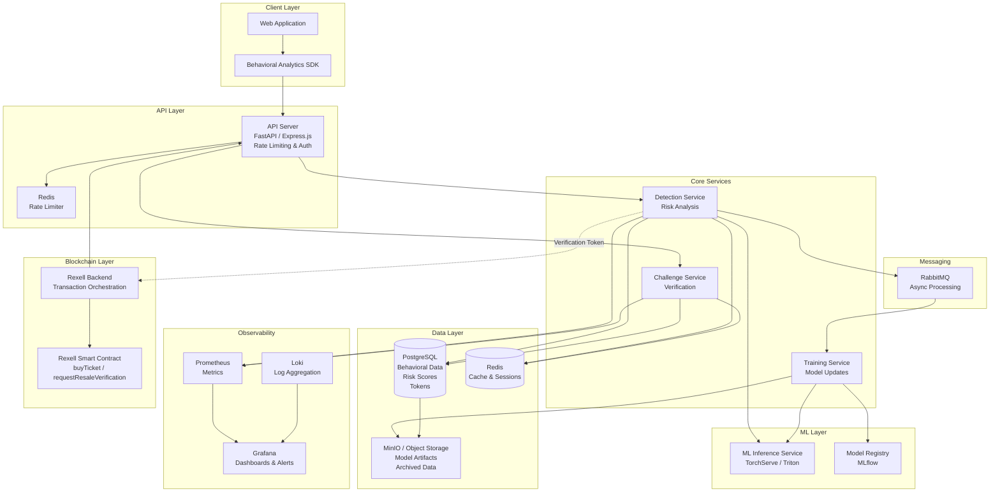
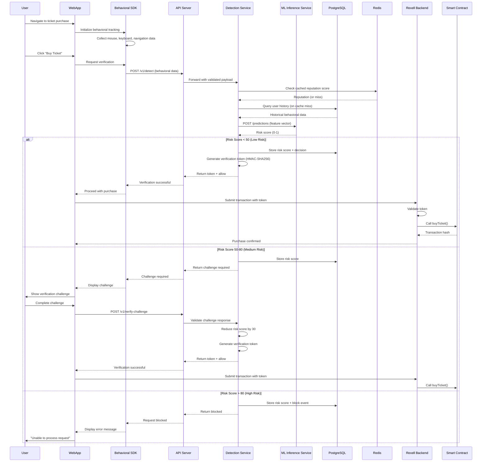

# Design Document: Rexell AI Bot Detection Integration (Cloud-Agnostic)

## Overview

This design document specifies the technical architecture for integrating AI-powered bot detection capabilities into the Rexell blockchain-based ticketing platform. The system uses containerized microservices and open-source tooling to provide real-time bot detection during ticket purchases and resale operations, protecting legitimate users from automated scalping attacks.

The architecture is fully cloud-agnostic and deployable on any cloud provider (AWS, GCP, Azure) or on-premises infrastructure using Docker and Kubernetes.

### System Goals

1. Detect and block automated bot activity during ticket purchase flows with sub-200ms latency
2. Analyze behavioral biometrics to distinguish human users from automated scripts
3. Provide adaptive challenge mechanisms that minimize friction for legitimate users
4. Integrate seamlessly with existing Rexell smart contracts (buyTicket, buyTickets, requestResaleVerification)
5. Scale horizontally to handle traffic spikes during high-demand ticket releases
6. Maintain cost efficiency through container orchestration and intelligent resource management
7. Ensure data privacy compliance with GDPR and CCPA regulations

### Key Design Principles

- **Container-First**: All services run as Docker containers orchestrated by Kubernetes
- **Defense in Depth**: Multiple detection layers including behavioral analysis, ML scoring, and adaptive challenges
- **Fail-Safe**: Graceful degradation to basic rate limiting when bot detection services are unavailable
- **Privacy by Design**: Anonymize user data, encrypt at rest and in transit, implement data retention policies
- **Observable**: Prometheus metrics, structured logging, and Grafana dashboards for full observability
- **Cloud-Agnostic**: No vendor-specific SDKs or managed services; deployable anywhere


## Architecture

### High-Level Architecture



### Architecture Components

**Client Layer**
- Behavioral Analytics SDK: JavaScript library embedded in the Rexell web application to capture user interactions
- Collects mouse movements, keystroke dynamics, touch gestures, navigation patterns
- Transmits encrypted behavioral data to the API Server over TLS 1.3

**API Layer**
- API Server: FastAPI (Python) or Express.js (TypeScript) REST API with request validation and authentication
- API key authentication via request headers; keys stored in environment secrets
- Rate limiting enforced via Redis sliding window: 100 req/sec per API key, burst capacity 200
- Request throttling returns HTTP 429 with Retry-After header

**Core Services**
- Detection Service: Analyzes behavioral data, invokes ML model, calculates risk scores, issues tokens
- Challenge Service: Generates and validates adaptive verification challenges
- Training Service: Scheduled job for monthly model retraining on accumulated data

**ML Layer**
- ML Inference Service: TorchServe or Triton Inference Server hosting the bot detection model
- Horizontal pod autoscaling based on request volume (min 1, max 10 replicas)
- Model artifacts stored in MinIO with versioning
- MLflow for experiment tracking and model registry

**Data Layer**
- PostgreSQL: Primary relational store for behavioral data, risk scores, verification tokens, user reputation
- Redis: In-memory cache for session state, rate limiting counters, reputation score caching
- MinIO: S3-compatible object storage for model artifacts, challenge images, and archived data

**Messaging**
- RabbitMQ: Asynchronous message queue for decoupled processing (e.g., training data ingestion, audit events)

**Observability**
- Prometheus: Metrics collection from all services via `/metrics` endpoints
- Grafana: Dashboards and alert rules for operational, detection, and cost views
- Loki: Structured log aggregation from all containers


### Data Flow



## Components and Interfaces

### Bot_Detection_Service

The core orchestration service responsible for coordinating bot detection operations.

**Responsibilities:**
- Receive and validate behavioral data from client SDK
- Coordinate between Behavioral_Analyzer, Risk_Scorer, and Challenge_Engine
- Generate and manage verification tokens
- Enforce rate limiting and request throttling
- Log detection events

**Interfaces:**

```typescript
interface BotDetectionService {
  detectBot(request: DetectionRequest): Promise<DetectionResponse>;
  validateToken(token: string, walletAddress: string): Promise<TokenValidation>;
  consumeToken(token: string): Promise<void>;
  getDetectionStats(timeRange: TimeRange): Promise<DetectionStats>;
}

interface DetectionRequest {
  sessionId: string;
  walletAddress: string;
  behavioralData: BehavioralData;
  context: RequestContext;
}

interface DetectionResponse {
  decision: 'allow' | 'challenge' | 'block';
  riskScore: number; // 0-100
  verificationToken?: string;
  challengeType?: ChallengeType;
  challengeId?: string;
  reason?: string;
}

interface RequestContext {
  eventId: string;
  ticketQuantity: number;
  timestamp: number;
  userAgent?: string;
}
```

**Implementation:**
- Python FastAPI service running in Docker container
- Kubernetes Deployment with 2-10 replicas (HPA based on CPU/request rate)
- Environment variables for DB connection strings, ML service URL, signing keys


### Behavioral_Analyzer

Component responsible for processing raw behavioral data and extracting features for the ML model.

**Interfaces:**

```typescript
interface BehavioralAnalyzer {
  extractFeatures(data: BehavioralData): Promise<FeatureVector>;
  validateData(data: BehavioralData): ValidationResult;
  calculateAnomalyScore(features: FeatureVector, history: UserHistory): number;
}

interface BehavioralData {
  mouseMovements: MouseEvent[];
  keystrokes: KeystrokeEvent[];
  navigationEvents: NavigationEvent[];
  touchEvents?: TouchEvent[];
  sessionDuration: number;
}

interface MouseEvent {
  timestamp: number;
  x: number;
  y: number;
  eventType: 'move' | 'click' | 'scroll';
}

interface KeystrokeEvent {
  timestamp: number;
  keyCode: string;
  pressTime: number;
  eventType: 'keydown' | 'keyup';
}

interface NavigationEvent {
  timestamp: number;
  fromPage: string;
  toPage: string;
  dwellTime: number;
}

interface FeatureVector {
  mouseVelocityMean: number;
  mouseVelocityStd: number;
  mouseAccelerationMean: number;
  mouseCurvatureMean: number;
  clickFrequency: number;
  keystrokeFlightTimeMean: number;
  keystrokeFlightTimeStd: number;
  keystrokeDwellTimeMean: number;
  navigationEntropy: number;
  sessionDuration: number;
  // 20+ additional features
}
```

**Implementation:**
- Embedded within the Detection Service as a Python module
- Feature extraction using NumPy/SciPy for statistical calculations
- Feature normalization to [0, 1] range for ML model input

### Risk_Scorer

Component that calculates risk scores using the ML model and contextual signals.

**Interfaces:**

```typescript
interface RiskScorer {
  calculateRiskScore(features: FeatureVector, context: RiskContext): Promise<RiskScore>;
  updateReputation(walletAddress: string, outcome: 'success' | 'failure'): Promise<void>;
  getReputation(walletAddress: string): Promise<ReputationScore>;
}

interface RiskContext {
  walletAddress: string;
  accountAge: number;
  transactionHistory: TransactionSummary;
  recentFailures: number;
  trustedStatus: boolean;
}

interface RiskScore {
  score: number; // 0-100
  confidence: number; // 0-1
  factors: RiskFactor[];
  decision: 'allow' | 'challenge' | 'block';
}

interface ReputationScore {
  score: number; // 0-100
  transactionCount: number;
  successRate: number;
  accountAge: number;
  trustedStatus: boolean;
  lastUpdated: number;
}
```

**Implementation:**
- HTTP call to ML Inference Service (`POST /predictions`) with feature vector payload
- Circuit breaker pattern (5 failures → open for 60s) for fault tolerance
- Reputation scores cached in Redis with 5-minute TTL
- Decision thresholds: allow (<50), challenge (50-80), block (>80)
- Fallback to rule-based scoring when ML Inference Service is unavailable

**ML Model Architecture:**
- Algorithm: Gradient Boosted Trees (XGBoost or scikit-learn GradientBoostingClassifier)
- Input: 30-dimensional feature vector
- Output: Bot probability score (0-1)
- Training framework: scikit-learn / XGBoost with MLflow experiment tracking
- Validation metrics: 95% accuracy, <2% false positive rate
- Model artifacts stored in MinIO with semantic versioning

### Challenge_Engine

Component that generates and validates adaptive verification challenges.

**Interfaces:**

```typescript
interface ChallengeEngine {
  generateChallenge(riskScore: number, context: ChallengeContext): Promise<Challenge>;
  validateChallenge(challengeId: string, response: ChallengeResponse): Promise<ChallengeResult>;
  getChallengeStats(timeRange: TimeRange): Promise<ChallengeStats>;
}

interface Challenge {
  challengeId: string;
  type: ChallengeType;
  content: ChallengeContent;
  expiresAt: number;
  maxAttempts: number;
}

type ChallengeType = 'image_selection' | 'behavioral_confirmation' | 'multi_step';

interface ChallengeResult {
  success: boolean;
  riskScoreAdjustment: number; // -30 for success, +10 for failure
  remainingAttempts: number;
  blockedUntil?: number;
}
```

**Implementation:**
- Separate Python FastAPI microservice (Challenge Service)
- Challenge types:
  - **Image Selection** (risk 50-65): Select images matching a category
  - **Multi-Step** (risk 65-80): Image selection + behavioral confirmation
- Challenge images stored in MinIO
- Challenge state stored in Redis with 5-minute TTL
- Rate limiting: max 3 failures per session, 15-minute cooldown

### Integration with Rexell Smart Contracts

**Integration Points:**

1. **buyTicket(eventId, nftUri)**: Single ticket purchase — token requested before transaction
2. **buyTickets(eventId, nftUris, quantity)**: Bulk purchase — 1.5x risk score multiplier applied
3. **requestResaleVerification(tokenId, price)**: Resale request — behavioral pattern analysis applied

**Verification Token Structure:**

```typescript
interface VerificationToken {
  tokenId: string;        // UUID v4
  walletAddress: string;  // Ethereum address
  eventId: string;
  maxQuantity: number;
  issuedAt: number;       // Unix timestamp (ms)
  expiresAt: number;      // issuedAt + 5 minutes
  signature: string;      // HMAC-SHA256 over payload
}
```

**Token Generation:**
```typescript
function generateToken(walletAddress: string, eventId: string, quantity: number): string {
  const payload = {
    tokenId: uuidv4(),
    walletAddress,
    eventId,
    maxQuantity: quantity,
    issuedAt: Date.now(),
    expiresAt: Date.now() + (5 * 60 * 1000),
  };
  const signature = crypto
    .createHmac('sha256', signingKey)
    .update(JSON.stringify(payload))
    .digest('hex');
  return Buffer.from(JSON.stringify({ ...payload, signature })).toString('base64');
}
```


## Data Models

### PostgreSQL Schema

**Table: behavioral_data**

Stores raw and processed behavioral data for analysis and model training.

```sql
CREATE TABLE behavioral_data (
  id            UUID PRIMARY KEY DEFAULT gen_random_uuid(),
  user_hash     TEXT NOT NULL,          -- SHA-256 of wallet address + salt
  session_id    TEXT NOT NULL,
  timestamp     BIGINT NOT NULL,
  feature_vector JSONB NOT NULL,
  raw_data      JSONB,                  -- Optional, for training
  context_data  JSONB NOT NULL,
  created_at    TIMESTAMPTZ DEFAULT NOW(),
  expires_at    TIMESTAMPTZ NOT NULL    -- 90 days from created_at
);

CREATE INDEX idx_behavioral_data_user_hash ON behavioral_data(user_hash);
CREATE INDEX idx_behavioral_data_session ON behavioral_data(session_id);
CREATE INDEX idx_behavioral_data_expires ON behavioral_data(expires_at);
```

**Table: risk_scores**

Stores calculated risk scores and detection decisions.

```sql
CREATE TABLE risk_scores (
  id            UUID PRIMARY KEY DEFAULT gen_random_uuid(),
  user_hash     TEXT NOT NULL,
  session_id    TEXT NOT NULL,
  risk_score    INTEGER NOT NULL CHECK (risk_score BETWEEN 0 AND 100),
  decision      TEXT NOT NULL CHECK (decision IN ('allow', 'challenge', 'block')),
  factors       JSONB NOT NULL,
  model_version TEXT NOT NULL,
  event_id      TEXT NOT NULL,
  ticket_qty    INTEGER NOT NULL,
  created_at    TIMESTAMPTZ DEFAULT NOW(),
  expires_at    TIMESTAMPTZ NOT NULL
);

CREATE INDEX idx_risk_scores_user_hash ON risk_scores(user_hash);
CREATE INDEX idx_risk_scores_decision ON risk_scores(decision, created_at);
CREATE INDEX idx_risk_scores_event ON risk_scores(event_id, created_at);
```

**Table: verification_tokens**

Stores active verification tokens with short TTL.

```sql
CREATE TABLE verification_tokens (
  token_id      UUID PRIMARY KEY,
  wallet_address TEXT NOT NULL,
  event_id      TEXT NOT NULL,
  max_quantity  INTEGER NOT NULL,
  issued_at     BIGINT NOT NULL,
  expires_at    BIGINT NOT NULL,
  consumed      BOOLEAN DEFAULT FALSE,
  consumed_at   BIGINT,
  tx_hash       TEXT
);

CREATE INDEX idx_tokens_wallet ON verification_tokens(wallet_address, issued_at);
```

**Table: user_reputation**

Stores user reputation scores and transaction history.

```sql
CREATE TABLE user_reputation (
  user_hash             TEXT PRIMARY KEY,
  reputation_score      INTEGER DEFAULT 50 CHECK (reputation_score BETWEEN 0 AND 100),
  transaction_count     INTEGER DEFAULT 0,
  successful_txns       INTEGER DEFAULT 0,
  failed_verifications  INTEGER DEFAULT 0,
  account_created_at    BIGINT NOT NULL,
  trusted_status        BOOLEAN DEFAULT FALSE,
  trusted_since         BIGINT,
  last_24h_failures     INTEGER DEFAULT 0,
  last_24h_purchases    INTEGER DEFAULT 0,
  last_activity_at      BIGINT,
  updated_at            TIMESTAMPTZ DEFAULT NOW()
);
```

**Table: challenge_state**

Stores active challenge state and attempt tracking.

```sql
CREATE TABLE challenge_state (
  challenge_id    UUID PRIMARY KEY,
  session_id      TEXT NOT NULL,
  user_hash       TEXT NOT NULL,
  challenge_type  TEXT NOT NULL,
  challenge_data  JSONB NOT NULL,
  correct_answer  TEXT NOT NULL,  -- Encrypted
  attempts        INTEGER DEFAULT 0,
  max_attempts    INTEGER DEFAULT 3,
  failed_attempts INTEGER DEFAULT 0,
  created_at      BIGINT NOT NULL,
  expires_at      BIGINT NOT NULL,
  completed_at    BIGINT
);

CREATE INDEX idx_challenge_session ON challenge_state(session_id, created_at);
```

### Redis Key Patterns

```
rate_limit:{api_key}:{window}          → sliding window counter (TTL: 1s)
reputation:{user_hash}                 → cached ReputationScore JSON (TTL: 5m)
session:{session_id}                   → session state JSON (TTL: 30m)
challenge:{challenge_id}               → challenge state JSON (TTL: 5m)
fallback:active                        → "1" when fallback mode is on (TTL: none)
block:{user_hash}                      → "1" when user is temporarily blocked (TTL: 15m)
```

### MinIO Bucket Structure

```
bot-detection-models/
├── models/
│   ├── v1.0.0/
│   │   ├── model.pkl (or model.pt)
│   │   ├── metadata.json
│   │   └── validation_metrics.json
│   └── latest -> v1.0.0/
├── training-data/
│   ├── 2024-01/
│   │   └── features.parquet
│   └── ...
└── challenge-content/
    └── images/
        ├── traffic_lights/
        └── crosswalks/

bot-detection-archive/
└── behavioral-data/
    └── 2024/01/
        └── data_20240101.parquet.gz
```

### Encryption Strategy

**Data at Rest:**
- PostgreSQL: Transparent Data Encryption (TDE) or filesystem-level encryption (LUKS)
- MinIO: Server-side encryption with AES-256 (SSE-S3 compatible)
- Redis: Encrypted at rest via OS-level disk encryption

**Data in Transit:**
- TLS 1.3 for all API communications
- Certificate pinning in client SDK
- mTLS between internal microservices (via service mesh or manual cert management)

**Data Anonymization:**
- Wallet addresses hashed using SHA-256 with a per-deployment salt before storage
- IP addresses truncated to /24 subnet (last octet removed)
- User agents normalized to browser family only
- No PII stored in logs or behavioral data


## API Specifications

### POST /v1/detect

Analyze behavioral data and return risk assessment.

**Request:**
```json
{
  "sessionId": "550e8400-e29b-41d4-a716-446655440000",
  "walletAddress": "0x742d35Cc6634C0532925a3b844Bc9e7595f0bEb",
  "behavioralData": {
    "mouseMovements": [{ "timestamp": 1234567890, "x": 100, "y": 200, "eventType": "move" }],
    "keystrokes": [{ "timestamp": 1234567891, "keyCode": "KeyA", "pressTime": 50, "eventType": "keydown" }],
    "navigationEvents": [{ "timestamp": 1234567800, "fromPage": "/events", "toPage": "/event/123", "dwellTime": 5000 }],
    "sessionDuration": 30000
  },
  "context": { "eventId": "123", "ticketQuantity": 2, "timestamp": 1234567890 }
}
```

**Response (Allow):** `{ "decision": "allow", "riskScore": 25, "verificationToken": "...", "expiresAt": 1234568190 }`

**Response (Challenge):** `{ "decision": "challenge", "riskScore": 65, "challengeType": "image_selection", "challengeId": "ch_..." }`

**Response (Block):** `{ "decision": "block", "riskScore": 95, "reason": "Automated bot activity detected", "retryAfter": 900 }`

### POST /v1/verify-challenge

Validate user response to verification challenge.

### POST /v1/validate-token

Validate verification token before transaction execution.

### POST /v1/consume-token

Mark token as consumed after successful transaction.

### GET /v1/health

Health check endpoint. Returns status of all dependent services (PostgreSQL, Redis, ML Inference Service).

```json
{
  "status": "healthy",
  "version": "1.2.0",
  "services": { "database": "healthy", "cache": "healthy", "ml_inference": "healthy" },
  "timestamp": 1234567890
}
```

## Deployment Architecture

### Kubernetes Manifests Overview

```
k8s/
├── namespace.yaml
├── detection-service/
│   ├── deployment.yaml      # 2-10 replicas, HPA on CPU + custom metrics
│   ├── service.yaml
│   └── hpa.yaml
├── challenge-service/
│   ├── deployment.yaml
│   └── service.yaml
├── ml-inference/
│   ├── deployment.yaml      # TorchServe or Triton, 1-10 replicas
│   ├── service.yaml
│   └── hpa.yaml
├── training-service/
│   └── cronjob.yaml         # Monthly retraining CronJob
├── postgresql/
│   └── statefulset.yaml
├── redis/
│   └── statefulset.yaml
├── rabbitmq/
│   └── statefulset.yaml
├── minio/
│   └── statefulset.yaml
└── monitoring/
    ├── prometheus/
    ├── grafana/
    └── loki/
```

### Container Images

| Service | Base Image | Language |
|---|---|---|
| Detection Service | python:3.11-slim | Python / FastAPI |
| Challenge Service | python:3.11-slim | Python / FastAPI |
| ML Inference Service | pytorch/torchserve:latest | Python / TorchServe |
| Training Service | python:3.11-slim | Python / scikit-learn |
| Behavioral SDK | node:20-alpine (build) | TypeScript |

### Environment Configuration

All secrets injected via Kubernetes Secrets or a secrets manager (Vault, Doppler, etc.):

```yaml
env:
  - name: DATABASE_URL
    valueFrom: { secretKeyRef: { name: bot-detection-secrets, key: database-url } }
  - name: REDIS_URL
    valueFrom: { secretKeyRef: { name: bot-detection-secrets, key: redis-url } }
  - name: ML_INFERENCE_URL
    value: "http://ml-inference-service:8080"
  - name: TOKEN_SIGNING_KEY
    valueFrom: { secretKeyRef: { name: bot-detection-secrets, key: signing-key } }
  - name: MINIO_ENDPOINT
    value: "http://minio-service:9000"
```


## Correctness Properties

*A property is a characteristic or behavior that should hold true across all valid executions of a system—essentially, a formal statement about what the system should do. Properties serve as the bridge between human-readable specifications and machine-verifiable correctness guarantees.*

### Property Reflection

After analyzing all acceptance criteria, the following consolidations eliminate redundancy:

- Requirements 1.2, 1.3, 1.4 (risk score decision logic) → combined into Property 2
- Requirements 2.2, 2.3 (behavioral data completeness) → combined into Property 5
- Requirements 3.2, 3.3 (model quality gates) → combined into Property 8
- Requirements 4.2, 4.3 (challenge type selection) → combined into Property 10
- Requirements 5.4, 5.5 (token structure) → combined into Property 16
- Requirements 7.2, 7.3 (rate limiting + response format) → combined into Property 23

### Property 1: Detection Latency

*For any* ticket purchase request with valid behavioral data, the Bot_Detection_Service analysis SHALL complete within 200 milliseconds.

**Validates: Requirements 1.1**

### Property 2: Risk Score Decision Thresholds

*For any* calculated risk score, the Bot_Detection_Service SHALL return 'block' when score > 80, 'challenge' when 50 ≤ score ≤ 80, and 'allow' with a verification token when score < 50.

**Validates: Requirements 1.2, 1.3, 1.4**

### Property 3: Blocked Request Logging

*For any* purchase request that is blocked, the Bot_Detection_Service SHALL create a log entry containing the risk score, decision, and behavioral indicators.

**Validates: Requirements 1.5**

### Property 4: Mouse Movement Sampling Rate

*For any* user interaction session lasting at least 1 second, the Behavioral_Analyzer SHALL collect at least 10 mouse movement samples per second during active interaction periods.

**Validates: Requirements 2.1**

### Property 5: Behavioral Data Completeness

*For any* behavioral data transmission, keystroke events SHALL include pressTime and inter-key intervals, and navigation events SHALL include fromPage, toPage, and dwellTime.

**Validates: Requirements 2.2, 2.3**

### Property 6: Data Transmission Latency

*For any* collected behavioral data, the Behavioral_Analyzer SHALL transmit the data to the API_Server within 5 seconds of collection completion.

**Validates: Requirements 2.4**

### Property 7: Data Retention TTL

*For any* behavioral data record stored in the Database, the expires_at field SHALL be set to exactly 90 days from the created_at timestamp.

**Validates: Requirements 2.6**

### Property 8: Model Deployment Quality Gates

*For any* newly trained bot detection model, the model SHALL NOT be deployed unless it achieves both ≥95% accuracy AND <2% false positive rate on validation datasets.

**Validates: Requirements 3.2, 3.3**

### Property 9: Model Performance Degradation Alerting

*For any* deployed model, when measured accuracy falls below 90% on validation data, an alert SHALL be triggered to platform administrators.

**Validates: Requirements 3.5**

### Property 10: Challenge Type Selection

*For any* risk score requiring a challenge, the Challenge_Engine SHALL present image_selection for scores 50–65, and multi_step for scores 65–80.

**Validates: Requirements 4.2, 4.3**

### Property 11: Challenge Success Risk Reduction

*For any* successfully completed verification challenge, the user's risk score SHALL be reduced by exactly 30 points.

**Validates: Requirements 4.4**

### Property 12: Challenge Failure Blocking

*For any* user session, when 3 challenge failures occur within that session, further purchase attempts SHALL be blocked for exactly 15 minutes.

**Validates: Requirements 4.5**

### Property 13: Challenge Validation Latency

*For any* challenge response submission, the Challenge_Engine SHALL complete validation within 100 milliseconds.

**Validates: Requirements 4.6**

### Property 14: Token Request Before Purchase

*For any* buyTicket or buyTickets smart contract call, the Rexell_Platform SHALL request a Verification_Token from the Bot_Detection_Service before executing the transaction.

**Validates: Requirements 5.1**

### Property 15: Invalid Token Rejection

*For any* smart contract transaction with an invalid or expired Verification_Token, the Rexell_Platform SHALL reject the transaction and return an error message.

**Validates: Requirements 5.3**

### Property 16: Token Structure and Validity

*For any* generated Verification_Token, the token SHALL include walletAddress, timestamp, cryptographic signature, and have expiresAt set to exactly 5 minutes from issuedAt.

**Validates: Requirements 5.4, 5.5**

### Property 17: Token Consumption Prevention

*For any* Verification_Token used in a successful transaction, the token SHALL be marked as consumed and SHALL NOT be accepted for subsequent transactions.

**Validates: Requirements 5.6**

### Property 18: Rapid Resale Request Flagging

*For any* reseller account, when multiple resale requests are submitted within 60 seconds, the account SHALL be flagged for review.

**Validates: Requirements 6.1**

### Property 19: Flagged Account Verification

*For any* reseller account that is flagged, all subsequent resale requests SHALL require additional verification before approval.

**Validates: Requirements 6.2**

### Property 20: Resale Risk Scoring Factors

*For any* resale request risk calculation, the Risk_Scorer SHALL include account age, transaction history, and behavioral consistency as factors in the score.

**Validates: Requirements 6.3**

### Property 21: Trusted Status Acquisition

*For any* reseller demonstrating consistent human-like behavior for 30 consecutive days, the Bot_Detection_Service SHALL assign trusted status that reduces verification requirements.

**Validates: Requirements 6.4**

### Property 22: Trusted Status Revocation

*For any* trusted reseller exhibiting behavioral anomalies exceeding the anomaly threshold, the Bot_Detection_Service SHALL revoke trusted status and reinstate full verification.

**Validates: Requirements 6.5**

### Property 23: Rate Limiting Enforcement

*For any* API key, when request rate exceeds 100 requests per second, the API_Server SHALL throttle subsequent requests and return HTTP 429 with a Retry-After header.

**Validates: Requirements 7.2, 7.3**

### Property 24: API Response Time P99

*For any* 100-request sample window, at least 99 requests SHALL complete within 300 milliseconds.

**Validates: Requirements 7.6**

### Property 25: Detection Event Logging

*For any* bot detection analysis, the Bot_Detection_Service SHALL create a log entry with severity level, risk score, and decision.

**Validates: Requirements 8.1**

### Property 26: High Bot Detection Rate Alerting

*For any* time window, when the ratio of blocked/challenged requests to total requests exceeds 20%, the Bot_Detection_Service SHALL trigger a high-priority alert.

**Validates: Requirements 8.2**

### Property 27: Service Error Rate Alerting

*For any* time window, when service error rate exceeds 1%, the Bot_Detection_Service SHALL trigger an alert to platform administrators.

**Validates: Requirements 8.3**

### Property 28: ML Inference Latency Alerting

*For any* time window, when ML_Inference_Service latency exceeds 500 milliseconds, the Bot_Detection_Service SHALL trigger a performance alert.

**Validates: Requirements 8.4**

### Property 29: Metrics Publishing

*For any* detection operation, the Bot_Detection_Service SHALL publish metrics to the Monitoring_Service including detection rate, false positive rate, and average risk score.

**Validates: Requirements 8.5**

### Property 30: User Identifier Anonymization

*For any* behavioral data stored in the Database, user wallet addresses SHALL be hashed using SHA-256 before storage, not stored in plaintext.

**Validates: Requirements 9.1**

### Property 31: Data Deletion Compliance

*For any* user data deletion request, all associated behavioral data SHALL be removed from the Database and Object_Storage within 30 days.

**Validates: Requirements 9.3**

### Property 32: PII Exclusion from Logs

*For any* log entry, the entry SHALL NOT contain personally identifiable information such as raw wallet addresses or full IP addresses.

**Validates: Requirements 9.4**

### Property 33: Data Access Audit Logging

*For any* data access operation on behavioral data or risk scores, the Bot_Detection_Service SHALL create an audit log entry with timestamp, accessor identity, and operation type.

**Validates: Requirements 9.6**

### Property 34: Fallback Mode Activation

*For any* time period when the Bot_Detection_Service health check fails, the Rexell_Platform SHALL activate fallback mode allowing purchases with basic rate limiting.

**Validates: Requirements 10.1**

### Property 35: Fallback Mode Purchase Limits

*For any* purchase request in fallback mode, the Rexell_Platform SHALL enforce a maximum of 2 tickets per wallet address per event.

**Validates: Requirements 10.2**

### Property 36: Service Recovery Time

*For any* Bot_Detection_Service recovery from an outage, normal bot detection operations SHALL resume within 60 seconds of health check success.

**Validates: Requirements 10.3**

### Property 37: Health Check Latency

*For any* health check request to the Bot_Detection_Service, the response SHALL be returned within 50 milliseconds.

**Validates: Requirements 10.4**

### Property 38: Data Archival Lifecycle

*For any* behavioral data record older than 90 days, the Bot_Detection_Service SHALL move the data from the Database to Object_Storage for long-term storage.

**Validates: Requirements 11.3**

### Property 39: Test Data Isolation

*For any* detection request with testing mode enabled, all generated data and results SHALL be tagged with a test identifier to prevent contamination of production datasets.

**Validates: Requirements 12.3**

### Property 40: Model Deployment Validation

*For any* model deployment, the Bot_Detection_Service SHALL validate model performance against a holdout test dataset before making the model available for inference.

**Validates: Requirements 12.5**


## Error Handling

### Error Categories

**Client Errors (4xx)**
- 400 Bad Request: Invalid behavioral data format, missing required fields, malformed JSON
- 401 Unauthorized: Missing or invalid API key
- 403 Forbidden: API key lacks required permissions
- 404 Not Found: Challenge ID or token ID not found
- 429 Too Many Requests: Rate limit exceeded; includes Retry-After header

**Server Errors (5xx)**
- 500 Internal Server Error: Unhandled exception in business logic
- 503 Service Unavailable: ML Inference Service unavailable, database connection failure, fallback mode active
- 504 Gateway Timeout: ML inference or database query exceeded timeout

### Error Handling Strategies

**Retry Logic**

```python
@retry(
    stop=stop_after_attempt(3),
    wait=wait_exponential(multiplier=0.1, max=2),
    retry=retry_if_exception_type((ServiceUnavailableError, TimeoutError))
)
async def call_ml_inference(features: FeatureVector) -> float:
    ...
```

**Circuit Breaker Pattern**

For ML Inference Service calls: 5 consecutive failures → circuit opens for 60 seconds → half-open probe → close on success.

```python
class CircuitBreaker:
    CLOSED = "CLOSED"
    OPEN = "OPEN"
    HALF_OPEN = "HALF_OPEN"

    def __init__(self, failure_threshold=5, timeout=60):
        self.state = self.CLOSED
        self.failure_count = 0
        self.last_failure_time = 0
        self.failure_threshold = failure_threshold
        self.timeout = timeout
```

**Fallback Mechanisms**

1. **ML Inference Service Unavailable**: Rule-based risk scoring using heuristics (session duration, mouse velocity variance). Conservative thresholds applied (challenge at score 40 instead of 50).
2. **Database Connection Failure**: Serve cached reputation scores from Redis; accept stale data for up to 5 minutes.
3. **Complete Service Failure**: Activate fallback mode — basic rate limiting (2 tickets per wallet per event), log all transactions for post-incident analysis, alert administrators immediately.

### Structured Error Logging

```python
@dataclass
class ErrorLog:
    timestamp: int
    correlation_id: str
    error_type: str
    error_message: str
    error_code: str
    context: dict  # session_id, user_hash, event_id, operation
    severity: Literal["ERROR", "CRITICAL"]
```

## Testing Strategy

### Dual Testing Approach

- **Unit tests**: Verify specific examples, edge cases, error conditions, and integration points
- **Property tests**: Verify universal properties across all inputs through randomization

Both are complementary and necessary. Unit tests catch concrete bugs; property tests verify general correctness across a wide input space.

### Property-Based Testing

**Framework Selection**
- **Python**: Hypothesis library
- **TypeScript (SDK)**: fast-check library

**Configuration**

Each property test MUST:
- Run minimum 100 iterations
- Include a comment tag referencing the design property
- Tag format: `# Feature: rexell-ai-bot-detection-integration, Property {N}: {property_text}`

**Example Property Test (Python / Hypothesis)**

```python
from hypothesis import given, settings
import hypothesis.strategies as st

# Feature: rexell-ai-bot-detection-integration, Property 2: Risk Score Decision Thresholds
@given(st.integers(min_value=0, max_value=100))
@settings(max_examples=100)
def test_risk_score_decision_thresholds(risk_score):
    decision = determine_decision(risk_score)
    if risk_score > 80:
        assert decision == "block"
    elif 50 <= risk_score <= 80:
        assert decision == "challenge"
    else:
        assert decision == "allow"
```

**Custom Generators**

```python
behavioral_data_strategy = st.fixed_dictionaries({
    "mouseMovements": st.lists(
        st.fixed_dictionaries({
            "timestamp": st.integers(min_value=0),
            "x": st.integers(min_value=0, max_value=1920),
            "y": st.integers(min_value=0, max_value=1080),
            "eventType": st.sampled_from(["move", "click", "scroll"])
        }),
        min_size=10, max_size=1000
    ),
    "keystrokes": st.lists(
        st.fixed_dictionaries({
            "timestamp": st.integers(min_value=0),
            "keyCode": st.text(min_size=1, max_size=10),
            "pressTime": st.integers(min_value=10, max_value=500),
            "eventType": st.sampled_from(["keydown", "keyup"])
        }),
        min_size=0, max_size=500
    ),
    "navigationEvents": st.lists(
        st.fixed_dictionaries({
            "timestamp": st.integers(min_value=0),
            "fromPage": st.sampled_from(["/events", "/event/123", "/profile"]),
            "toPage": st.sampled_from(["/events", "/event/123", "/checkout"]),
            "dwellTime": st.integers(min_value=100, max_value=60000)
        }),
        min_size=1, max_size=20
    ),
    "sessionDuration": st.integers(min_value=1000, max_value=300000)
})
```

### Unit Testing

**Focus Areas**
1. Specific examples: known bot patterns (linear movement), known human patterns (natural curves), boundary conditions (risk score exactly 50, 80)
2. Edge cases: empty behavioral data, single event, 10,000+ events, negative timestamps
3. Error conditions: ML service timeout, database connection failure, invalid API keys, expired/consumed tokens
4. Integration points: token generation/validation flow, challenge flow, fallback mode activation

### Integration Testing

**Test Scenarios**
1. End-to-end purchase flow (low-risk user → token → transaction)
2. Challenge flow (medium-risk → challenge → success → token → transaction)
3. Fallback flow (ML service outage → fallback activation → rate limiting → recovery)
4. Resale detection flow (rapid requests → flagging → additional verification)

### Load Testing

**Scenarios and Targets**

| Scenario | Rate | Duration | P50 | P95 | P99 | Error Rate |
|---|---|---|---|---|---|---|
| Normal | 50 req/s | 1 hour | <150ms | <250ms | <300ms | <0.1% |
| Peak | 200 req/s | 15 min | <150ms | <250ms | <300ms | <0.1% |
| Spike | 0→500 req/s | 10 sec | — | — | — | <1% |
| Sustained | 150 req/s | 4 hours | <150ms | <250ms | <300ms | <0.1% |

**Load Testing Tools**: k6 or Locust for HTTP load generation; Prometheus for metrics collection.

### ML Model Testing

**Validation Metrics**
- Overall accuracy: ≥95%
- False positive rate: <2%
- False negative rate: <5%
- F1 Score: ≥91%

**A/B Testing**
- Deploy new models to 10% of traffic initially
- Monitor for 48 hours before full rollout
- Automatic rollback if accuracy degrades >5%

### Monitoring and Observability

**Key Prometheus Metrics**
- `bot_detection_requests_total{decision}` — counter by decision type
- `bot_detection_risk_score_histogram` — distribution of risk scores
- `bot_detection_latency_seconds{quantile}` — P50/P95/P99 latency
- `bot_detection_error_rate` — error percentage
- `ml_inference_latency_seconds` — ML service response time
- `challenge_completion_rate` — ratio of successful challenges
- `fallback_mode_active` — gauge (0 or 1)

**Grafana Dashboards**
1. Operational: request volume, error rates, latency percentiles, service health
2. Detection: detection rate over time, risk score distribution, challenge success rate
3. Infrastructure: container CPU/memory, database connections, Redis hit rate

**Alerting Rules (Grafana/Prometheus)**
- Detection rate > 20%: high-priority alert
- Error rate > 1%: warning; > 5%: critical
- ML inference latency > 500ms: warning
- Fallback mode active: critical
- Model accuracy < 90%: critical
