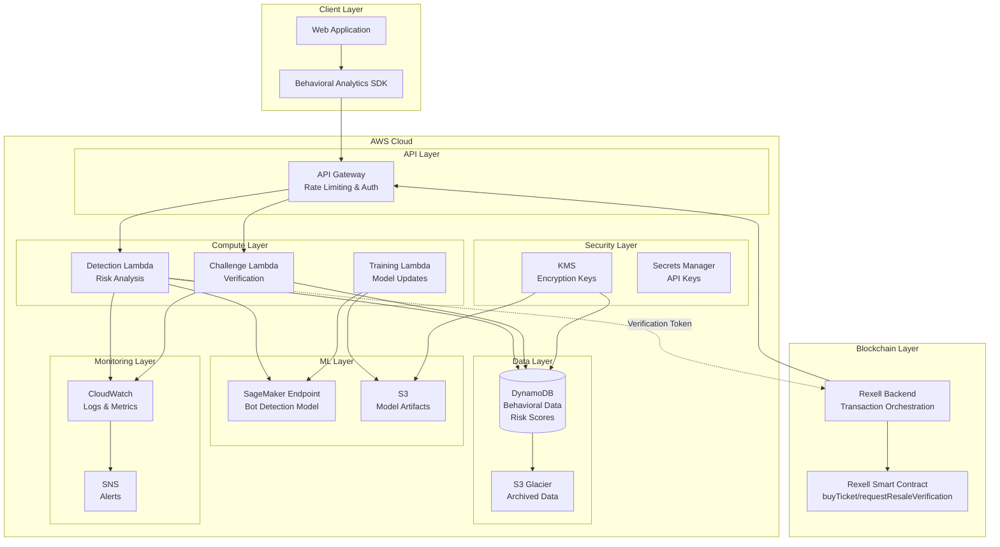
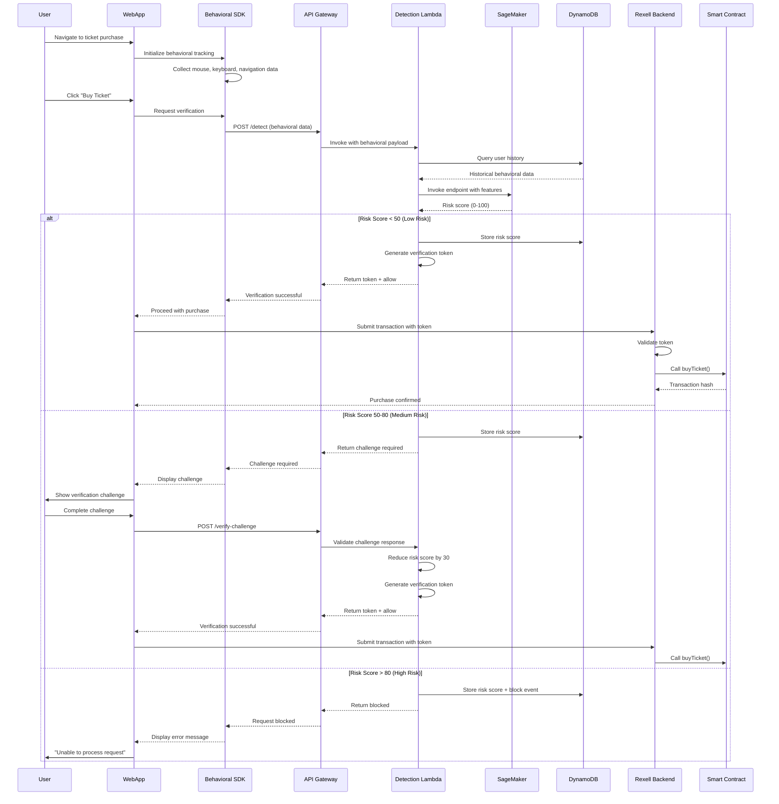

# Design Document: Rexell AI Bot Detection Integration

## Overview

This design document specifies the technical architecture for integrating AI-powered bot detection capabilities into the Rexell blockchain-based ticketing platform. The system leverages AWS managed services to provide real-time bot detection during ticket purchases and resale operations, protecting legitimate users from automated scalping attacks.

### System Goals

The bot detection system aims to:

1. Detect and block automated bot activity during ticket purchase flows with sub-200ms latency
2. Analyze behavioral biometrics to distinguish human users from automated scripts
3. Provide adaptive challenge mechanisms that minimize friction for legitimate users
4. Integrate seamlessly with existing Rexell smart contracts (buyTicket, buyTickets, requestResaleVerification)
5. Scale elastically to handle traffic spikes during high-demand ticket releases
6. Maintain cost efficiency through serverless architecture and intelligent resource management
7. Ensure data privacy compliance with GDPR and CCPA regulations

### Key Design Principles

- **Serverless-First**: Utilize AWS Lambda and managed services to minimize operational overhead
- **Defense in Depth**: Multiple detection layers including behavioral analysis, ML scoring, and adaptive challenges
- **Fail-Safe**: Graceful degradation to basic rate limiting when bot detection services are unavailable
- **Privacy by Design**: Anonymize user data, encrypt at rest and in transit, implement data retention policies
- **Observable**: Comprehensive logging, metrics, and alerting for detection performance and system health

## Architecture

### High-Level Architecture




### Architecture Components


**Client Layer**
- Behavioral Analytics SDK: JavaScript library embedded in Rexell web application to capture user interactions
- Collects mouse movements, keystroke dynamics, touch gestures, navigation patterns
- Transmits encrypted behavioral data to API Gateway

**API Layer**
- AWS API Gateway: RESTful API endpoints with request/response validation
- Authentication via API keys stored in AWS Secrets Manager
- Rate limiting: 100 req/sec per API key, burst capacity 200 requests
- Request throttling with exponential backoff for exceeded limits

**Compute Layer**
- Detection Lambda: Analyzes behavioral data, invokes ML model, calculates risk scores
- Challenge Lambda: Generates and validates adaptive verification challenges
- Training Lambda: Scheduled function for monthly model retraining on accumulated data

**ML Layer**
- SageMaker Endpoint: Real-time inference endpoint hosting bot detection model
- Auto-scaling based on request volume (min 1, max 10 instances)
- Model artifacts stored in S3 with versioning enabled

**Data Layer**
- DynamoDB: Primary data store for behavioral data, risk scores, verification tokens
- On-demand pricing for variable workload patterns
- Point-in-time recovery enabled for data protection
- S3 Glacier: Long-term archive for data older than 90 days

**Security Layer**
- AWS KMS: Customer-managed keys for encryption at rest
- Secrets Manager: Secure storage for API keys, signing keys, external credentials
- IAM roles with least-privilege access policies

**Monitoring Layer**
- CloudWatch: Centralized logging, custom metrics, dashboards
- SNS: Alert notifications for high bot detection rates, errors, performance degradation
- X-Ray: Distributed tracing for request flow analysis

### Deployment Architecture

The system deploys across multiple AWS availability zones for high availability:

- API Gateway: Multi-AZ by default
- Lambda functions: Deployed in VPC with subnets in 3 AZs
- DynamoDB: Global tables with multi-region replication (optional)
- SageMaker endpoints: Multi-AZ deployment with automatic failover

### Data Flow




## Components and Interfaces

### Bot_Detection_Service

The core orchestration service responsible for coordinating bot detection operations.

**Responsibilities:**
- Receive and validate behavioral data from client SDK
- Coordinate between Behavioral_Analyzer, Risk_Scorer, and Challenge_Engine
- Generate and manage verification tokens
- Enforce rate limiting and request throttling
- Log detection events to CloudWatch

**Interfaces:**


```typescript
interface BotDetectionService {
  // Analyze user behavior and return risk assessment
  detectBot(request: DetectionRequest): Promise<DetectionResponse>;
  
  // Validate verification token
  validateToken(token: string, walletAddress: string): Promise<TokenValidation>;
  
  // Mark token as consumed after successful transaction
  consumeToken(token: string): Promise<void>;
  
  // Get detection statistics for monitoring
  getDetectionStats(timeRange: TimeRange): Promise<DetectionStats>;
}

interface DetectionRequest {
  sessionId: string;
  walletAddress: string;
  behavioralData: BehavioralData;
  context: RequestContext;
}

interface DetectionResponse {
  decision: 'allow' | 'challenge' | 'block';
  riskScore: number; // 0-100
  verificationToken?: string; // Present if decision is 'allow'
  challengeType?: ChallengeType; // Present if decision is 'challenge'
  challengeId?: string; // Present if decision is 'challenge'
  reason?: string; // Explanation for decision
}

interface RequestContext {
  eventId: string;
  ticketQuantity: number;
  timestamp: number;
  ipAddress?: string;
  userAgent?: string;
}
```

**Implementation:**
- AWS Lambda function (Node.js 18.x runtime)
- Memory: 1024 MB
- Timeout: 10 seconds
- Concurrency: Reserved capacity of 50 during peak hours, auto-scaling up to 500
- Environment variables: DynamoDB table names, SageMaker endpoint, KMS key ARN

### Behavioral_Analyzer

Component responsible for processing raw behavioral data and extracting features for ML model.

**Responsibilities:**
- Validate and sanitize incoming behavioral data
- Extract statistical features from mouse movements (velocity, acceleration, curvature)
- Analyze keystroke dynamics (flight time, dwell time, rhythm patterns)
- Calculate navigation pattern features (page sequence entropy, dwell time distribution)
- Aggregate features into ML-ready feature vector

**Interfaces:**

```typescript
interface BehavioralAnalyzer {
  // Extract features from raw behavioral data
  extractFeatures(data: BehavioralData): Promise<FeatureVector>;
  
  // Validate behavioral data completeness and integrity
  validateData(data: BehavioralData): ValidationResult;
  
  // Calculate anomaly score based on historical patterns
  calculateAnomalyScore(features: FeatureVector, history: UserHistory): number;
}

interface BehavioralData {
  mouseMovements: MouseEvent[];
  keystrokes: KeystrokeEvent[];
  navigationEvents: NavigationEvent[];
  touchEvents?: TouchEvent[];
  sessionDuration: number;
}

interface MouseEvent {
  timestamp: number;
  x: number;
  y: number;
  eventType: 'move' | 'click' | 'scroll';
}

interface KeystrokeEvent {
  timestamp: number;
  keyCode: string;
  pressTime: number; // Duration of key press in ms
  eventType: 'keydown' | 'keyup';
}

interface NavigationEvent {
  timestamp: number;
  fromPage: string;
  toPage: string;
  dwellTime: number;
}

interface FeatureVector {
  mouseVelocityMean: number;
  mouseVelocityStd: number;
  mouseAccelerationMean: number;
  mouseCurvatureMean: number;
  clickFrequency: number;
  keystrokeFlightTimeMean: number;
  keystrokeFlightTimeStd: number;
  keystrokeDwellTimeMean: number;
  navigationEntropy: number;
  sessionDuration: number;
  // ... additional 20+ features
}
```

**Implementation:**
- Embedded within Detection Lambda function
- Feature extraction algorithms based on research in behavioral biometrics
- Statistical calculations using math.js library
- Feature normalization to [0, 1] range for ML model input

### Risk_Scorer


Component that calculates risk scores using ML model and contextual signals.

**Responsibilities:**
- Invoke SageMaker endpoint with feature vector
- Combine ML model score with contextual signals (account age, transaction history)
- Apply reputation adjustments for trusted users
- Calculate final risk score (0-100)
- Determine decision threshold (allow/challenge/block)

**Interfaces:**

```typescript
interface RiskScorer {
  // Calculate risk score for a user session
  calculateRiskScore(features: FeatureVector, context: RiskContext): Promise<RiskScore>;
  
  // Update user reputation based on successful transactions
  updateReputation(walletAddress: string, outcome: 'success' | 'failure'): Promise<void>;
  
  // Get user reputation score
  getReputation(walletAddress: string): Promise<ReputationScore>;
}

interface RiskContext {
  walletAddress: string;
  accountAge: number; // Days since first transaction
  transactionHistory: TransactionSummary;
  recentFailures: number; // Failed verifications in last 24h
  trustedStatus: boolean;
}

interface RiskScore {
  score: number; // 0-100
  confidence: number; // 0-1
  factors: RiskFactor[];
  decision: 'allow' | 'challenge' | 'block';
}

interface RiskFactor {
  name: string;
  contribution: number; // -50 to +50
  description: string;
}

interface ReputationScore {
  score: number; // 0-100
  transactionCount: number;
  successRate: number;
  accountAge: number;
  trustedStatus: boolean;
  lastUpdated: number;
}
```

**Implementation:**
- Embedded within Detection Lambda function
- SageMaker endpoint invocation using AWS SDK v3
- Caching of reputation scores in DynamoDB with TTL
- Decision thresholds: allow (<50), challenge (50-80), block (>80)
- Reputation decay: -1 point per day of inactivity

**ML Model Architecture:**
- Algorithm: Gradient Boosted Trees (XGBoost)
- Input: 30-dimensional feature vector
- Output: Bot probability score (0-1)
- Training data: Historical behavioral data labeled by human review and challenge outcomes
- Validation metrics: 95% accuracy, <2% false positive rate
- Model versioning: Semantic versioning stored in S3 metadata

### Challenge_Engine

Component that generates and validates adaptive verification challenges.

**Responsibilities:**
- Select appropriate challenge type based on risk score
- Generate challenge content (images, questions, behavioral tasks)
- Validate user responses
- Adjust risk scores based on challenge outcomes
- Track challenge failure rates per user

**Interfaces:**

```typescript
interface ChallengeEngine {
  // Generate a challenge appropriate for the risk level
  generateChallenge(riskScore: number, context: ChallengeContext): Promise<Challenge>;
  
  // Validate user response to challenge
  validateChallenge(challengeId: string, response: ChallengeResponse): Promise<ChallengeResult>;
  
  // Get challenge statistics for monitoring
  getChallengeStats(timeRange: TimeRange): Promise<ChallengeStats>;
}

interface ChallengeContext {
  sessionId: string;
  walletAddress: string;
  previousFailures: number;
}

interface Challenge {
  challengeId: string;
  type: ChallengeType;
  content: ChallengeContent;
  expiresAt: number;
  maxAttempts: number;
}

type ChallengeType = 'image_selection' | 'behavioral_confirmation' | 'multi_step';

interface ChallengeContent {
  instructions: string;
  data: any; // Challenge-specific data
}

interface ChallengeResponse {
  challengeId: string;
  answer: any; // Challenge-specific answer format
  completionTime: number; // Time taken to complete in ms
}

interface ChallengeResult {
  success: boolean;
  riskScoreAdjustment: number; // -30 for success, +10 for failure
  remainingAttempts: number;
  blockedUntil?: number; // Timestamp if user is temporarily blocked
}
```

**Implementation:**
- Separate AWS Lambda function (Challenge Lambda)
- Challenge types:
  - **Image Selection** (risk 50-65): Select images matching a category (e.g., "Select all traffic lights")
  - **Behavioral Confirmation** (risk 65-80): Perform specific mouse/keyboard patterns
  - **Multi-Step** (risk 65-80): Combination of image selection + behavioral confirmation
- Challenge content stored in S3 bucket
- Challenge state stored in DynamoDB with 5-minute TTL
- Rate limiting: Max 3 failures per session, 15-minute cooldown

### Integration with Rexell Smart Contracts


The bot detection system integrates with existing Rexell smart contract functions:

**Integration Points:**

1. **buyTicket(eventId, nftUri)**: Single ticket purchase
   - Rexell backend requests verification token before transaction
   - Token validated and consumed upon successful purchase
   
2. **buyTickets(eventId, nftUris, quantity)**: Bulk ticket purchase
   - Higher scrutiny for bulk purchases (risk score multiplier: 1.5x)
   - Token includes quantity limit to prevent token reuse for additional tickets
   
3. **requestResaleVerification(tokenId, price)**: Resale request
   - Behavioral analysis of resale patterns
   - Account history and trusted status considered
   - Rapid successive requests flagged for review

**Verification Token Structure:**

```typescript
interface VerificationToken {
  tokenId: string; // UUID v4
  walletAddress: string; // Ethereum address
  eventId: string; // Event being purchased
  maxQuantity: number; // Maximum tickets allowed
  issuedAt: number; // Unix timestamp
  expiresAt: number; // Unix timestamp (5 minutes from issuance)
  signature: string; // HMAC-SHA256 signature
}
```

**Token Generation:**
```typescript
function generateToken(walletAddress: string, eventId: string, quantity: number): string {
  const payload = {
    tokenId: uuidv4(),
    walletAddress,
    eventId,
    maxQuantity: quantity,
    issuedAt: Date.now(),
    expiresAt: Date.now() + (5 * 60 * 1000), // 5 minutes
  };
  
  const signature = crypto
    .createHmac('sha256', signingKey)
    .update(JSON.stringify(payload))
    .digest('hex');
  
  return Buffer.from(JSON.stringify({ ...payload, signature })).toString('base64');
}
```

**Backend Integration Flow:**

```typescript
// Rexell backend service
async function executePurchase(walletAddress: string, eventId: string, quantity: number) {
  // 1. Request bot detection verification
  const detectionResult = await botDetectionClient.detectBot({
    sessionId: getCurrentSessionId(),
    walletAddress,
    behavioralData: getBehavioralData(),
    context: { eventId, ticketQuantity: quantity, timestamp: Date.now() }
  });
  
  // 2. Handle detection result
  if (detectionResult.decision === 'block') {
    throw new Error('Purchase blocked due to suspicious activity');
  }
  
  if (detectionResult.decision === 'challenge') {
    // Return challenge to frontend for user completion
    return { requiresChallenge: true, challengeId: detectionResult.challengeId };
  }
  
  // 3. Validate token
  const tokenValid = await botDetectionClient.validateToken(
    detectionResult.verificationToken,
    walletAddress
  );
  
  if (!tokenValid) {
    throw new Error('Invalid verification token');
  }
  
  // 4. Execute blockchain transaction
  const tx = await rexellContract.buyTickets(eventId, nftUris, quantity);
  await tx.wait();
  
  // 5. Mark token as consumed
  await botDetectionClient.consumeToken(detectionResult.verificationToken);
  
  return { success: true, transactionHash: tx.hash };
}
```

## Data Models

### DynamoDB Tables

**Table: BehavioralData**

Stores raw and processed behavioral data for analysis and model training.


```typescript
interface BehavioralDataRecord {
  // Partition key: hashed wallet address for anonymization
  PK: string; // Format: "USER#{hashedWalletAddress}"
  
  // Sort key: timestamp for time-series queries
  SK: string; // Format: "SESSION#{timestamp}#{sessionId}"
  
  // Data fields
  sessionId: string;
  timestamp: number;
  featureVector: FeatureVector;
  rawBehavioralData?: BehavioralData; // Optional, for training
  contextData: RequestContext;
  
  // Metadata
  createdAt: number;
  ttl: number; // 90 days from creation
}
```

**Indexes:**
- GSI1: sessionId (PK) → timestamp (SK) for session lookups
- TTL enabled on `ttl` attribute for automatic deletion after 90 days

**Table: RiskScores**

Stores calculated risk scores and detection decisions.

```typescript
interface RiskScoreRecord {
  // Partition key: hashed wallet address
  PK: string; // Format: "USER#{hashedWalletAddress}"
  
  // Sort key: timestamp
  SK: string; // Format: "RISK#{timestamp}"
  
  // Data fields
  sessionId: string;
  riskScore: number;
  decision: 'allow' | 'challenge' | 'block';
  factors: RiskFactor[];
  modelVersion: string;
  
  // Context
  eventId: string;
  ticketQuantity: number;
  
  // Metadata
  createdAt: number;
  ttl: number; // 90 days from creation
}
```

**Indexes:**
- GSI1: decision (PK) → timestamp (SK) for filtering by decision type
- GSI2: eventId (PK) → timestamp (SK) for event-specific analysis

**Table: VerificationTokens**

Stores active verification tokens with short TTL.

```typescript
interface VerificationTokenRecord {
  // Partition key: token ID
  PK: string; // Format: "TOKEN#{tokenId}"
  
  // Sort key: wallet address for validation
  SK: string; // Format: "WALLET#{walletAddress}"
  
  // Data fields
  tokenId: string;
  walletAddress: string;
  eventId: string;
  maxQuantity: number;
  issuedAt: number;
  expiresAt: number;
  consumed: boolean;
  consumedAt?: number;
  
  // Metadata
  ttl: number; // 10 minutes from creation (5 min validity + 5 min grace)
}
```

**Indexes:**
- GSI1: walletAddress (PK) → issuedAt (SK) for user token history
- TTL enabled on `ttl` attribute

**Table: UserReputation**

Stores user reputation scores and transaction history.

```typescript
interface UserReputationRecord {
  // Partition key: hashed wallet address
  PK: string; // Format: "USER#{hashedWalletAddress}"
  
  // Sort key: fixed value for single record per user
  SK: string; // Format: "REPUTATION"
  
  // Data fields
  reputationScore: number; // 0-100
  transactionCount: number;
  successfulTransactions: number;
  failedVerifications: number;
  accountCreatedAt: number;
  trustedStatus: boolean;
  trustedSince?: number;
  
  // Recent activity tracking
  last24hFailures: number;
  last24hPurchases: number;
  lastActivityAt: number;
  
  // Metadata
  updatedAt: number;
}
```

**Table: ChallengeState**

Stores active challenge state and attempt tracking.

```typescript
interface ChallengeStateRecord {
  // Partition key: challenge ID
  PK: string; // Format: "CHALLENGE#{challengeId}"
  
  // Sort key: session ID
  SK: string; // Format: "SESSION#{sessionId}"
  
  // Data fields
  challengeId: string;
  sessionId: string;
  walletAddress: string;
  challengeType: ChallengeType;
  challengeContent: ChallengeContent;
  correctAnswer: any; // Encrypted
  
  // Attempt tracking
  attempts: number;
  maxAttempts: number;
  failedAttempts: number;
  
  // Timing
  createdAt: number;
  expiresAt: number;
  completedAt?: number;
  
  // Metadata
  ttl: number; // 10 minutes from creation
}
```

**Indexes:**
- GSI1: sessionId (PK) → createdAt (SK) for session challenge lookup
- TTL enabled on `ttl` attribute

### S3 Bucket Structure

**Bucket: rexell-bot-detection-models**

Stores ML model artifacts and training data.

```
rexell-bot-detection-models/
├── models/
│   ├── v1.0.0/
│   │   ├── model.tar.gz
│   │   ├── metadata.json
│   │   └── validation_metrics.json
│   ├── v1.1.0/
│   │   └── ...
│   └── latest -> v1.1.0/
├── training-data/
│   ├── 2024-01/
│   │   ├── labeled_data.parquet
│   │   └── features.parquet
│   └── 2024-02/
│       └── ...
└── challenge-content/
    ├── images/
    │   ├── traffic_lights/
    │   ├── crosswalks/
    │   └── ...
    └── templates/
        └── ...
```

**Bucket: rexell-bot-detection-archive**

Long-term archive for behavioral data (S3 Glacier).

```
rexell-bot-detection-archive/
├── behavioral-data/
│   ├── 2024/
│   │   ├── 01/
│   │   │   ├── data_20240101.parquet.gz
│   │   │   └── ...
│   │   └── 02/
│   │       └── ...
└── risk-scores/
    └── ...
```

### Encryption Strategy


**Data at Rest:**
- DynamoDB: AWS KMS encryption with customer-managed key (CMK)
- S3: Server-side encryption with KMS (SSE-KMS)
- Key rotation: Automatic annual rotation enabled

**Data in Transit:**
- TLS 1.3 for all API communications
- Certificate pinning in client SDK
- Mutual TLS for backend-to-Lambda communication

**Data Anonymization:**
- Wallet addresses hashed using SHA-256 with salt before storage
- IP addresses truncated to /24 subnet (last octet removed)
- User agents normalized to browser family only
- No PII stored in logs or behavioral data

## API Specifications

### POST /v1/detect

Analyze behavioral data and return risk assessment.

**Request:**
```json
{
  "sessionId": "550e8400-e29b-41d4-a716-446655440000",
  "walletAddress": "0x742d35Cc6634C0532925a3b844Bc9e7595f0bEb",
  "behavioralData": {
    "mouseMovements": [
      { "timestamp": 1234567890, "x": 100, "y": 200, "eventType": "move" }
    ],
    "keystrokes": [
      { "timestamp": 1234567891, "keyCode": "KeyA", "pressTime": 50, "eventType": "keydown" }
    ],
    "navigationEvents": [
      { "timestamp": 1234567800, "fromPage": "/events", "toPage": "/event/123", "dwellTime": 5000 }
    ],
    "sessionDuration": 30000
  },
  "context": {
    "eventId": "123",
    "ticketQuantity": 2,
    "timestamp": 1234567890,
    "userAgent": "Mozilla/5.0..."
  }
}
```

**Response (Allow):**
```json
{
  "decision": "allow",
  "riskScore": 25,
  "verificationToken": "eyJhbGciOiJIUzI1NiIsInR5cCI6IkpXVCJ9...",
  "expiresAt": 1234568190,
  "factors": [
    { "name": "mouse_velocity", "contribution": -10, "description": "Natural mouse movement patterns" },
    { "name": "account_age", "contribution": -15, "description": "Established account" }
  ]
}
```

**Response (Challenge):**
```json
{
  "decision": "challenge",
  "riskScore": 65,
  "challengeType": "image_selection",
  "challengeId": "ch_550e8400e29b41d4a716446655440000",
  "challenge": {
    "instructions": "Select all images containing traffic lights",
    "images": [
      { "id": "img1", "url": "https://..." },
      { "id": "img2", "url": "https://..." }
    ],
    "expiresAt": 1234568190
  },
  "factors": [
    { "name": "mouse_velocity", "contribution": 20, "description": "Unusually consistent velocity" },
    { "name": "keystroke_rhythm", "contribution": 15, "description": "Mechanical typing pattern" }
  ]
}
```

**Response (Block):**
```json
{
  "decision": "block",
  "riskScore": 95,
  "reason": "Automated bot activity detected",
  "retryAfter": 900,
  "factors": [
    { "name": "mouse_velocity", "contribution": 40, "description": "Impossible movement speed" },
    { "name": "session_duration", "contribution": 30, "description": "Suspiciously short session" }
  ]
}
```

**Error Responses:**
- 400 Bad Request: Invalid behavioral data format
- 429 Too Many Requests: Rate limit exceeded
- 500 Internal Server Error: Service unavailable
- 503 Service Unavailable: Fallback mode active

### POST /v1/verify-challenge

Validate user response to verification challenge.

**Request:**
```json
{
  "challengeId": "ch_550e8400e29b41d4a716446655440000",
  "sessionId": "550e8400-e29b-41d4-a716-446655440000",
  "response": {
    "selectedImages": ["img1", "img3", "img5"]
  },
  "completionTime": 8500
}
```

**Response (Success):**
```json
{
  "success": true,
  "verificationToken": "eyJhbGciOiJIUzI1NiIsInR5cCI6IkpXVCJ9...",
  "expiresAt": 1234568190,
  "adjustedRiskScore": 35
}
```

**Response (Failure):**
```json
{
  "success": false,
  "remainingAttempts": 2,
  "message": "Incorrect response. Please try again."
}
```

**Response (Blocked):**
```json
{
  "success": false,
  "blocked": true,
  "blockedUntil": 1234568790,
  "message": "Too many failed attempts. Please try again in 15 minutes."
}
```

### POST /v1/validate-token

Validate verification token before transaction execution.

**Request:**
```json
{
  "token": "eyJhbGciOiJIUzI1NiIsInR5cCI6IkpXVCJ9...",
  "walletAddress": "0x742d35Cc6634C0532925a3b844Bc9e7595f0bEb",
  "eventId": "123"
}
```

**Response:**
```json
{
  "valid": true,
  "maxQuantity": 2,
  "expiresAt": 1234568190
}
```

### POST /v1/consume-token

Mark token as consumed after successful transaction.

**Request:**
```json
{
  "token": "eyJhbGciOiJIUzI1NiIsInR5cCI6IkpXVCJ9...",
  "transactionHash": "0x1234567890abcdef..."
}
```

**Response:**
```json
{
  "consumed": true,
  "consumedAt": 1234567900
}
```

### GET /v1/health

Health check endpoint for monitoring.

**Response:**
```json
{
  "status": "healthy",
  "version": "1.2.0",
  "services": {
    "lambda": "healthy",
    "sagemaker": "healthy",
    "dynamodb": "healthy"
  },
  "timestamp": 1234567890
}
```


## Correctness Properties

*A property is a characteristic or behavior that should hold true across all valid executions of a system—essentially, a formal statement about what the system should do. Properties serve as the bridge between human-readable specifications and machine-verifiable correctness guarantees.*

### Property Reflection

After analyzing all acceptance criteria, I identified the following consolidation opportunities to eliminate redundancy:

**Consolidated Properties:**
- Properties 1.2, 1.3, 1.4 (risk score decision logic) can be combined into a single comprehensive property about decision thresholds
- Properties 4.2, 4.3 (challenge type selection) can be combined into one property about challenge type mapping
- Properties 5.4, 5.5 (token structure) can be combined into one property about token completeness
- Properties 2.2, 2.3 (data completeness) can be combined into one property about behavioral data completeness
- Properties 3.2, 3.3 (model quality gates) can be combined into one property about deployment validation

**Unique Properties Retained:**
- Performance properties (1.1, 2.4, 4.6, 7.6, 10.4) remain separate as they test different latency requirements
- Logging properties (1.5, 8.1) remain separate as they test different aspects of observability
- Token lifecycle properties (5.6, 6.1) remain separate as they test different behaviors

### Property 1: Detection Latency

*For any* ticket purchase request with valid behavioral data, the Bot_Detection_Service analysis SHALL complete within 200 milliseconds.

**Validates: Requirements 1.1**

### Property 2: Risk Score Decision Thresholds

*For any* calculated risk score, the Bot_Detection_Service SHALL return 'block' when score > 80, 'challenge' when 50 ≤ score ≤ 80, and 'allow' with verification token when score < 50.

**Validates: Requirements 1.2, 1.3, 1.4**

### Property 3: Blocked Request Logging

*For any* purchase request that is blocked, the Bot_Detection_Service SHALL create a CloudWatch log entry containing the risk score, decision, and behavioral indicators.

**Validates: Requirements 1.5**

### Property 4: Mouse Movement Sampling Rate

*For any* user interaction session lasting at least 1 second, the Behavioral_Analyzer SHALL collect at least 10 mouse movement samples per second during active interaction periods.

**Validates: Requirements 2.1**

### Property 5: Behavioral Data Completeness

*For any* behavioral data transmission, keystroke events SHALL include pressTime and inter-key intervals, and navigation events SHALL include fromPage, toPage, and dwellTime.

**Validates: Requirements 2.2, 2.3**

### Property 6: Data Transmission Latency

*For any* collected behavioral data, the Behavioral_Analyzer SHALL transmit the data to AWS Lambda within 5 seconds of collection completion.

**Validates: Requirements 2.4**

### Property 7: Data Retention TTL

*For any* behavioral data record stored in DynamoDB, the record SHALL have a TTL attribute set to 90 days from the creation timestamp.

**Validates: Requirements 2.6**

### Property 8: Model Deployment Quality Gates

*For any* newly trained bot detection model, the model SHALL NOT be deployed unless it achieves both ≥95% accuracy AND <2% false positive rate on validation datasets.

**Validates: Requirements 3.2, 3.3**

### Property 9: Model Performance Degradation Alerting

*For any* deployed model, when measured accuracy falls below 90% on validation data, an alert SHALL be triggered to platform administrators.

**Validates: Requirements 3.5**

### Property 10: Challenge Type Selection

*For any* risk score requiring a challenge, the Challenge_Engine SHALL present image_selection for scores 50-65, and multi_step for scores 65-80.

**Validates: Requirements 4.2, 4.3**

### Property 11: Challenge Success Risk Reduction

*For any* successfully completed verification challenge, the user's risk score SHALL be reduced by exactly 30 points.

**Validates: Requirements 4.4**

### Property 12: Challenge Failure Blocking

*For any* user session, when 3 challenge failures occur within that session, further purchase attempts SHALL be blocked for exactly 15 minutes.

**Validates: Requirements 4.5**

### Property 13: Challenge Validation Latency

*For any* challenge response submission, the Challenge_Engine SHALL complete validation within 100 milliseconds.

**Validates: Requirements 4.6**

### Property 14: Token Request Before Purchase

*For any* buyTicket or buyTickets smart contract call, the Rexell_Platform SHALL request a Verification_Token from the Bot_Detection_Service before executing the transaction.

**Validates: Requirements 5.1**

### Property 15: Invalid Token Rejection

*For any* smart contract transaction with an invalid or expired Verification_Token, the Rexell_Platform SHALL reject the transaction and return an error message.

**Validates: Requirements 5.3**

### Property 16: Token Structure and Validity

*For any* generated Verification_Token, the token SHALL include walletAddress, timestamp, cryptographic signature, and have expiresAt set to exactly 5 minutes from issuance.

**Validates: Requirements 5.4, 5.5**

### Property 17: Token Consumption Prevention

*For any* Verification_Token used in a successful transaction, the token SHALL be marked as consumed and SHALL NOT be accepted for subsequent transactions.

**Validates: Requirements 5.6**

### Property 18: Rapid Resale Request Flagging

*For any* reseller account, when multiple resale requests are submitted within 60 seconds, the account SHALL be flagged for review.

**Validates: Requirements 6.1**

### Property 19: Flagged Account Verification

*For any* reseller account that is flagged, all subsequent resale requests SHALL require additional verification before approval.

**Validates: Requirements 6.2**

### Property 20: Resale Risk Scoring Factors

*For any* resale request risk calculation, the Risk_Scorer SHALL include account age, transaction history, and behavioral consistency as factors in the score.

**Validates: Requirements 6.3**

### Property 21: Trusted Status Acquisition

*For any* reseller demonstrating consistent human-like behavior for 30 consecutive days, the Bot_Detection_Service SHALL assign trusted status that reduces verification requirements.

**Validates: Requirements 6.4**

### Property 22: Trusted Status Revocation

*For any* trusted reseller exhibiting behavioral anomalies exceeding the anomaly threshold, the Bot_Detection_Service SHALL revoke trusted status and reinstate full verification.

**Validates: Requirements 6.5**

### Property 23: API Rate Limiting

*For any* API key, when request rate exceeds 100 requests per second, the AWS_API_Gateway SHALL throttle subsequent requests.

**Validates: Requirements 7.2**

### Property 24: Rate Limit Response Format

*For any* throttled API request, the AWS_API_Gateway SHALL return HTTP status code 429 with a retry-after header.

**Validates: Requirements 7.3**

### Property 25: Lambda Auto-Scaling

*For any* time period when concurrent Lambda requests exceed 80% of provisioned capacity, the Bot_Detection_Service SHALL automatically scale up Lambda function instances.

**Validates: Requirements 7.5**

### Property 26: API Response Time P99

*For any* 100-request sample window, at least 99 requests SHALL complete within 300 milliseconds.

**Validates: Requirements 7.6**

### Property 27: Detection Event Logging

*For any* bot detection analysis, the Bot_Detection_Service SHALL create a CloudWatch log entry with severity level, risk score, and decision.

**Validates: Requirements 8.1**

### Property 28: High Bot Detection Rate Alerting

*For any* time window, when the ratio of blocked/challenged requests to total requests exceeds 20%, the Bot_Detection_Service SHALL trigger a high-priority alert.

**Validates: Requirements 8.2**

### Property 29: Lambda Error Rate Alerting

*For any* time window, when AWS Lambda function error rate exceeds 1%, the Bot_Detection_Service SHALL trigger an alert to platform administrators.

**Validates: Requirements 8.3**

### Property 30: SageMaker Latency Alerting

*For any* time window, when AWS SageMaker endpoint latency exceeds 500 milliseconds, the Bot_Detection_Service SHALL trigger a performance alert.

**Validates: Requirements 8.4**

### Property 31: CloudWatch Metrics Publishing

*For any* detection operation, the Bot_Detection_Service SHALL publish metrics to CloudWatch including detection rate, false positive rate, and average risk score.

**Validates: Requirements 8.5**

### Property 32: User Identifier Anonymization

*For any* behavioral data stored in DynamoDB, user wallet addresses SHALL be hashed using SHA-256 before storage, not stored in plaintext.

**Validates: Requirements 9.1**

### Property 33: Data Deletion Compliance

*For any* user data deletion request, all associated behavioral data SHALL be removed from DynamoDB and S3 within 30 days.

**Validates: Requirements 9.3**

### Property 34: PII Exclusion from Logs

*For any* CloudWatch log entry, the entry SHALL NOT contain personally identifiable information such as raw wallet addresses or full IP addresses.

**Validates: Requirements 9.4**

### Property 35: Data Access Audit Logging

*For any* data access operation on behavioral data or risk scores, the Bot_Detection_Service SHALL create an audit log entry with timestamp, accessor identity, and operation type.

**Validates: Requirements 9.6**

### Property 36: Fallback Mode Activation

*For any* time period when the Bot_Detection_Service health check fails, the Rexell_Platform SHALL activate fallback mode allowing purchases with basic rate limiting.

**Validates: Requirements 10.1**

### Property 37: Fallback Mode Purchase Limits

*For any* purchase request in fallback mode, the Rexell_Platform SHALL enforce a maximum of 2 tickets per wallet address per event.

**Validates: Requirements 10.2**

### Property 38: Service Recovery Time

*For any* Bot_Detection_Service recovery from an outage, normal bot detection operations SHALL resume within 60 seconds of health check success.

**Validates: Requirements 10.3**

### Property 39: Health Check Latency

*For any* health check request to the Bot_Detection_Service, the response SHALL be returned within 50 milliseconds.

**Validates: Requirements 10.4**

### Property 40: Availability Zone Failover

*For any* AWS availability zone failure, the Bot_Detection_Service SHALL automatically route traffic to healthy zones without manual intervention.

**Validates: Requirements 10.6**

### Property 41: Data Archival Lifecycle

*For any* behavioral data record older than 90 days, the Bot_Detection_Service SHALL move the data from DynamoDB to S3 Glacier storage.

**Validates: Requirements 11.3**

### Property 42: Test Data Isolation

*For any* detection request with testing mode enabled, all generated data and results SHALL be tagged with a test identifier to prevent contamination of production datasets.

**Validates: Requirements 12.3**

### Property 43: Model Deployment Validation

*For any* model deployment, the Bot_Detection_Service SHALL validate model performance against a holdout test dataset before making the model available for inference.

**Validates: Requirements 12.5**


## Error Handling

### Error Categories

**Client Errors (4xx)**

1. **400 Bad Request**
   - Invalid behavioral data format
   - Missing required fields
   - Malformed JSON payload
   - Response: Error code, field-level validation messages

2. **401 Unauthorized**
   - Missing API key
   - Invalid API key
   - Expired credentials
   - Response: Authentication error message

3. **403 Forbidden**
   - API key lacks required permissions
   - Account suspended
   - Response: Permission denied message

4. **404 Not Found**
   - Challenge ID not found
   - Token ID not found
   - Response: Resource not found message

5. **429 Too Many Requests**
   - Rate limit exceeded
   - Burst capacity exceeded
   - Response: HTTP 429 with Retry-After header

**Server Errors (5xx)**

1. **500 Internal Server Error**
   - Lambda function exception
   - Unhandled error in business logic
   - Response: Generic error message, correlation ID for support

2. **503 Service Unavailable**
   - SageMaker endpoint unavailable
   - DynamoDB throttling
   - Fallback mode active
   - Response: Service unavailable message, retry guidance

3. **504 Gateway Timeout**
   - Lambda timeout (>10 seconds)
   - SageMaker inference timeout
   - Response: Timeout message, correlation ID

### Error Handling Strategies

**Retry Logic**

```typescript
interface RetryConfig {
  maxRetries: 3;
  baseDelay: 100; // milliseconds
  maxDelay: 2000; // milliseconds
  backoffMultiplier: 2;
  retryableErrors: [
    'ServiceUnavailable',
    'ThrottlingException',
    'RequestTimeout',
    'InternalServerError'
  ];
}

async function retryWithBackoff<T>(
  operation: () => Promise<T>,
  config: RetryConfig
): Promise<T> {
  let lastError: Error;
  
  for (let attempt = 0; attempt <= config.maxRetries; attempt++) {
    try {
      return await operation();
    } catch (error) {
      lastError = error;
      
      if (!isRetryable(error, config) || attempt === config.maxRetries) {
        throw error;
      }
      
      const delay = Math.min(
        config.baseDelay * Math.pow(config.backoffMultiplier, attempt),
        config.maxDelay
      );
      
      await sleep(delay);
    }
  }
  
  throw lastError;
}
```

**Circuit Breaker Pattern**

For SageMaker endpoint calls, implement circuit breaker to prevent cascading failures:

```typescript
class CircuitBreaker {
  private state: 'CLOSED' | 'OPEN' | 'HALF_OPEN' = 'CLOSED';
  private failureCount: number = 0;
  private lastFailureTime: number = 0;
  
  private readonly failureThreshold = 5;
  private readonly timeout = 60000; // 60 seconds
  private readonly halfOpenAttempts = 3;
  
  async execute<T>(operation: () => Promise<T>): Promise<T> {
    if (this.state === 'OPEN') {
      if (Date.now() - this.lastFailureTime > this.timeout) {
        this.state = 'HALF_OPEN';
      } else {
        throw new Error('Circuit breaker is OPEN');
      }
    }
    
    try {
      const result = await operation();
      this.onSuccess();
      return result;
    } catch (error) {
      this.onFailure();
      throw error;
    }
  }
  
  private onSuccess(): void {
    this.failureCount = 0;
    this.state = 'CLOSED';
  }
  
  private onFailure(): void {
    this.failureCount++;
    this.lastFailureTime = Date.now();
    
    if (this.failureCount >= this.failureThreshold) {
      this.state = 'OPEN';
    }
  }
}
```

**Fallback Mechanisms**

1. **SageMaker Unavailable**: Use rule-based risk scoring
   - Calculate risk score based on heuristics (session duration, mouse velocity variance)
   - Apply conservative thresholds (challenge at score 40 instead of 50)

2. **DynamoDB Throttling**: Use in-memory cache
   - Cache user reputation scores for 5 minutes
   - Accept stale data during throttling events

3. **Complete Service Failure**: Fallback mode
   - Basic rate limiting: 2 tickets per wallet per event
   - Log all transactions for post-incident analysis
   - Alert administrators immediately

### Error Logging and Monitoring

**Structured Error Logging**

```typescript
interface ErrorLog {
  timestamp: number;
  correlationId: string;
  errorType: string;
  errorMessage: string;
  errorCode: string;
  stackTrace?: string;
  context: {
    sessionId?: string;
    walletAddress?: string; // hashed
    eventId?: string;
    operation: string;
  };
  severity: 'ERROR' | 'CRITICAL';
}
```

**Error Metrics**

CloudWatch metrics for error tracking:
- `ErrorRate`: Percentage of requests resulting in errors
- `ErrorsByType`: Count of errors by error type
- `CircuitBreakerState`: Current state of circuit breakers
- `FallbackModeActive`: Boolean indicating fallback mode status

**Alerting Thresholds**

- Error rate > 1%: Warning alert
- Error rate > 5%: Critical alert
- Circuit breaker OPEN: Critical alert
- Fallback mode active: Critical alert
- SageMaker endpoint errors > 10/minute: Warning alert

## Testing Strategy

### Dual Testing Approach

The bot detection system requires both unit testing and property-based testing for comprehensive coverage:

- **Unit tests**: Verify specific examples, edge cases, error conditions, and integration points
- **Property tests**: Verify universal properties across all inputs through randomization

Both testing approaches are complementary and necessary. Unit tests catch concrete bugs in specific scenarios, while property tests verify general correctness across a wide input space.

### Property-Based Testing

**Framework Selection**

- **JavaScript/TypeScript**: fast-check library
- **Python**: Hypothesis library (for ML model testing)

**Configuration**

Each property test MUST:
- Run minimum 100 iterations (due to randomization)
- Include a comment tag referencing the design property
- Tag format: `// Feature: rexell-ai-bot-detection-integration, Property {number}: {property_text}`

**Example Property Test**

```typescript
import fc from 'fast-check';

// Feature: rexell-ai-bot-detection-integration, Property 2: Risk Score Decision Thresholds
describe('Risk Score Decision Thresholds', () => {
  it('should return correct decision for any risk score', () => {
    fc.assert(
      fc.property(
        fc.integer({ min: 0, max: 100 }), // Generate random risk scores
        (riskScore) => {
          const decision = determineDecision(riskScore);
          
          if (riskScore > 80) {
            expect(decision).toBe('block');
          } else if (riskScore >= 50 && riskScore <= 80) {
            expect(decision).toBe('challenge');
          } else {
            expect(decision).toBe('allow');
            expect(decision.verificationToken).toBeDefined();
          }
        }
      ),
      { numRuns: 100 }
    );
  });
});
```

**Property Test Coverage**

Property tests MUST be written for:
- All 43 correctness properties defined in this document
- Each property maps to one or more property-based tests
- Tests use generators to create random valid inputs
- Tests verify the property holds across all generated inputs

**Custom Generators**

```typescript
// Generator for behavioral data
const behavioralDataArbitrary = fc.record({
  mouseMovements: fc.array(
    fc.record({
      timestamp: fc.integer({ min: 0, max: Date.now() }),
      x: fc.integer({ min: 0, max: 1920 }),
      y: fc.integer({ min: 0, max: 1080 }),
      eventType: fc.constantFrom('move', 'click', 'scroll')
    }),
    { minLength: 10, maxLength: 1000 }
  ),
  keystrokes: fc.array(
    fc.record({
      timestamp: fc.integer({ min: 0, max: Date.now() }),
      keyCode: fc.string({ minLength: 1, maxLength: 10 }),
      pressTime: fc.integer({ min: 10, max: 500 }),
      eventType: fc.constantFrom('keydown', 'keyup')
    }),
    { minLength: 0, maxLength: 500 }
  ),
  navigationEvents: fc.array(
    fc.record({
      timestamp: fc.integer({ min: 0, max: Date.now() }),
      fromPage: fc.constantFrom('/events', '/event/123', '/profile'),
      toPage: fc.constantFrom('/events', '/event/123', '/profile', '/checkout'),
      dwellTime: fc.integer({ min: 100, max: 60000 })
    }),
    { minLength: 1, maxLength: 20 }
  ),
  sessionDuration: fc.integer({ min: 1000, max: 300000 })
});

// Generator for wallet addresses
const walletAddressArbitrary = fc.hexaString({ minLength: 40, maxLength: 40 })
  .map(hex => `0x${hex}`);

// Generator for risk scores
const riskScoreArbitrary = fc.integer({ min: 0, max: 100 });
```

### Unit Testing

**Unit Test Focus Areas**

1. **Specific Examples**
   - Test known bot patterns (e.g., perfectly linear mouse movement)
   - Test known human patterns (e.g., natural mouse acceleration curves)
   - Test boundary conditions (e.g., risk score exactly 50, exactly 80)

2. **Edge Cases**
   - Empty behavioral data
   - Minimal behavioral data (1 mouse event)
   - Extremely large behavioral data (10,000+ events)
   - Malformed data (negative timestamps, invalid coordinates)

3. **Error Conditions**
   - SageMaker endpoint timeout
   - DynamoDB throttling
   - Invalid API keys
   - Expired tokens
   - Consumed tokens

4. **Integration Points**
   - Token generation and validation flow
   - Challenge generation and validation flow
   - Fallback mode activation and deactivation
   - CloudWatch logging integration

**Example Unit Tests**

```typescript
describe('Bot Detection Service', () => {
  describe('Token Generation', () => {
    it('should generate token with 5-minute expiration', () => {
      const token = generateToken('0x123...', 'event-1', 2);
      const decoded = decodeToken(token);
      
      expect(decoded.expiresAt - decoded.issuedAt).toBe(5 * 60 * 1000);
    });
    
    it('should include required fields in token', () => {
      const token = generateToken('0x123...', 'event-1', 2);
      const decoded = decodeToken(token);
      
      expect(decoded).toHaveProperty('tokenId');
      expect(decoded).toHaveProperty('walletAddress');
      expect(decoded).toHaveProperty('eventId');
      expect(decoded).toHaveProperty('signature');
    });
    
    it('should reject token with invalid signature', () => {
      const token = generateToken('0x123...', 'event-1', 2);
      const tampered = token.replace(/.$/, 'X'); // Tamper with last character
      
      expect(() => validateToken(tampered, '0x123...')).toThrow('Invalid signature');
    });
  });
  
  describe('Fallback Mode', () => {
    it('should activate fallback when health check fails', async () => {
      mockHealthCheck.mockRejectedValue(new Error('Service unavailable'));
      
      await checkServiceHealth();
      
      expect(isFallbackModeActive()).toBe(true);
    });
    
    it('should enforce 2-ticket limit in fallback mode', async () => {
      activateFallbackMode();
      
      const result = await attemptPurchase('0x123...', 'event-1', 3);
      
      expect(result.success).toBe(false);
      expect(result.error).toContain('Maximum 2 tickets');
    });
  });
});
```

### Integration Testing

**Test Environments**

- **Development**: Isolated AWS account with mock data
- **Staging**: Production-like environment with synthetic traffic
- **Production**: Canary deployments with 5% traffic

**Integration Test Scenarios**

1. **End-to-End Purchase Flow**
   - User navigates to event page
   - Behavioral data collected
   - Bot detection analysis performed
   - Token generated and validated
   - Smart contract transaction executed

2. **Challenge Flow**
   - Medium-risk user triggers challenge
   - Challenge presented and completed
   - Risk score adjusted
   - Token generated after success

3. **Fallback Flow**
   - Simulate SageMaker outage
   - Verify fallback mode activation
   - Verify rate limiting enforcement
   - Verify normal operation resumption

4. **Resale Detection Flow**
   - Simulate rapid resale requests
   - Verify account flagging
   - Verify additional verification requirement

### Load Testing

**Load Test Scenarios**

1. **Normal Load**: 50 req/sec sustained for 1 hour
2. **Peak Load**: 200 req/sec sustained for 15 minutes
3. **Spike Load**: 0 to 500 req/sec in 10 seconds
4. **Sustained High Load**: 150 req/sec for 4 hours

**Performance Targets**

- P50 latency: < 150ms
- P95 latency: < 250ms
- P99 latency: < 300ms
- Error rate: < 0.1%
- Throughput: 200 req/sec sustained

**Load Testing Tools**

- Artillery.io for HTTP load generation
- AWS Lambda for distributed load generation
- CloudWatch for metrics collection
- Custom dashboards for real-time monitoring

### ML Model Testing

**Model Validation**

1. **Accuracy Metrics**
   - Overall accuracy: ≥95%
   - Precision: ≥93%
   - Recall: ≥90%
   - F1 Score: ≥91%

2. **Fairness Metrics**
   - False positive rate: <2%
   - False negative rate: <5%
   - Consistent performance across user segments

3. **Robustness Testing**
   - Adversarial examples (slightly perturbed bot patterns)
   - Out-of-distribution data (new bot techniques)
   - Temporal stability (performance over time)

**A/B Testing**

- Deploy new models to 10% of traffic initially
- Monitor for 48 hours before full rollout
- Compare metrics: accuracy, false positive rate, latency
- Automatic rollback if metrics degrade >5%

### Monitoring and Observability

**Key Metrics**

- Detection rate (% of requests blocked/challenged)
- False positive rate (estimated from challenge success rate)
- Average risk score
- API latency (P50, P95, P99)
- Error rate
- Token generation rate
- Challenge completion rate
- Fallback mode activation count

**Dashboards**

1. **Operational Dashboard**
   - Request volume
   - Error rates
   - Latency percentiles
   - Service health status

2. **Detection Dashboard**
   - Detection rate over time
   - Risk score distribution
   - Challenge success rate
   - Top blocked events

3. **Cost Dashboard**
   - Lambda invocations and duration
   - SageMaker inference costs
   - DynamoDB read/write units
   - Data transfer costs

**Alerting**

- PagerDuty integration for critical alerts
- Slack notifications for warnings
- Email summaries for daily reports
- Escalation policy: 5 minutes → 15 minutes → 30 minutes

