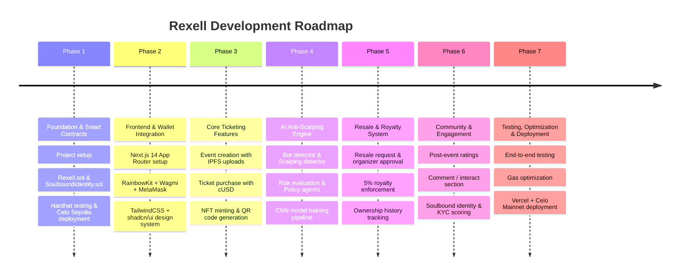
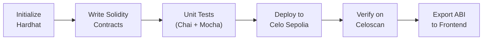
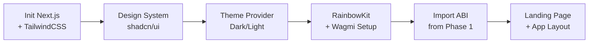
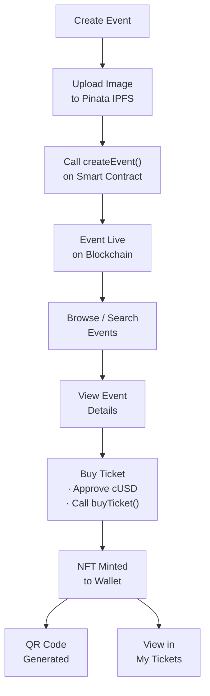
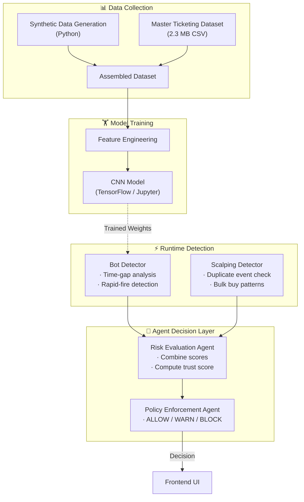
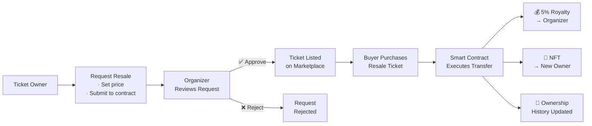
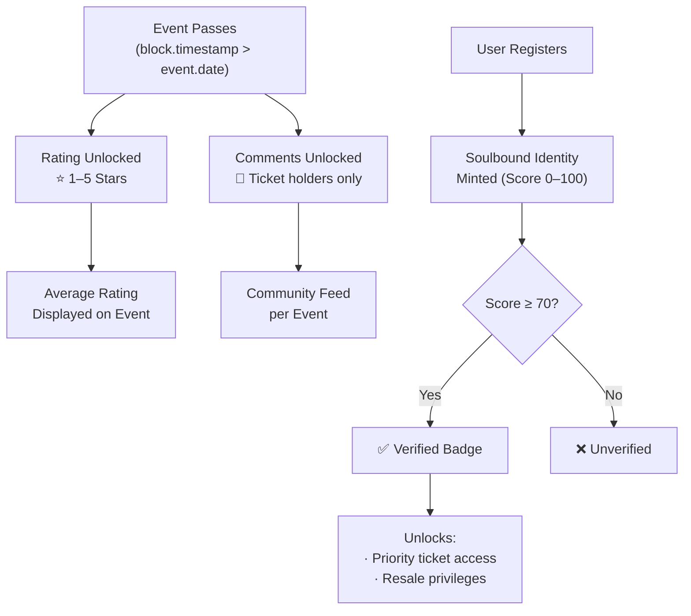
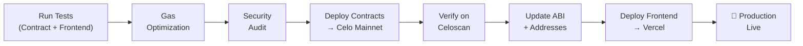
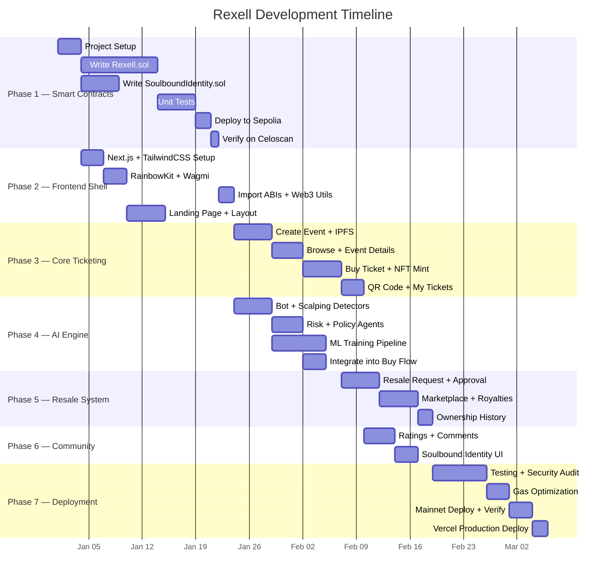
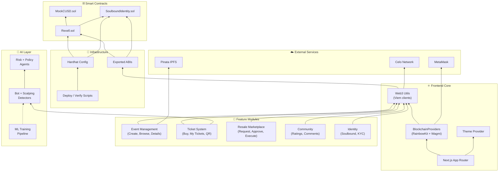

# 💠 REXELL — Project Plan

> A phased development plan for building a Web3 event ticketing platform on Celo with NFT tickets, anti-scalping AI, and resale royalties.

---

## 📑 Table of Contents

- [Project Overview](#project-overview)
- [Development Phases](#development-phases)
- [Phase 1 — Foundation & Smart Contracts](#-phase-1--foundation--smart-contracts)
- [Phase 2 — Frontend & Wallet Integration](#-phase-2--frontend--wallet-integration)
- [Phase 3 — Core Ticketing Features](#-phase-3--core-ticketing-features)
- [Phase 4 — AI Anti-Scalping Engine](#-phase-4--ai-anti-scalping-engine)
- [Phase 5 — Resale & Royalty System](#-phase-5--resale--royalty-system)
- [Phase 6 — Community & Engagement](#-phase-6--community--engagement)
- [Phase 7 — Testing, Optimization & Deployment](#-phase-7--testing-optimization--deployment)
- [Gantt Chart](#-gantt-chart)
- [Module Dependency Map](#-module-dependency-map)
- [Risk & Mitigation](#-risk--mitigation)

---

## Project Overview

| Attribute | Detail |
|---|---|
| **Project** | Rexell — Web3 Event Ticketing Platform |
| **Blockchain** | Celo (EVM-compatible, mobile-first) |
| **Frontend** | Next.js 14 + React 18 + TypeScript |
| **Smart Contracts** | Solidity 0.8.17 + Hardhat + OpenZeppelin |
| **AI/ML** | TypeScript agents + Python CNN model |
| **Storage** | On-chain (Celo) + Off-chain (Pinata IPFS) |
| **Deployment** | Vercel (frontend) + Celo Sepolia/Mainnet (contracts) |

---

## Development Phases

---

## 🔷 Phase 1 — Foundation & Smart Contracts

> Set up the project infrastructure and develop, test, and deploy the core smart contracts.

### Tasks

| # | Task | Tech | Deliverable |
|---|---|---|---|
| 1.1 | Initialize Hardhat project | Hardhat, Node.js, pnpm | `hardhat.config.js`, `package.json` |
| 1.2 | Write `Rexell.sol` | Solidity 0.8.17, OpenZeppelin | ERC-721 contract with event CRUD, ticket minting |
| 1.3 | Write `SoulboundIdentity.sol` | Solidity, OpenZeppelin | Non-transferable ERC-721 identity NFT |
| 1.4 | Write `MockCUSD.sol` | Solidity | Test ERC-20 token for local dev |
| 1.5 | Write unit tests | Hardhat, Chai, Mocha | `test/` directory with full contract coverage |
| 1.6 | Configure Celo networks | Hardhat, dotenv | Sepolia + Mainnet RPC configs |
| 1.7 | Deploy to Celo Sepolia | Hardhat, ethers.js | Deployed contract addresses |
| 1.8 | Verify on Celoscan | hardhat-etherscan | Verified source on Celoscan |
| 1.9 | Create ABI update scripts | TypeScript | `scripts/update-abi.ts` → copies ABI to frontend |

### Flow

---

## 🔷 Phase 2 — Frontend & Wallet Integration

> Build the Next.js application shell, design system, and wallet connectivity.

### Tasks

| # | Task | Tech | Deliverable |
|---|---|---|---|
| 2.1 | Initialize Next.js 14 App Router | Next.js, TypeScript, pnpm | `frontend/` directory |
| 2.2 | Set up TailwindCSS + shadcn/ui | TailwindCSS, Radix UI, PostCSS | Design tokens, `components/ui/` |
| 2.3 | Configure theme provider | next-themes | Dark/Light mode toggle |
| 2.4 | Set up RainbowKit + Wagmi | RainbowKit, Wagmi, Viem | `providers/blockchain-providers.tsx` |
| 2.5 | Configure Celo Sepolia chain | Viem | `lib/celoSepolia.ts` custom chain definition |
| 2.6 | Create web3 utility library | Viem | `lib/web3.ts` — public/wallet clients, price formatting |
| 2.7 | Import contract ABIs | TypeScript | `blockchain/abi/rexell-abi.ts`, `soulbound-abi.ts` |
| 2.8 | Build landing page | React, TailwindCSS | `app/(marketing)/` with hero, features, CTA |
| 2.9 | Build app layout | React | `app/(application)/layout.tsx` with header, footer, nav |

### Flow

---

## 🔷 Phase 3 — Core Ticketing Features

> Implement the primary user flows: creating events, browsing, buying tickets, and generating QR-coded NFTs.

### Tasks

| # | Task | Tech | Deliverable |
|---|---|---|---|
| 3.1 | Create Event page | React, Wagmi, Viem | `app/(application)/create-event/page.tsx` |
| 3.2 | Pinata IPFS upload API | Next.js API Routes, Pinata SDK | `app/api/files/route.ts` |
| 3.3 | Browse Events page | React, Wagmi | `app/(application)/events/page.tsx` |
| 3.4 | Event Details page | React, Wagmi | `app/(application)/event-details/page.tsx` |
| 3.5 | Buy Ticket flow | Wagmi, cUSD (ERC-20 approve + contract call) | `app/(application)/buy/page.tsx` |
| 3.6 | NFT ticket minting | Smart contract interaction | ERC-721 minted to buyer wallet |
| 3.7 | QR code generation | react-qr-code, qrcode | QR with ticket metadata |
| 3.8 | Ticket export as image | html-to-image | Downloadable ticket graphic |
| 3.9 | My Tickets page | React, Wagmi | `app/(application)/my-tickets/page.tsx` |
| 3.10 | My Events (organizer) page | React, Wagmi | `app/(application)/my-events/page.tsx` |
| 3.11 | Purchase History page | React, Wagmi | `app/(application)/history/page.tsx` |

### Flow

---

## 🔷 Phase 4 — AI Anti-Scalping Engine

> Build the multi-layered AI fraud detection system that analyzes every purchase attempt.

### Tasks

| # | Task | Tech | Deliverable |
|---|---|---|---|
| 4.1 | Build Bot Detector model | TypeScript | `lib/ai/models/bot-detector.ts` |
| 4.2 | Build Scalping Detector model | TypeScript | `lib/ai/models/scalping-detector.ts` |
| 4.3 | Build Risk Evaluation Agent | TypeScript | `lib/ai/agents/risk-agent.ts` |
| 4.4 | Build Policy Enforcement Agent | TypeScript | `lib/ai/agents/policy-agent.ts` |
| 4.5 | Build AI Mode orchestrator | TypeScript | `lib/ai/ai-mode.ts` |
| 4.6 | Build AI Logger | TypeScript | `lib/ai/logger.ts` |
| 4.7 | Generate synthetic training data | Python | `ml/generate_data.py` |
| 4.8 | Assemble & preprocess datasets | Python | `dataset/assemble_dataset.py` |
| 4.9 | Train CNN model | Python, TensorFlow | `dataset/CNN.ipynb` |
| 4.10 | Integrate AI into buy flow | React, TypeScript | Warning/Block UI before purchase |
| 4.11 | Build AI API route | Next.js API Routes | `app/api/ai/route.ts` |

### Pipeline Architecture

---

## 🔷 Phase 5 — Resale & Royalty System

> Implement the controlled ticket resale marketplace with organizer verification and royalty payments.

### Tasks

| # | Task | Tech | Deliverable |
|---|---|---|---|
| 5.1 | Resale request submission | Wagmi, Viem | User initiates resale with price |
| 5.2 | Resale verification flow | React | `components/ResaleVerification.tsx` |
| 5.3 | Organizer approval dashboard | React, Wagmi | `app/(application)/resale-approval/page.tsx` |
| 5.4 | Resale API routes | Next.js API Routes | `pages/api/resale-*` (approve, reject, request, ticket) |
| 5.5 | Execute resale with royalty | Smart Contract | 5% royalty auto-deducted, NFT transferred |
| 5.6 | Resale marketplace page | React | `app/(application)/resale/page.tsx` |
| 5.7 | Ownership history tracking | Smart Contract + UI | `HistoryCard.tsx`, on-chain ownership chain |
| 5.8 | Anti-scalping rules | Smart Contract | One-resale-per-ticket limit |

### Resale Flow

---

## 🔷 Phase 6 — Community & Engagement

> Add social features that build trust and community around events.

### Tasks

| # | Task | Tech | Deliverable |
|---|---|---|---|
| 6.1 | Post-event rating system | React, Smart Contract | `submitRating()` — only after event date |
| 6.2 | Star rating UI | react-rating-stars-component | Rating display on event page |
| 6.3 | Comment / interact section | React, Smart Contract | `Comment.tsx`, `addComment()` |
| 6.4 | Soulbound Identity minting | Smart Contract, Wagmi | Identity NFT with KYC score |
| 6.5 | Identity verification UI | React | Display verification status on profile |
| 6.6 | Verified badge on tickets | React | Badge icon for score ≥ 70 |

### Engagement Flow

---

## 🔷 Phase 7 — Testing, Optimization & Deployment

> End-to-end testing, performance tuning, and production deployment.

### Tasks

| # | Task | Tech | Deliverable |
|---|---|---|---|
| 7.1 | Smart contract unit tests | Hardhat, Chai, Mocha | Full test suite in `test/` |
| 7.2 | Frontend component tests | Jest or Vitest | Component test coverage |
| 7.3 | End-to-end user flow tests | Browser testing | Full buy, resale, rating flows |
| 7.4 | Solidity gas optimization | Hardhat gas reporter, `viaIR: true` | Reduced gas costs |
| 7.5 | Frontend performance audit | Lighthouse, Vercel Analytics | Core Web Vitals pass |
| 7.6 | Security audit (contracts) | Slither, manual review | Vulnerability report |
| 7.7 | Deploy contracts to Celo Mainnet | Hardhat | Production contract addresses |
| 7.8 | Verify contracts on Celoscan | hardhat-etherscan | Public verification |
| 7.9 | Deploy frontend to Vercel | Vercel CLI / Git push | Production URL |
| 7.10 | Configure production env | dotenv, Vercel dashboard | Production API keys & RPC URLs |
| 7.11 | Set up monitoring | Vercel Analytics | Usage dashboards |

### Deployment Pipeline

---

## 📅 Gantt Chart

---

## 🗺️ Module Dependency Map

---

## ⚠️ Risk & Mitigation

| Risk | Impact | Likelihood | Mitigation |
|---|---|---|---|
| **Smart contract vulnerability** | 🔴 Critical | Medium | OpenZeppelin audited libs, ReentrancyGuard, unit tests, manual audit |
| **Gas costs too high** | 🟡 Medium | Medium | Solidity optimizer (`runs: 200`, `viaIR: true`), batch operations |
| **Scalping bypasses AI** | 🟡 Medium | Low | Multi-layer detection (bot + scalping + agents), on-chain one-resale limit |
| **IPFS gateway downtime** | 🟡 Medium | Low | Pinata dedicated gateway, fallback to `ipfs.io` |
| **MetaMask UX friction** | 🟡 Medium | High | RainbowKit simplifies flow, clear error messages |
| **Celo network congestion** | 🟠 Low | Low | Low gas fees on Celo, transaction retry logic |
| **Private key exposure** | 🔴 Critical | Low | `.env` in `.gitignore`, deployment via secure CI/CD |

---

<i>💠 Rexell — Revolutionizing event ticketing with blockchain technology</i>

