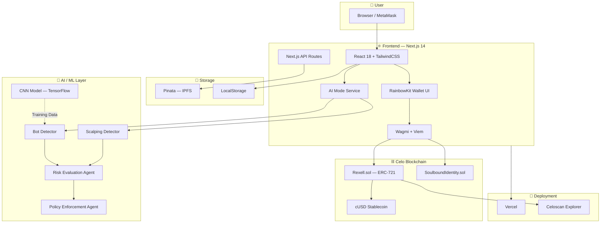
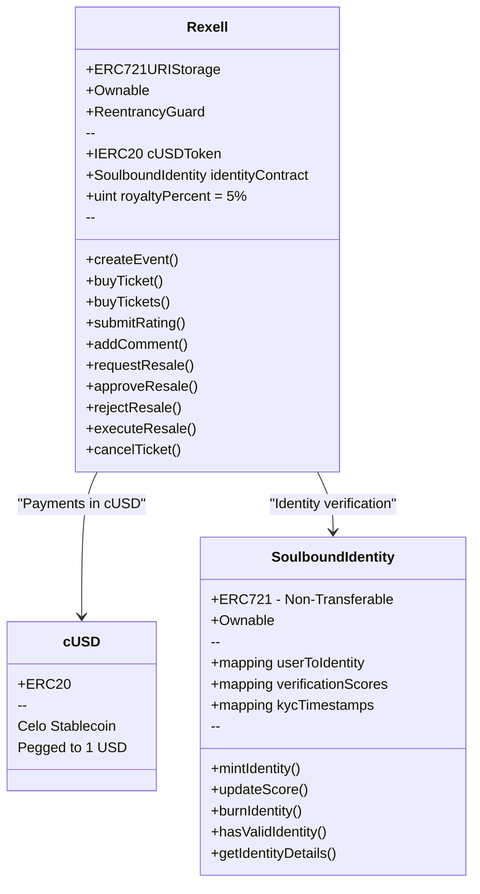
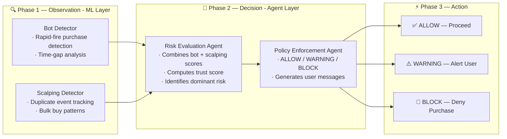
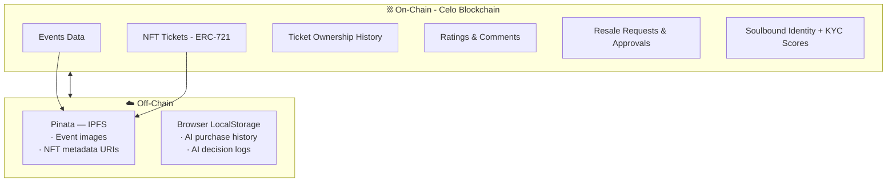
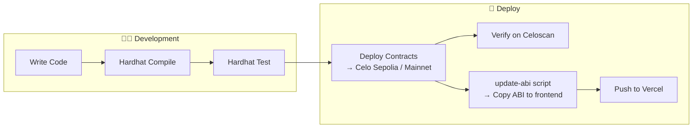
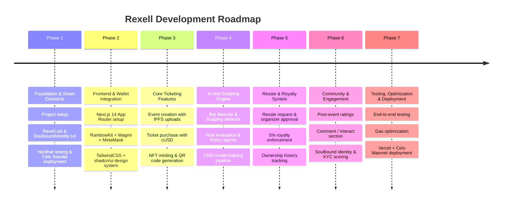
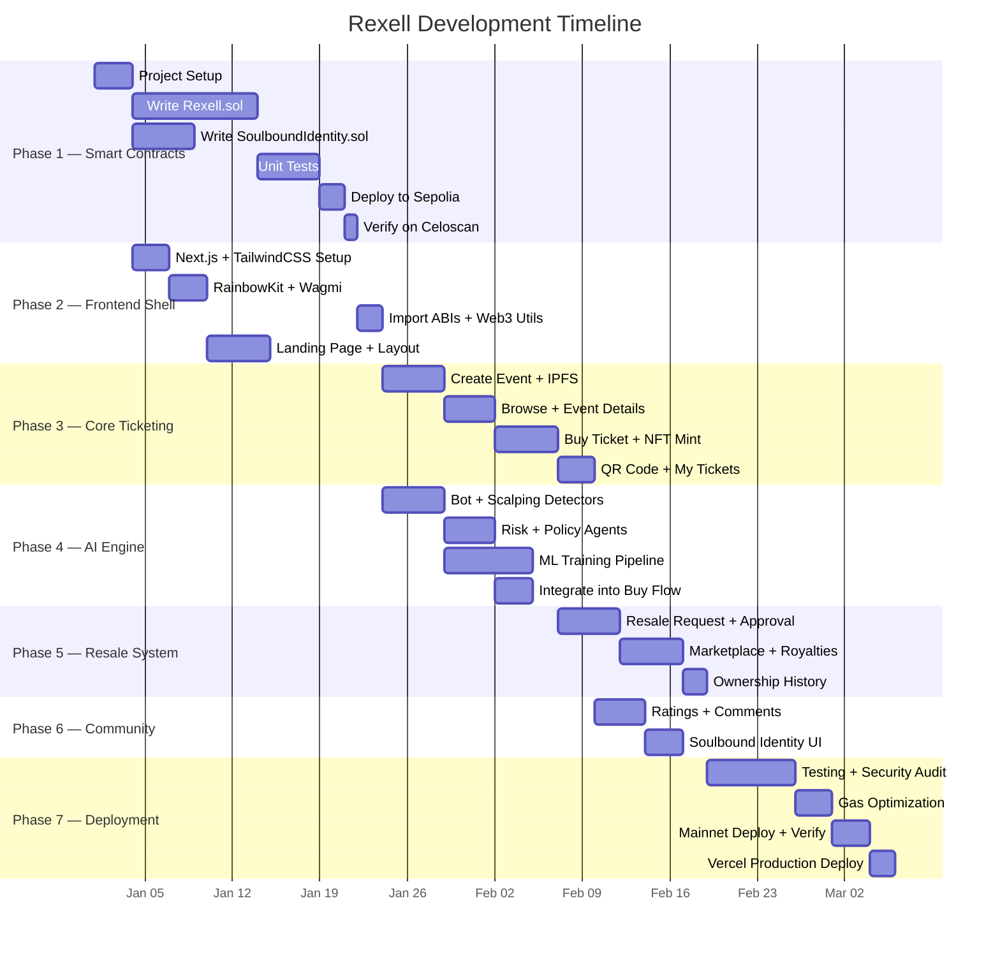
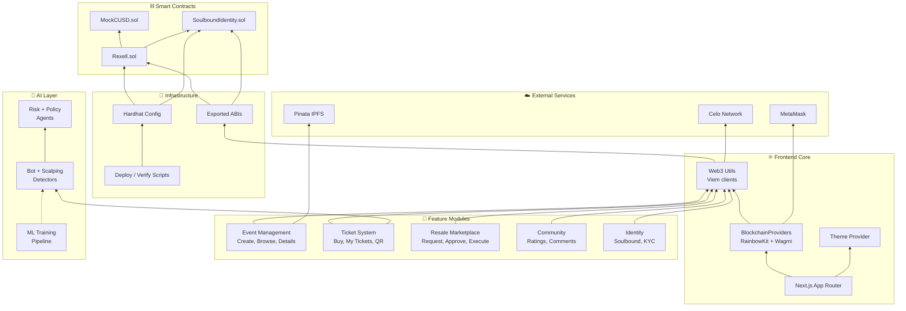

<!-- TITLE -->
<h1 align="center">💠 REXELL 💠</h1>

<p align="center">
  <b>Web3 Platform for Events</b><br>
  Revolutionizing event ticketing with blockchain technology.
</p>

<details>
<summary> Table of Contents</summary>

- [About the Project](#about-the-project)
- [High-Level Architecture](#high-level-architecture)
- [Frontend](#-frontend)
- [Blockchain / Smart Contracts](#-blockchain--smart-contracts)
- [AI / ML Anti-Scalping Engine](#-aiml-anti-scalping-engine)
- [Storage & Data Layer](#-storage--data-layer)
- [DevOps & Deployment](#-devops--deployment)
- [Application Flow](#-application-flow)
- [Project Plan](#-project-plan)
- [Gantt Chart](#-gantt-chart)
- [Risk & Mitigation](#-risk--mitigation)
- [Tech Stack Summary](#-tech-stack-summary)
- [Resale Functionality](#resale-functionality)
- [Installation and Setup](#installation-and-setup)

</details>

## About the Project

**Summary**: Rexell is a blockchain-based platform where users can create events and buy NFT tickets, tackling ticket scalping and enhancing trust. 

**Problem Statement**: The traditional event ticketing industry faces numerous challenges, including ticket scalping, fraud, and lack of transparency. These issues undermine trust and can result in significant financial losses for both event organizers and attendees. Additionally, there is often no reliable way to verify the authenticity of an event, leaving buyers unsure of the legitimacy of the events they plan to attend.

**Solution**: Rexell offers a blockchain-based platform where users can create events and purchase tickets that are issued as Non-Fungible Tokens (NFTs). This innovative approach ensures that each ticket is unique, verifiable, and secure, addressing the problems of ticket scalping and fraud. By recording transactions on the blockchain, Rexell provides a transparent and immutable record of ticket ownership and event details.

### Objectives
- **Eliminate Ticket Scalping and Fraud**: Implement blockchain technology to issue tickets as NFTs, ensuring their authenticity and preventing duplication or counterfeit tickets.
- **Enhance Trust and Transparency**: Provide a transparent platform where all transactions and ticket ownership are recorded on the blockchain, fostering trust among users.
- **Simplify Event Creation and Management**: Offer a user-friendly interface for event organizers to create and manage their events, streamlining the process of selling tickets.

### Scope
- **Event Creation and Management**: Users can create, manage, and promote their events on the Rexell platform. Event organizers will have access to tools for tracking ticket sales and managing attendees.
- **NFT Ticketing System**: All tickets will be issued as NFTs, providing a secure and verifiable method of ticket distribution. This system will prevent ticket scalping and fraud by ensuring each ticket is unique and traceable.
- **Blockchain-Based Transactions**: All ticket sales and transfers will be recorded on the blockchain, ensuring transparency and immutability of all transactions.
- **User-Friendly Interface**: The platform will be designed with a focus on usability, ensuring a seamless experience for both event organizers and attendees.
- **Resale Functionality**: Users can resell their tickets through a verification process that prevents scalping.

#### Additional Features
- **Rating Section**: There is a section where only those who bought the tickets rate how the event was. This section only works after the event has passed.
- **Interact Section**: There is a section where ticket holders can interact by posting comments. Ticket holders can also use this section to give feedback on how the event was.
- **Anti-Scalping Resale System**: Users can resell tickets only after organizer verification to prevent scalping.

---

## High-Level Architecture



---

## ⚛️ Frontend

The frontend is a **Next.js 14** application using the **App Router** pattern with **React 18** and **TypeScript**.

### Core Framework

| Technology | Version | Purpose |
|---|---|---|
| **Next.js** | 14.2.3 | React meta-framework (SSR, API Routes, App Router) |
| **React** | 18.x | Component-based UI library |
| **TypeScript** | 5.x | Static type checking |

### Styling & UI

| Technology | Version | Purpose |
|---|---|---|
| **TailwindCSS** | 3.4.1 | Utility-first CSS framework |
| **Radix UI** (shadcn/ui) | Various | Accessible, unstyled component primitives |
| **Lucide React** | 0.376.0 | Icon library |
| **Sonner** | 1.4.41 | Toast notification system |
| **next-themes** | 0.3.0 | Dark / light theme toggling |
| **class-variance-authority** | 0.7.0 | Component variant management |
| **tailwind-merge** | 2.3.0 | Tailwind class conflict resolution |
| **tailwindcss-animate** | 1.0.7 | Animation utilities |

#### Radix UI Primitives Used

`Accordion` · `Avatar` · `Dropdown Menu` · `Label` · `Menubar` · `Popover` · `Select` · `Slot`

### Web3 / Blockchain Integration

| Technology | Version | Purpose |
|---|---|---|
| **RainbowKit** | 2.0.6 | Wallet connection UI (MetaMask) |
| **Wagmi** | 2.7.1 | React hooks for Ethereum |
| **Viem** | 2.9.29 | Low-level EVM interaction (ABI encoding, contract calls) |
| **@celo/contractkit** | 8.0.0 | Celo-specific transaction helpers |
| **@celo/rainbowkit-celo** | 1.2.0 | Celo chain presets for RainbowKit |
| **ethers.js** | 6.16.0 | Ethereum library (deployment scripts) |
| **web3.js** | 1.10 | Alternative Web3 library |

### Utilities

| Technology | Purpose |
|---|---|
| **@tanstack/react-query** | Async state management & caching |
| **date-fns** | Date formatting and manipulation |
| **qrcode / react-qr-code** | QR code generation for tickets |
| **html-to-image** | Screenshot / export tickets as images |
| **react-day-picker** | Calendar date picker component |
| **react-rating-stars-component** | Star-based event rating |
| **react-icons** | Additional icon sets |
| **@vercel/analytics** | Usage analytics |

### Frontend Directory Structure

```
frontend/
├── app/                    # Next.js App Router
│   ├── (application)/      # Authenticated app pages
│   │   ├── buy/            # Buy tickets
│   │   ├── create-event/   # Create new events
│   │   ├── event-details/  # Event detail view
│   │   ├── events/         # Browse all events
│   │   ├── history/        # Purchase history
│   │   ├── market/         # Marketplace
│   │   ├── my-events/      # Organizer's events
│   │   ├── my-tickets/     # User's tickets
│   │   ├── resale/         # Resale marketplace
│   │   ├── resale-approval/# Organizer approves resale
│   │   └── resell/         # List ticket for resale
│   ├── (marketing)/        # Public landing pages
│   └── api/                # API routes (ai, files)
├── blockchain/             # ABI files & chain config
├── components/             # Reusable React components
│   ├── ui/                 # shadcn/ui primitives
│   ├── landing/            # Landing page sections
│   ├── shared/             # Shared components
│   └── AI/                 # AI mode components
├── lib/                    # Core utilities
│   ├── ai/                 # AI anti-scalping engine
│   │   ├── agents/         # Risk & policy agents
│   │   └── models/         # Bot & scalping detectors
│   ├── web3.ts             # Viem client setup
│   └── celoSepolia.ts      # Custom chain config
├── ml/                     # ML training scripts
├── providers/              # Context providers
│   ├── blockchain-providers.tsx
│   └── theme-provider.tsx
└── public/                 # Static assets
```

---

## ⛓️ Blockchain / Smart Contracts

The project uses **Solidity** smart contracts deployed on the **Celo** blockchain (EVM-compatible, mobile-first, carbon-negative).

### Smart Contract Stack

| Technology | Version | Purpose |
|---|---|---|
| **Solidity** | 0.8.17 | Smart contract language |
| **Hardhat** | 2.22.3 | Development, testing & deployment framework |
| **OpenZeppelin** | 4.9.6 | Audited contract libraries (ERC-721, Ownable, ReentrancyGuard) |
| **@nomicfoundation/hardhat-toolbox** | 5.0.0 | Hardhat plugins bundle |
| **@nomicfoundation/hardhat-ethers** | 3.1.0 | Ethers.js integration for Hardhat |

### Networks

| Network | Chain ID | RPC URL | Explorer |
|---|---|---|---|
| **Celo Mainnet** | 42220 | `https://forno.celo.org` | [celoscan.io](https://celoscan.io) |
| **Celo Sepolia (Testnet)** | 11142220 | `https://celo-sepolia.drpc.org` | [sepolia.celoscan.io](https://sepolia.celoscan.io) |
| **Hardhat (Local)** | 31337 | `http://127.0.0.1:8545` | — |

### Contracts



#### Rexell.sol — Main Contract (742 lines)
- **ERC-721 NFT Tickets** — each ticket is a unique NFT with metadata URI
- **Event CRUD** — create events with name, venue, category, date, price, IPFS image
- **Ticket Purchase** — pay with cUSD (Celo Dollar stablecoin), mint NFT
- **Rating & Comments** — post-event ratings (only after event date) and comments
- **Anti-Scalping Resale** — request → organizer approval → execute with 5% royalty
- **Ownership History** — full on-chain tracking of ticket transfers

#### SoulboundIdentity.sol — Identity Contract (91 lines)
- **Non-Transferable (Soulbound) NFT** — cannot be transferred once minted
- **KYC Verification Score** (0–100) — determines user trustworthiness
- **Identity Validation** — users need score ≥ 70 to be considered verified

---

## 🤖 AI/ML Anti-Scalping Engine

Rexell includes a multi-layered AI system that detects and prevents ticket scalping and bot activity.

### Architecture — Agentic Pipeline



### AI Components

| Component | File | Role |
|---|---|---|
| **Bot Detector** | `lib/ai/models/bot-detector.ts` | Analyzes purchase timing patterns to detect automated bots |
| **Scalping Detector** | `lib/ai/models/scalping-detector.ts` | Flags users buying duplicates or bulk tickets for same event |
| **Risk Evaluation Agent** | `lib/ai/agents/risk-agent.ts` | Combines detector scores into a unified trust score |
| **Policy Enforcement Agent** | `lib/ai/agents/policy-agent.ts` | Makes final ALLOW / WARNING / BLOCK decision |
| **AI Mode Service** | `lib/ai/ai-mode.ts` | Orchestrates the full pipeline per purchase attempt |
| **AI Logger** | `lib/ai/logger.ts` | Logs AI decisions for auditing |

### ML Training Pipeline

| File | Language | Purpose |
|---|---|---|
| `ml/generate_data.py` | Python | Generate synthetic training data |
| `ml/train_model.py` | Python | Train ML model (TensorFlow/scikit-learn) |
| `ml/train_model.js` | JavaScript | Alternative JS-based training |
| `dataset/CNN.ipynb` | Jupyter | CNN model experimentation notebook |
| `dataset/assemble_dataset.py` | Python | Assemble and preprocess raw datasets |
| `dataset/blockchain_ticketing_master.csv` | CSV | 2.3 MB master ticketing dataset |

---

## 💾 Storage & Data Layer

Rexell uses a **decentralized storage** approach — no traditional database.



| Layer | Technology | Data Stored |
|---|---|---|
| **On-Chain** | Celo Blockchain | Events, tickets (NFTs), ratings, comments, resale state, identity |
| **IPFS (Pinata)** | Pinata Cloud Gateway | Event images, NFT metadata JSON, ticket artwork |
| **Client-side** | Browser LocalStorage | AI purchase history, decision logs |

---

## 🚀 DevOps & Deployment

| Tool | Purpose |
|---|---|
| **Vercel** | Frontend hosting (Next.js optimized) |
| **Netlify** | Alternative static hosting (config present) |
| **Hardhat** | Smart contract compilation, testing & deployment |
| **Celoscan** | On-chain contract verification & explorer |
| **pnpm** | Package manager |
| **ESLint** | Code linting |
| **Prettier** | Code formatting |
| **PostCSS** | CSS processing pipeline |

### Deployment Flow



---

## 🔄 Application Flow

### End-to-End User Journey


---

## 📋 Project Plan

Rexell is developed in **7 phases**:



### Phase 1 — Foundation & Smart Contracts

| # | Task | Tech | Deliverable |
|---|---|---|---|
| 1.1 | Initialize Hardhat project | Hardhat, Node.js, pnpm | `hardhat.config.js`, `package.json` |
| 1.2 | Write `Rexell.sol` | Solidity 0.8.17, OpenZeppelin | ERC-721 contract with event CRUD, ticket minting |
| 1.3 | Write `SoulboundIdentity.sol` | Solidity, OpenZeppelin | Non-transferable ERC-721 identity NFT |
| 1.4 | Write `MockCUSD.sol` | Solidity | Test ERC-20 token for local dev |
| 1.5 | Write unit tests | Hardhat, Chai, Mocha | `test/` directory with full contract coverage |
| 1.6 | Deploy to Celo Sepolia | Hardhat, ethers.js | Deployed contract addresses |
| 1.7 | Verify on Celoscan | hardhat-etherscan | Verified source on Celoscan |
| 1.8 | Create ABI update scripts | TypeScript | `scripts/update-abi.ts` → copies ABI to frontend |

### Phase 2 — Frontend & Wallet Integration

| # | Task | Tech | Deliverable |
|---|---|---|---|
| 2.1 | Initialize Next.js 14 App Router | Next.js, TypeScript, pnpm | `frontend/` directory |
| 2.2 | Set up TailwindCSS + shadcn/ui | TailwindCSS, Radix UI, PostCSS | Design tokens, `components/ui/` |
| 2.3 | Configure theme provider | next-themes | Dark/Light mode toggle |
| 2.4 | Set up RainbowKit + Wagmi | RainbowKit, Wagmi, Viem | `providers/blockchain-providers.tsx` |
| 2.5 | Configure Celo Sepolia chain | Viem | `lib/celoSepolia.ts` custom chain definition |
| 2.6 | Create web3 utility library | Viem | `lib/web3.ts` — public/wallet clients, price formatting |
| 2.7 | Import contract ABIs | TypeScript | `blockchain/abi/rexell-abi.ts`, `soulbound-abi.ts` |
| 2.8 | Build landing page + app layout | React, TailwindCSS | `app/(marketing)/`, header, footer, nav |

### Phase 3 — Core Ticketing Features

| # | Task | Tech | Deliverable |
|---|---|---|---|
| 3.1 | Create Event page | React, Wagmi, Viem | `app/(application)/create-event/page.tsx` |
| 3.2 | Pinata IPFS upload API | Next.js API Routes, Pinata SDK | `app/api/files/route.ts` |
| 3.3 | Browse Events + Event Details | React, Wagmi | Events listing and detail pages |
| 3.4 | Buy Ticket flow | Wagmi, cUSD (ERC-20 approve + contract call) | `app/(application)/buy/page.tsx` |
| 3.5 | NFT ticket minting | Smart contract interaction | ERC-721 minted to buyer wallet |
| 3.6 | QR code generation + ticket export | react-qr-code, html-to-image | QR with metadata, downloadable graphic |
| 3.7 | My Tickets + My Events pages | React, Wagmi | User's tickets and organizer's events |
| 3.8 | Purchase History page | React, Wagmi | `app/(application)/history/page.tsx` |

### Phase 4 — AI Anti-Scalping Engine

| # | Task | Tech | Deliverable |
|---|---|---|---|
| 4.1 | Build Bot Detector model | TypeScript | `lib/ai/models/bot-detector.ts` |
| 4.2 | Build Scalping Detector model | TypeScript | `lib/ai/models/scalping-detector.ts` |
| 4.3 | Build Risk Evaluation Agent | TypeScript | `lib/ai/agents/risk-agent.ts` |
| 4.4 | Build Policy Enforcement Agent | TypeScript | `lib/ai/agents/policy-agent.ts` |
| 4.5 | Build AI Mode orchestrator | TypeScript | `lib/ai/ai-mode.ts` |
| 4.6 | Generate synthetic training data | Python | `ml/generate_data.py` |
| 4.7 | Train CNN model | Python, TensorFlow | `dataset/CNN.ipynb` |
| 4.8 | Integrate AI into buy flow | React, TypeScript | Warning/Block UI before purchase |

### Phase 5 — Resale & Royalty System

| # | Task | Tech | Deliverable |
|---|---|---|---|
| 5.1 | Resale request submission | Wagmi, Viem | User initiates resale with price |
| 5.2 | Resale verification flow | React | `components/ResaleVerification.tsx` |
| 5.3 | Organizer approval dashboard | React, Wagmi | `app/(application)/resale-approval/page.tsx` |
| 5.4 | Resale API routes | Next.js API Routes | `pages/api/resale-*` |
| 5.5 | Execute resale with royalty | Smart Contract | 5% royalty auto-deducted, NFT transferred |
| 5.6 | Resale marketplace page | React | `app/(application)/resale/page.tsx` |
| 5.7 | Ownership history tracking | Smart Contract + UI | `HistoryCard.tsx`, on-chain ownership chain |

### Phase 6 — Community & Engagement

| # | Task | Tech | Deliverable |
|---|---|---|---|
| 6.1 | Post-event rating system | React, Smart Contract | `submitRating()` — only after event date |
| 6.2 | Star rating UI | react-rating-stars-component | Rating display on event page |
| 6.3 | Comment / interact section | React, Smart Contract | `Comment.tsx`, `addComment()` |
| 6.4 | Soulbound Identity minting | Smart Contract, Wagmi | Identity NFT with KYC score |
| 6.5 | Identity verification UI | React | Display verification status, verified badge |

### Phase 7 — Testing, Optimization & Deployment

| # | Task | Tech | Deliverable |
|---|---|---|---|
| 7.1 | Smart contract unit tests | Hardhat, Chai, Mocha | Full test suite in `test/` |
| 7.2 | End-to-end user flow tests | Browser testing | Full buy, resale, rating flows |
| 7.3 | Solidity gas optimization | Hardhat gas reporter, `viaIR: true` | Reduced gas costs |
| 7.4 | Security audit (contracts) | Slither, manual review | Vulnerability report |
| 7.5 | Deploy contracts to Celo Mainnet | Hardhat | Production contract addresses |
| 7.6 | Verify contracts on Celoscan | hardhat-etherscan | Public verification |
| 7.7 | Deploy frontend to Vercel | Vercel CLI / Git push | Production URL |

---

## 📅 Gantt Chart



---

## 🗺️ Module Dependency Map



---

## ⚠️ Risk & Mitigation

| Risk | Impact | Likelihood | Mitigation |
|---|---|---|---|
| **Smart contract vulnerability** | 🔴 Critical | Medium | OpenZeppelin audited libs, ReentrancyGuard, unit tests, manual audit |
| **Gas costs too high** | 🟡 Medium | Medium | Solidity optimizer (`runs: 200`, `viaIR: true`), batch operations |
| **Scalping bypasses AI** | 🟡 Medium | Low | Multi-layer detection (bot + scalping + agents), on-chain one-resale limit |
| **IPFS gateway downtime** | 🟡 Medium | Low | Pinata dedicated gateway, fallback to `ipfs.io` |
| **MetaMask UX friction** | 🟡 Medium | High | RainbowKit simplifies flow, clear error messages |
| **Celo network congestion** | 🟠 Low | Low | Low gas fees on Celo, transaction retry logic |
| **Private key exposure** | 🔴 Critical | Low | `.env` in `.gitignore`, deployment via secure CI/CD |

---

## 📊 Tech Stack Summary

| Layer | Technologies |
|---|---|
| **Frontend Framework** | Next.js 14, React 18, TypeScript 5 |
| **Styling** | TailwindCSS 3.4, Radix UI / shadcn/ui, Lucide Icons |
| **State Management** | TanStack React Query, React Context |
| **Web3 Client** | Wagmi 2, Viem 2, RainbowKit 2, Celo ContractKit |
| **Wallet** | MetaMask (via RainbowKit) |
| **Blockchain** | Celo (EVM-compatible, Mainnet + Sepolia Testnet) |
| **Smart Contracts** | Solidity 0.8.17, OpenZeppelin 4.9.6 |
| **Token Standard** | ERC-721 (NFT Tickets), ERC-20 (cUSD Payments) |
| **Identity** | Soulbound NFT (Non-Transferable ERC-721) |
| **Dev Framework** | Hardhat 2.22, Ethers.js 6 |
| **AI/ML** | Custom TypeScript agents, Python (TensorFlow, CNN) |
| **Storage** | Pinata IPFS (images/metadata), Celo (on-chain data) |
| **Deployment** | Vercel (frontend), Celoscan (contract verification) |
| **Package Manager** | pnpm |
| **Linting & Formatting** | ESLint, Prettier |
| **Analytics** | Vercel Analytics |

---

## Resale Functionality

Rexell includes a comprehensive resale system designed to prevent ticket scalping while allowing legitimate ticket transfers:

1. **Resale Verification**: Users must request verification before reselling tickets
2. **Organizer Approval**: Event organizers must approve all resale requests
3. **Price Control**: Resale prices are visible to organizers
4. **Limited Resales**: Each ticket can only be resold once

For detailed information about the resale functionality, see [RESALE.md](frontend/components/RESALE.md).

## Installation and Setup

### Prerequisites
Ensure you have **Node.js** installed.

### Steps
1. Clone the repository:
   ```bash
   git clone https://github.com/Sayyed23/Rexell
   cd Rexell/frontend
   ```
2. Install dependencies:

    ```bash
    pnpm install
    ```

3. Run the application:

    ```bash
    npm run dev
    ```

------

<p align="center"><i>💠 Rexell — Built with ❤️ on the Celo blockchain</i></p>
<p align="right">(<a href="#top">back to top</a>)</p>
