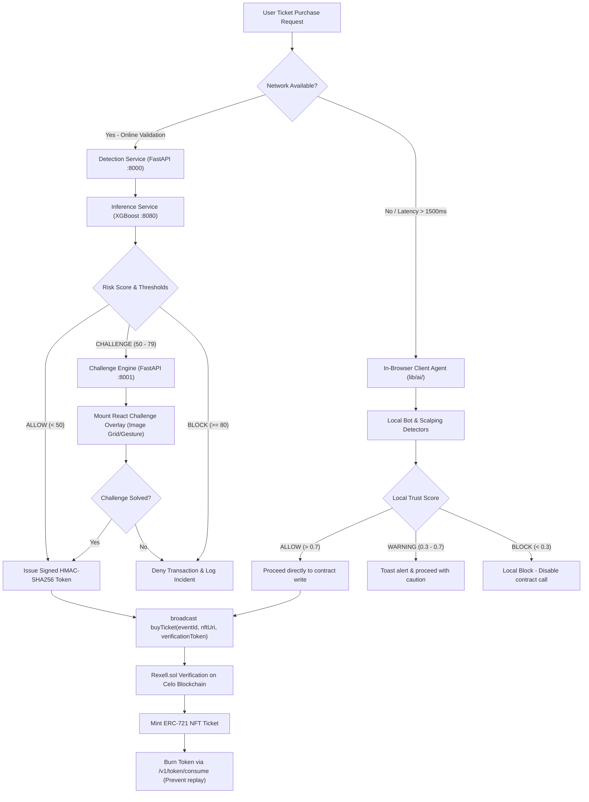
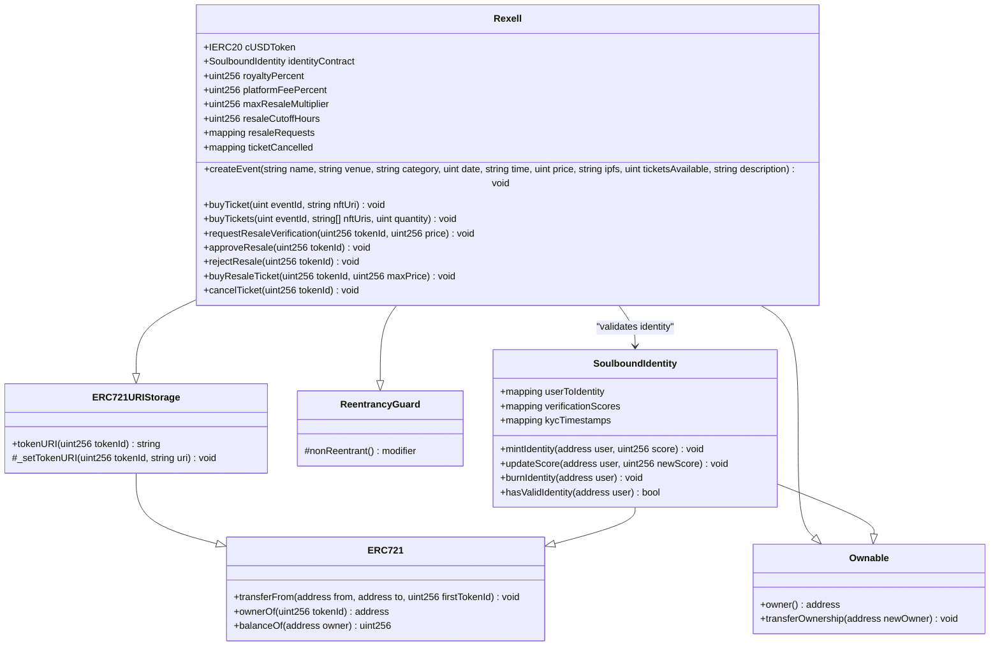

# Rexell Technical Specification Blueprint

Rexell is a state-of-the-art, privacy-first, Web3 event ticketing and anti-scalping suite built for the HackIndia AI Agents Hackathon 2026.
This blueprint serves as a comprehensive developer manual detailing our smart contract architectures, server-side bot-detection microservices, behavioral biometrics extraction, dynamic challenges, and database models.

---

## 🗺️ 1. Project Vision & Core Philosophy

The traditional ticketing industry suffers from systemic inefficiencies, including hyper-inflationary ticket scalping, automated front-running bots, duplication fraud, and a complete lack of transparency in secondary marketplaces. Event organizers rarely profit from high secondary markups, and genuine fans are priced out by automated buying scripts.

**Rexell** resolves these issues by combining a **mobile-friendly Web3 EVM architecture** with a **real-time behavioral bot detection network**. It guarantees that tickets are issued as unique cryptographic NFTs, payments are completed securely using stablecoins, and ticket purchases/resales are actively gated by predictive machine learning models.

### The Four Pillars of Rexell

1. **Soulbound Identity & Trusted KYC**: By enforcing a non-transferable Soulbound identity NFT (`SoulboundIdentity.sol` or RID), users maintain an on-chain verification score (0–100). Only wallets scoring $\ge 70$ can purchase tickets or list them on the secondary marketplace, tying purchase permissions to cryptographic humanity.
2. **Invisible Biometric Behavioral Telemetry**: Real-time client-side tracking records mouse movements, click cadence, keystroke flight times, and window focus dynamics at $\ge 20\text{ Hz}$. Headless automation frameworks (Puppeteer, Playwright, Selenium) are silently identified before a transaction can be signed.
3. **Anti-Scalping Resale Gating & Organizer Royalties**: Tickets can only be listed on the secondary market with organizer approval. The platform caps listing prices at $200\%$ of the face value, stops listings $48\text{ hours}$ before the event starts, and automatically routes $5\%$ royalty to the organizer, $2\%$ platform fee, and $93\%$ to the seller.
4. **GDPR-Compliant Privacy-First Telemetry**: User privacy is preserved by hashing public wallet keys using SHA-256 with a secret salt (`WALLET_SALT`). IP addresses are truncated to subnets (/24 for IPv4, /48 for IPv6), and behavioral databases automatically purge raw data after $90\text{ days}$.

---

## 🏗️ 2. System Architecture & Hybrid Flow

Rexell implements a dual-layer fraud prevention system to balance low-latency user interfaces with secure, decentralized transaction gating:



### Modular Monorepo Components

* **`frontend` (Next.js 14 Web Portal)**: Provides the SSR/ISR React application, incorporates RainbowKit and Wagmi for Celo wallet connectivity, loads in-browser AI heuristic agents (`lib/ai/`), and mounts the Behavioral SDK tracker.
* **`contracts` (Solidity Smart Contracts)**: Contains `Rexell.sol` (the primary ticket management, purchase, and marketplace ledger), `SoulboundIdentity.sol` (RID token), and mock cUSD ERC-20 payment frameworks.
* **`bot-detection/services` (FastAPI Microservices)**: 
  * `detection`: Manages telemetry ingestion, feature extraction, rate limiting, and Base64 HMAC token validation.
  * `inference`: Hosts the XGBoost classification model server.
  * `challenge`: Drives adaptive, interactive multi-step verification challenges.
  * `training`: K8s CronJob executing monthly retraining runs.
* **`bot-detection/sdk` (Behavioral Telemetry SDK)**: Lightweight TypeScript tracking module loaded in the user's browser, sampling user events into a circular buffer and submitting vectors to the API.

---

## 🔌 3. Technology Stack

Rexell utilizes high-performance, enterprise-grade frameworks across all application tiers:

| Operational Layer | Core Frameworks & Tools | Key Purpose in Rexell |
| :--- | :--- | :--- |
| **Web Frontend** | Next.js 14, React 18, TypeScript 5 | Responsive interface rendering, server-side rendering (SSR), and secure API routes. |
| **Styling & Icons** | TailwindCSS 3.4, Radix UI, Lucide Icons | Premium styling, glassmorphism, responsive grid layout, and accessible visual cues. |
| **Web3 Client Interaction** | Wagmi 2, Viem 2, RainbowKit 2 | EVM event listeners, ABI serialization, wallet connection (MetaMask), and contract transaction broadcasting. |
| **EVM Blockchain** | Celo Sepolia Testnet & Celo Mainnet | Zero-carbon, mobile-first, low-gas execution environment for NFT tickets and KYC identities. |
| **Smart Contracts** | Solidity 0.8.17, OpenZeppelin 4.9.6 | Secure contract patterns (ERC-721 URI Storage, ReentrancyGuard, Ownable). |
| **Stablecoin Ledger** | ERC-20 (cUSD Token) | Decentralized stable value processing for event creation and ticket sales. |
| **ML Inference Engine** | FastAPI, XGBoost, Joblib | 8080 model server performing microsecond classification on behavioral vectors. |
| **State & Message Brokers** | PostgreSQL, Redis, RabbitMQ | Postgres for risk events, Redis for rate limiting, RabbitMQ for security alert propagation. |
| **Artifact & File Storage** | Pinata IPFS, MinIO / AWS S3 | IPFS for decentralized ticket metadata, MinIO/S3 for XGBoost model file distributions. |
| **Deployment Infrastructure** | Vercel (Frontend), Kubernetes & AWS CDK | High-availability hosting, horizontal autoscaling (HPA), and IaC serverless definitions. |

---

## 🧠 4. Model Training & Feature Engineering Pipeline

### XGBoost Model Configuration

To prevent automated scripts from bypassing static checks, Rexell trains an **XGBoost Classifier** on user kinematics. The model is tuned to enforce low false-positive rates to prevent blocking legitimate buyers:

```python
XGBOOST_MODEL_PARAMS = {
    "n_estimators": 250,
    "max_depth": 6,
    "learning_rate": 0.05,
    "subsample": 0.8,
    "colsample_bytree": 0.8,
    "objective": "binary:logistic",
    "eval_metric": "auc",
    "scale_pos_weight": 1.0,
    "random_state": 42
}
```

### Telemetry Feature Extraction

The Behavioral SDK captures user interactions at $\ge 20\text{ Hz}$ and compiles them into a vector of $30+$ features:

1. **Velocity Standard Deviation (`velocity_std_dev`)**: Variation in cursor movement speed. Humans show high velocity variance; bots show constant speed.
2. **Path Curvature (`path_curvature`)**: Sum of angles between consecutive movement segments. Bots exhibit near-zero curvature (straight lines) or constant curves.
3. **Click Cadence (`click_dwell_ratio`)**: The time delta between `mousedown` and `mouseup` events. Automation tools show identical clicks ($\le 2\text{ ms}$).
4. **Keystroke Dwell Time (`keystroke_dwell_mean`)**: The average duration a keyboard key is depressed (typically $80\text{ ms}$–$120\text{ ms}$ for humans).
5. **Focus Entropy (`focus_transition_entropy`)**: Frequency of window focus changes. Excessive tab transitions indicate automated scrapers scraping other events.

### Server-Side Risk Scoring Algorithm

The `RiskScorer` combines live ML classification probabilities with historical user reputation scores:

```python
# Combined Risk Scoring Logic in FastAPI Detection Service
class RiskScorer:
    def __init__(self, ml_client: MLInferenceClient, reputation_service: ReputationService):
        self.ml_client = ml_client
        self.reputation_service = reputation_service

    async def calculate_risk_score(
        self, 
        user_hash: str, 
        features: FeatureVector, 
        context: Optional[RiskContext] = None
    ) -> RiskScore:
        factors: List[RiskFactor] = []
        
        # 1. Obtain probability from XGBoost inference server (0.0 to 1.0)
        ml_prob = await self.ml_client.get_prediction_with_fallback(user_hash, features)
        ml_score = ml_prob * 100.0
        
        factors.append(RiskFactor(
            factor="behavioral_ml_inference",
            contribution=ml_score,
            description=f"XGBoost probability: {ml_prob:.4f}"
        ))

        # 2. Extract 30-day user reputation score (0.0 to 100.0)
        reputation = await self.reputation_service.get_reputation_score(user_hash)
        
        # Human reputation reduces score by up to 20; bot history adds up to 20
        rep_contribution = (50.0 - reputation) * 0.4 
        factors.append(RiskFactor(
            factor="user_reputation",
            contribution=rep_contribution,
            description=f"Reputation rating: {reputation:.1f}"
        ))

        final_score = ml_score + rep_contribution

        # 3. Apply multiplier policy for bulk purchases
        if context and context.isBulkPurchase:
            pre_multiplier_score = final_score
            final_score *= 1.5  # 50% risk markup for bulk ticketing
            factors.append(RiskFactor(
                factor="bulk_purchase_policy",
                contribution=final_score - pre_multiplier_score,
                description=f"Bulk risk multiplier applied (Qty: {context.requestedQuantity})"
            ))

        # Clamp between 0.0 and 100.0
        final_score = max(0.0, min(100.0, final_score))

        # Determine enforcement decision
        decision = DetectionResponseDecision.allow
        if final_score >= 80.0: # settings.RISK_THRESHOLD_BLOCK
            decision = DetectionResponseDecision.block
        elif final_score >= 50.0: # settings.RISK_THRESHOLD_CHALLENGE
            decision = DetectionResponseDecision.challenge

        return RiskScore(
            score=final_score,
            factors=factors,
            decision=decision
        )
```

---

## ⛓️ 5. Soulbound Identity & Web3 KYC Integration

To guarantee account integrity, Rexell utilizes a **Soulbound KYC identity token (`SoulboundIdentity.sol`)** that links verification data to Celo addresses.

### Soulbound Rid Details

* **Non-Transferable**: The contract overrides `_beforeTokenTransfer` to revert all transfers except minting and burning, anchoring the identity token to a single wallet address.
* **On-Chain KYC Score**: The contract owner (an authorized verification oracle) calls `mintIdentity()` and `updateScore()` to bind verification indices ($0$–$100$) directly to the address.
* **Smart Contract Gating**: The main ticketing contract checks the user's score during purchase and resale actions:
  
  $$\text{KYC Status} = \begin{cases} \text{Valid} & \text{if Score} \ge 70 \\ \text{Invalid} & \text{if Score} < 70 \end{cases}$$

### Anti-Replay HMAC Token Validation

When a user passes behavioral telemetry or completes an adaptive challenge, the server issues a Base64 verification token. The contract reads this token as a `verification_token` argument and verifies its validity:

$$\text{Token Payload} = \text{wallet\_address} \parallel \text{event\_id} \parallel \text{max\_quantity} \parallel \text{expires\_at}$$

$$\text{HMAC-Signature} = \text{HMAC-SHA256}(\text{Token Payload}, \text{TOKEN\_SIGNING\_KEY})$$

The client submits the signature token to the Celo block, and the Next.js backend marks the token as "consumed" via `POST /v1/token/consume` immediately after transaction confirmation to prevent replay attacks.

---

## 📜 6. Smart Contract Architecture

The platform architecture is governed by two custom Solidity contracts on Celo Sepolia/Mainnet:



### Ticket Resale & Royalty Code Snippet

The following excerpt from `Rexell.sol` showcases how secondary marketplace purchases are executed on-chain with royalty cuts:

```solidity
// d:\Rexell\contracts\Rexell.sol L630-L670
function buyResaleTicket(uint256 tokenId, uint256 maxPrice) public nonReentrant {
    require(_exists(tokenId), "Ticket does not exist");
    require(ownerOf(tokenId) != msg.sender, "Cannot buy your own ticket");
    require(resaleRequests[tokenId].approved, "Resale not approved");
    require(!ticketCancelled[tokenId], "Ticket has been cancelled");
    
    ResaleRequest storage request = resaleRequests[tokenId];
    require(request.price <= maxPrice, "Price exceeds maximum allowed");
    
    address seller = request.owner;
    uint256 price = request.price;
    
    // Calculate royalty, platform fee, and seller distributions
    uint256 royaltyAmount = (price * royaltyPercent) / 100;
    uint256 platformFeeAmount = (price * platformFeePercent) / 100;
    uint256 sellerAmount = price - royaltyAmount - platformFeeAmount;
    
    // Fetch event organizer
    address organizer = getEventOrganizerForToken(tokenId);
    if (organizer == address(0)) {
        organizer = mine; // Fallback to contract owner
    }

    // Execute payments using cUSD stablecoin ERC-20 interface
    require(cUSDToken.transferFrom(msg.sender, organizer, royaltyAmount), "Royalty transfer failed");
    require(cUSDToken.transferFrom(msg.sender, platformFeeRecipient, platformFeeAmount), "Platform fee transfer failed");
    require(cUSDToken.transferFrom(msg.sender, seller, sellerAmount), "Payment to seller failed");
    
    // Transfer NFT ticket ownership from contract escrow to buyer
    _transfer(address(this), msg.sender, tokenId);
    
    // Update ticket ownership chain history
    ticketOwnershipHistory[tokenId].push(msg.sender);
    
    // Clear completed resale state
    delete resaleRequests[tokenId];
    
    emit TicketResold(tokenId, seller, msg.sender, price);
    emit RoyaltyPaid(tokenId, organizer, royaltyAmount);
    emit PlatformFeePaid(tokenId, platformFeeAmount);
}
```

---

## 🔄 7. Resale Gating & Royalty Tokenomics

To suppress scalping and arbitrage, secondary market listings are governed by programmatic guardrails in `Rexell.sol`:

1. **Max Price Multiplier Ceiling**: Listings cannot exceed $200\%$ of the ticket's original purchase price (`maxResaleMultiplier = 200`), capping profit margins for scalpers.
2. **Resale Timeline Cutoff**: Resale listings are disabled $48\text{ hours}$ before the scheduled event time (`resaleCutoffHours = 48`), blocking last-minute speculative flips.
3. **Escrow and Distribution Math**: Approved tickets are locked in the `Rexell` contract escrow. Upon purchase, fees are distributed as follows:

$$\text{Organizer Royalty} = \text{Price} \times 5\%$$

$$\text{Platform Fee} = \text{Price} \times 2\%$$

$$\text{Seller Share} = \text{Price} \times 93\%$$

### Trusted Wallet Status Promotion

Users with consistent, low-risk interactions bypass the resale sliding-window limits. The `ReputationService` automatically flags a wallet as **Trusted** if its $30\text{-day}$ telemetry logs meet the following thresholds:

* **Minimal Active Sessions**: $\ge 20$ completed sessions.
* **Mean Risk Score**: $\le 20.0$ average score.
* **Variance Standard Deviation**: $\le 15.0$.
* **Max Risk Cap**: No single session scoring $\ge 70.0$.

---

## 📁 8. Monorepo Directory Layout

```
Rexell/
├── contracts/                   # Solidity Smart Contracts
│   ├── Rexell.sol               # Ticket NFT Minting & Resale Marketplace
│   ├── SoulboundIdentity.sol    # KYC Scores and Identity NFT
│   └── MockCUSD.sol             # ERC-20 payment simulator
├── bot-detection/               # Server-Side Detection Engine
│   ├── services/                # FastAPI Microservices
│   │   ├── detection/           # Telemetry Ingestion, HMAC generation
│   │   ├── challenge/           # MFA challenge engine
│   │   └── inference/           # XGBoost model hosting & A/B router
│   ├── sdk/                     # TypeScript Biometric Tracker SDK
│   ├── docker/                  # Docker Compose configuration files
│   └── k8s/                     # Kubernetes overlays (dev, prod)
├── frontend/                    # Web Client (Next.js App Router)
│   ├── app/                     # Next.js Pages & Route Handlers
│   ├── components/              # UI Component Library (Lucide, Radix)
│   │   └── AI/                  # AI Mode interfaces & challenge prompts
│   └── lib/                     # Client utilities
│       └── ai/                  # Client-side fallback heuristics
│           ├── agents/          # Policy & Risk estimation agents
│           └── models/          # Browser bot & repetition detectors
├── scripts/                     # Smart contract deployment scripts
├── test/                        # Contract Hardhat testing suite
├── hardhat.config.js            # Hardhat network configurations
└── package.json                 # Monorepo dependencies and scripts
```

---

## ✍️ 9. Prompt Engineering & LLM Integration

For offline/client-side fallback operations and administrative assistance, Rexell utilizes low-latency Google Gemini models with targeted prompts designed to return structured, JSON-parseable outputs:

### Category & Ticket Details Generator

```
System: You are an event tagging assistant. Given an event description, categorize it into Music, Sports, Theatre, Tech, or Social, and return a JSON dictionary containing 'category', 'suggested_tags' (list), and 'price_recommendation' (integer value representing USD cents). Return ONLY the raw JSON output. Do not include markdown codeblocks or explanations.

User: A 3-day hackathon focused on Web3, AI agents, and smart contract security hosted in Mumbai with team networking tables and hands-on developer workshops.
```

### Event Review & Spam Sentiment Guard

```
System: You are a moderation system for event review logs. Analyze comments for spam, commercial links, ticket scalping listings, and abusive text. Return a JSON structure containing 'status' (either APPROVED or FLAG_FOR_REVIEW) and 'reason' (string). Return ONLY JSON.

User: Selling 3 VIP tickets to the Coldplay concert! PM me on Telegram @scalp_guy to purchase. Best price guaranteed!
```

---

## 🗃️ 10. Database Schemas

The Postgres state database maps metadata variables to on-chain addresses:

```sql
-- Client behavioral logs circular buffers (Purged after 90 days)
CREATE TABLE behavioral_data (
    id VARCHAR(64) PRIMARY KEY,
    session_id VARCHAR(64) NOT NULL UNIQUE,
    user_hash VARCHAR(64) NOT NULL, -- SHA-256 hash of wallet
    user_agent TEXT NOT NULL,
    ip_address VARCHAR(45) NOT NULL, -- Truncated IPv4/IPv6 address
    events JSONB NOT NULL,
    created_at BIGINT NOT NULL,
    expires_at BIGINT NOT NULL
);

-- XGBoost classification decision scores
CREATE TABLE risk_score (
    id VARCHAR(64) PRIMARY KEY,
    behavioral_data_id VARCHAR(64) REFERENCES behavioral_data(id),
    user_hash VARCHAR(64) NOT NULL,
    session_id VARCHAR(64) NOT NULL,
    score DOUBLE PRECISION NOT NULL, -- Range: 0.00 to 100.00
    decision VARCHAR(16) NOT NULL, -- ALLOW / CHALLENGE / BLOCK
    factors JSONB NOT NULL,
    created_at BIGINT NOT NULL
);

-- Active signed verification tokens (5-minute TTL)
CREATE TABLE verification_token (
    token_id VARCHAR(64) PRIMARY KEY, -- Base64 HMAC payload signature
    user_hash VARCHAR(64) NOT NULL,
    event_id VARCHAR(64) NOT NULL,
    max_quantity INT NOT NULL,
    issued_at BIGINT NOT NULL,
    expires_at BIGINT NOT NULL,
    consumed_at BIGINT, -- Nullable until on-chain purchase executes
    tx_hash VARCHAR(66) -- Celo transaction hash link
);
```

---

## 🎯 11. Core System Performance Goals

To maintain a secure, seamless user experience, Rexell enforces several performance boundaries:

* **Model File Footprint**: The compiled XGBoost file (`model.joblib`) must remain $\le 5\text{ MB}$ to ensure sub-second startup times within serverless pods.
* **Ingestion API Latency**: The `/v1/detect` endpoint must achieve $p99 \le 300\text{ ms}$ response latency to prevent purchase UI lag.
* **Client-Side Refresh Interval**: The Owner Dashboard and Secondary Market UI auto-refresh contract states every $5\text{ seconds}$ to prevent double-purchase race conditions.
* **On-Chain Gas Optimization**: Optimized array updates in `buyTickets()` limit batch ticket purchase gas overhead to $\le 150,000\text{ gas}$ on Celo.
* **Recovery Fail-Safe Mode**: If the database crashes, the `FallbackController` short-circuits validation check routes and restricts active addresses to a hard limit of $2\text{ tickets}$ per event.

---

## 📅 12. Future Roadmap

```
[Phase 1: Foundations] ──► [Phase 2: Decentralized Scaling] ──► [Phase 3: Cryptographic Trust]
  - Hardhat Contract Suite    - Gyroscope Telemetry SDK        - zk-SNARK private KYC scores
  - FastAPI Ingestion         - Arbitrum/Polygon Ports         - Decentralized validation oracle
  - 5% Royalty Marketplace    - Whispers speech integration    - Hardware enclave attestation
```

### Phase 1: Foundations (Q2 2026 - Active)
* Complete on-chain smart contract testing and deploy `Rexell` and `SoulboundIdentity` contracts to Celo.
* Wire Next.js client-side pages with the Wagmi/Viem providers.
* Integrate the behavioral tracker SDK and host FastAPI containers within local Docker networks.

### Phase 2: Decentralized Scaling (Q4 2026)
* Launch ticket marketplaces on Arbitrum and Polygon networks via cross-chain relay systems.
* Integrate mobile gyroscope and accelerometer telemetry into the tracker SDK for mobile purchase validation.
* Set up a real-time event analytics dashboard for organizer telemetry tracking.

### Phase 3: Cryptographic Trust (Q2 2027)
* Transition the Soulbound identity contract to use zk-SNARKs (e.g., Circom/SnarkJS), enabling users to verify their KYC status without exposing their public wallet history or credit score.
* Implement Intel SGX secure enclaves for inference pipelines to protect raw user biometric data.

---

> [!NOTE]
> All files generated and referenced in this specification are stored locally under the monorepo root.
> To review the printable publication-quality version of this document, refer to the generated PDF located in the root of the workspace: [Rexell_Architecture_Blueprint.pdf](file:///d:/Rexell/Rexell_Architecture_Blueprint.pdf).
