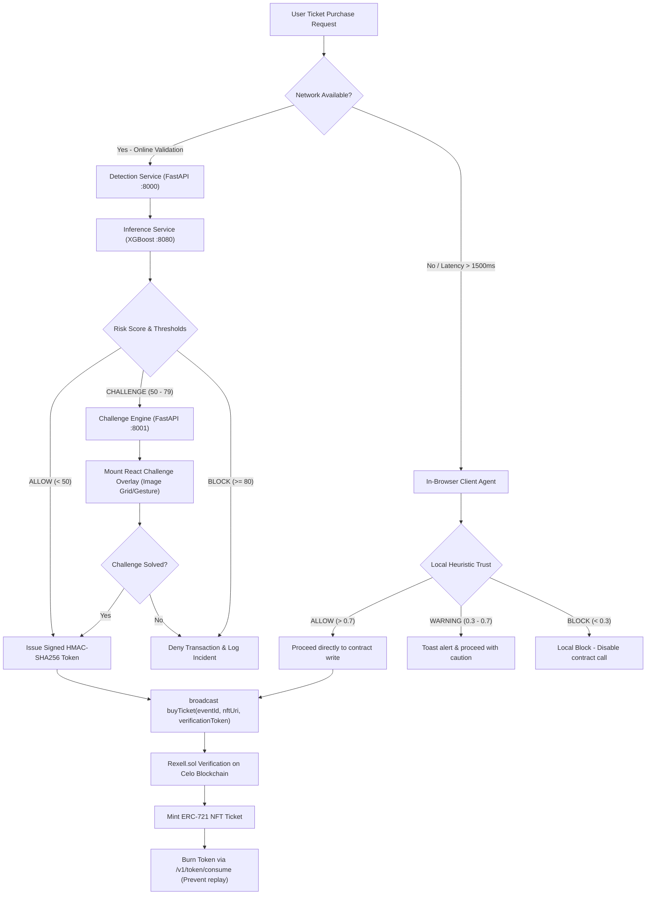

# Rexell Complete System Documentation & Technical Manual

Rexell is a state-of-the-art, privacy-first, Web3 event ticketing and anti-scalping platform. It combines mobile-friendly Web3 EVM (Ethereum Virtual Machine) smart contracts on the Celo blockchain with a real-time behavioral and transactional bot-detection network. This ensures that tickets are distributed fairly to genuine fans at capped prices, organizers receive secondary resale royalties, and automation scripts are kept off the marketplace.

---

## 🗺️ 1. Executive Summary & Core Philosophy

The traditional ticketing industry suffers from systemic inefficiencies, including hyper-inflationary ticket scalping, automated front-running bots, duplication fraud, and a lack of transparency in secondary marketplaces. 

Rexell resolves these issues by pairing an EVM-compatible decentralized ticket ledger with real-time biometric and transactional bot detection. The platform operates on four core pillars:

1. **Soulbound Identity & KYC (Know Your Customer) Score (SoulboundIdentity.sol)**: Rather than relying on simple wallet addresses, users maintain an on-chain verification score (0–100) bound to a non-transferable Soulbound NFT (Non-Fungible Token). Wallet scores >= 70 are required to list tickets on the secondary marketplace or complete bulk purchases.
2. **Invisible Biometric Behavioral Telemetry**: A lightweight client-side SDK (Software Development Kit) tracks mouse movements, click cadence, keystroke dwell times, and tab focus transitions at >= 20 Hz. Automated execution frameworks (Puppeteer, Playwright, Selenium) are silently identified.
3. **Anti-Scalping Resale Gating & Organizer Royalties**: Secondary listings must be approved by event organizers. Ticket resale prices are capped at 200% of original face value, and resales are disabled 48 hours before events. Every completed resale automatically routes 5% royalty to the organizer, 2% platform fee, and 93% to the seller.
4. **GDPR-Compliant (General Data Protection Regulation) Privacy-First Telemetry**: User privacy is respected by hashing wallet addresses using SHA-256 (Secure Hash Algorithm 256-bit) with a secret salt (WALLET_SALT). IP (Internet Protocol) addresses are truncated to subnets (/24 for IPv4, /48 for IPv6), and behavioral logs are automatically purged after 90 days.

---

## 🏗️ 2. High-Level Architecture & End-to-End Flow

Rexell implements a dual-layer fraud prevention system that bridges off-chain, low-latency machine learning models with on-chain, secure, and decentralized smart contract logic.

---

## ⚛️ 3. Frontend Architecture & Modules

The frontend is a **Next.js 14** application utilizing the **App Router** pattern, **React 18**, and **TypeScript**. Styling is handled using **TailwindCSS 3.4.1**, **Radix UI** primitives, and **Lucide React** icons. Web3 integration is built on **RainbowKit 2.0.6**, **Wagmi 2.7.1**, and **Viem 2.9.29** for Celo wallet connectivity.

### Directory Structure & Pages

* `events/`: Browse all events (Grid layout, Category filter, Search bar)
* `event-details/[id]/`: Event details view (Tickets available, dates, ratings, and comments)
* `buy/[id]/`: Buy tickets page (Quantity selection, stablecoin approvals, and transaction token check)
* `history/`: User's ticket purchase history (Receipt logs and transaction history)
* `my-tickets/`: Wallet NFT Tickets (Generates dynamic QR Codes for event entry)
* `my-events/`: Organizer dashboard (Created events, ticket statistics, and sales data)
* `resell/[tokenId]/`: List owned ticket for secondary resale
* `resale/`: Browse tickets available in secondary market
* `resale-approval/`: Organizer resale approval interface
* `admin/`: Platform administrator dashboard (Configuration tabs)
* `owner/resale-requests/`: Escrow contract audit dashboard

### Key Overlays & AI (Machine Learning) Components

* **KYCFlow.tsx (Anti-Sybil Profile)**: Renders the user's Soulbound Identity status, composite score, and credentials. Mounts interactive forms to stake cUSD or vouch for friends to increase the score.
* **BotChallengeModal.tsx (Challenge Grid)**: Triggered when the telemetry risk score lands in the CHALLENGE range (50–79). Mounts image grids or gesture pattern tracers (Multi-Factor Authentication or MFA) to prove human kinematics.
* **WarningModal.tsx**: Alerts intermediate-threat users before transaction signoff, offering an option to retry or proceed with warning logging.
* **Assistant.tsx (AI Chatbot)**: Side drawer chatbot powered by Google Gemini, querying event configurations, resale rules, and platform troubleshooting.
* **AIDemandForecast.tsx**: Embedded visualizer in the organizer dashboard that predicts ticket selling rates and highlights pricing recommendations based on current demand parameters.

---

## 🔌 4. Backend Architecture & Microservices

The backend comprises five modular **FastAPI** microservices, containerized with **Docker** and managed via **Kubernetes**.

### Database Architecture & Integrations

The backend utilizes a hybrid relational SQL (Structured Query Language) data architecture split across two production database systems depending on deployment models:

#### 1. Google Cloud SQL (PostgreSQL Engine)
The primary real-time telemetry storage for the `detection` service is hosted on Google Cloud SQL using the PostgreSQL engine.
* **Implementation Details**:
  * Utilizes async SQLAlchemy connections with the `postgresql+asyncpg` driver.
  * Connects securely from Kubernetes pods using the Google Cloud SQL Auth Proxy sidecar container, removing the need for open public IP addresses.
  * Handles transaction token states, sliding-window risk calculations, and telemetry ingestion logs.
* **Core Schemas**:
  * `behavioral_data`: Circular log buffer of user mouse/keyboard kinematics (purged after 90 days for GDPR compliance).
  * `risk_score`: Persisted evaluations and classification decisions from the XGBoost (Extreme Gradient Boosting) engine.
  * `verification_token`: Keeps track of valid base64 HMAC (Hash-based Message Authentication Code) signatures and on-chain consumption states.

#### 2. Microsoft SQL Server (MSSQL)
The `identity_oracle` microservice and the frontend's Next.js API (Application Programming Interface) routes integrate directly with Microsoft SQL Server to record user reputations, social graphs, and application activity logs.
* **Implementation Details**:
  * Connects using SQLAlchemy and pyodbc (`mssql+pyodbc:///?odbc_connect=...`) for Windows Active Directory/SQL Auth.
  * Employs an automatic fallback mechanism: if the SQL Server instance becomes unreachable, the service transparently diverts operations to a local SQLite database (`identity_oracle.db`).
  * Used by `frontend/lib/activityLogger.ts` to log transaction hashes, user interactions, and event activities to a permanent enterprise registry.
* **Core Schemas**:
  * `wallet_reputation`: Stores historical tx (transaction) counts, ENS (Ethereum Name Service) mappings, POAP (Proof of Attendance Protocol) flags, and base scores.
  * `funding_clusters`: Maps funding networks to detect automated Sybil farming.
  * `vouch_graph`: Tracks active peer-to-peer trust vouchers and vouchees.
  * `app_activities`: Logs security-sensitive user actions (staking, vouching, and minting identities).

---

## ⛓️ 5. Smart Contracts & EVM Logic

Decentralized states, payments, and ticket issuances are governed by Solidity smart contracts deployed on **Celo Sepolia Testnet** (11142220) and **Celo Mainnet** (42220).

### 1. `Rexell.sol` (Main Ticket Ledger)
* **ERC-721 NFT implementation**: Inherits OpenZeppelin's `ERC721URIStorage`, `Ownable`, and `ReentrancyGuard`.
* **Stablecoin Integration**: Transactions are processed in **cUSD** (Celo Dollar ERC-20 stablecoin).
* **On-Chain Anti-Replay Guard**: Reads the HMAC signature issued by the detection service. The contract recovers the signature and marks the token as used, reverting if the payload is expired, signed by an invalid key, or replayed.
* **Secondary Marketplace**: Handles listing requests, approvals, and secondary marketplace purchases. Implements fee division: 5% to organizer, 2% to platform treasury, 93% to seller.
* **Resale Multiplier Cap**: Enforces `maxResaleMultiplier = 200` (200% cap on original price).
* **Time Cutoff**: Enforces `resaleCutoffHours = 48` (48 hours before event start).

### 2. `SoulboundIdentity.sol` (KYC Ledger)
* **Non-Transferable ERC-721**: Overrides `_beforeTokenTransfer` to revert all transfers except minting and burning.
* **On-Chain KYC Score**: Binds scores (0–100) and active vouches directly to wallet addresses. Score >= 70 grants verified status.

---

## 🧠 6. Core System Algorithms

### A. Anti-Sybil Identity Score Algorithm
The composite Anti-Sybil score (S) determines whether a wallet is trusted (>= 70) to resell tickets, list at a markup, or make bulk purchases.

S = Clamp(S_base + S_vouch + S_stake, 0, 100)

1. **Base Score (S_base)**: Max 80. Calculated from wallet history:
   * **ENS Domain**: +15 points
   * **POAP Tokens**: +10 points
   * **Wallet Age (A)**: +10 if A > 30d, +15 if A > 90d, +25 if A > 180d
   * **Transaction Count (T)**: +10 if T > 10, +15 if T > 50, +20 if T > 100
2. **Vouch Boost (S_vouch)**: Each active vouch from a verified user adds +30 points. Mass-vouching is capped (max 3 vouches per user) to prevent black markets.
3. **Stake Boost (S_stake)**: Staking cUSD into the Soulbound contract grants +30 points per 25 cUSD staked.
4. **Funding Cluster Cooldown**: If a wallet is funded by a centralized faucet/source that recently funded >5 wallets, the FundingCluster analyzer flags it as a Sybil farm, triggering a **14-day cooldown** that caps S at 40, blocking verification.

### B. Biometric Bot Detection Feature Vector
The client SDK samples event data at 20 Hz and constructs a feature vector X_bot:
1. **Velocity Standard Deviation**: Humans exhibit irregular, variable speed; bots show constant speed.
2. **Path Curvature**: Straight lines or constant angles indicate headless scripts.
3. **Click Dwell Ratio**: Time delta between mousedown and mouseup. Bots show identical dwell times <= 2 ms.
4. **Keystroke Dwell Mean**: Key depress times (humans range between 80-120 ms).
5. **Focus Transition Entropy**: Scrapers constantly switch focus/tabs.

### C. Scalper Intent Model (Multi-Task Learning)
To catch human-driven scalper operations, a dual-head XGBoost configuration is used:
* **Bot Head**: Processes biometric features X_bot to detect automation.
* **Scalper Head**: Processes X_scalper (intent telemetry: quantity requested, markup percentage, page navigation flow entropy, duplicate events browsed) to detect scalper intent.

---

## 🚀 7. Infrastructure & Deployments

* **Frontend**: Next.js App deployed to **Vercel** with edge caching.
* **Smart Contracts**: Deployed via **Hardhat** scripts to Celo Sepolia and verified on **Celoscan**. ABI (Application Binary Interface) logs copy directly to the frontend via `scripts/update-abi.js`.
* **Microservices**: Containerized with multi-stage Dockerfiles. Deployed on **Kubernetes** with HPA (Horizontal Pod Autoscaler) targeting CPU (Central Processing Unit) utilization.
* **Cloud Databases**: 
  * In production, the `detection` telemetry service connects to a managed **Google Cloud SQL PostgreSQL** instance.
  * The `identity_oracle` connects to a hosted **Microsoft SQL Server (MSSQL)** instance for user reputations and vouch graphs, with transparent local SQLite failover support.
* **Cache & Storage**: **Redis** handles the sliding-window rate-limiting and fallback controller state cache.
* **Decentralized Media**: Event images and NFT JSON (JavaScript Object Notation) schemas are stored in **Pinata IPFS** (InterPlanetary File System).
