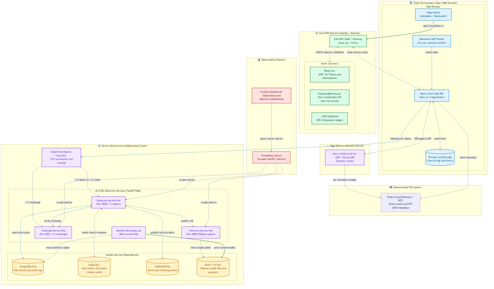
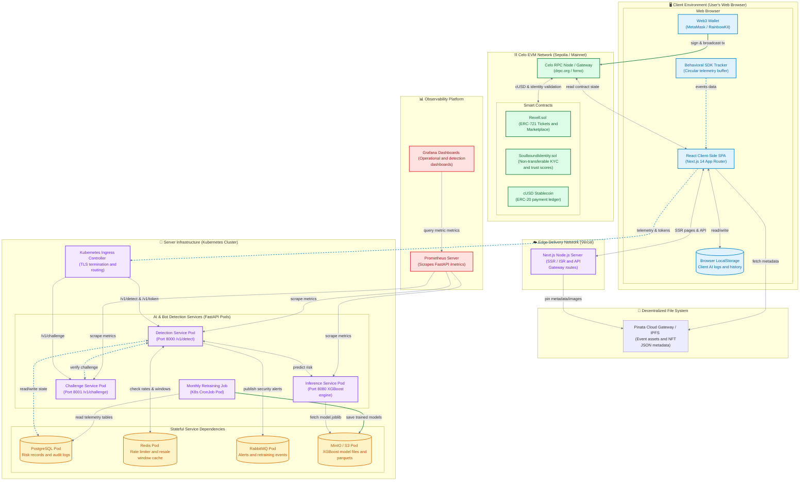
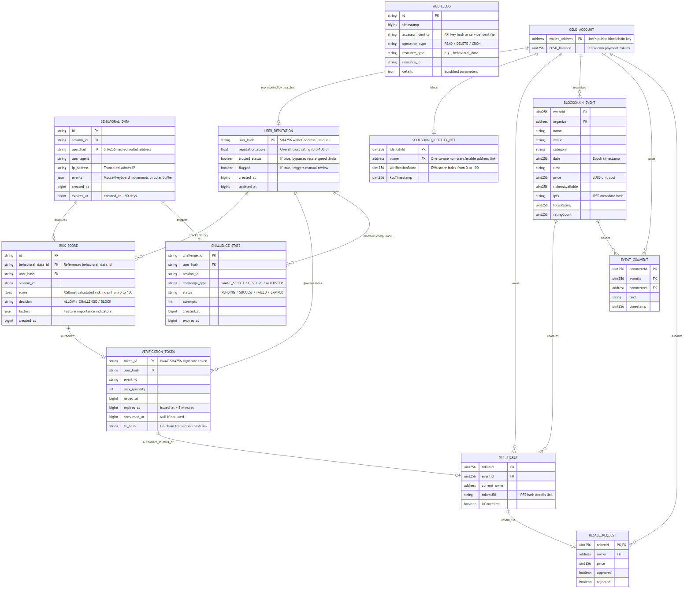
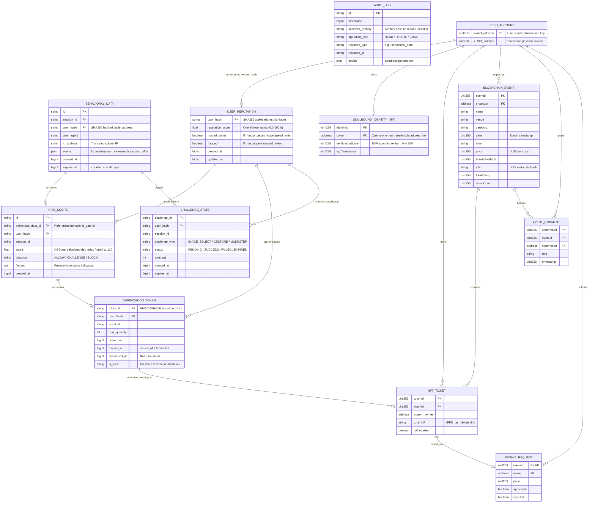
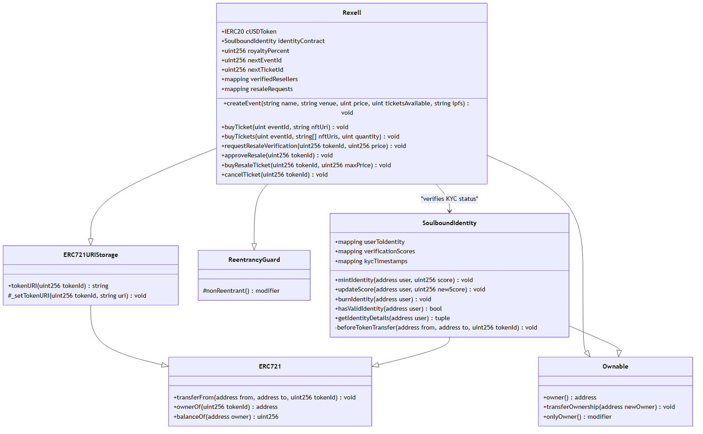
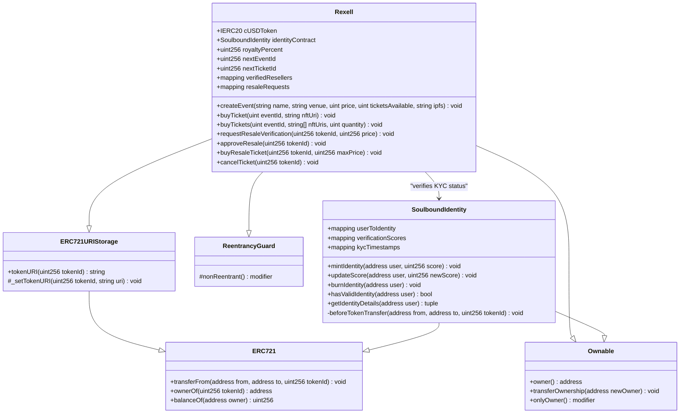
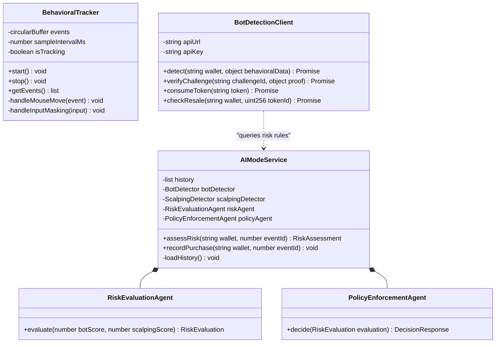
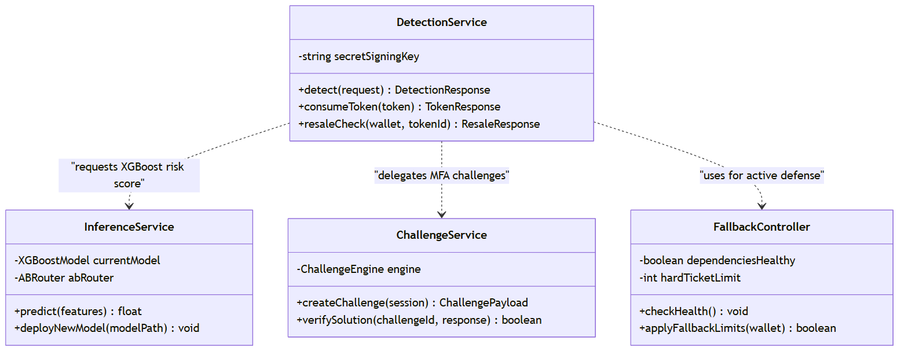
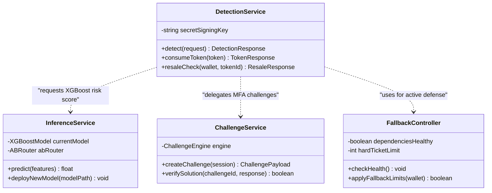
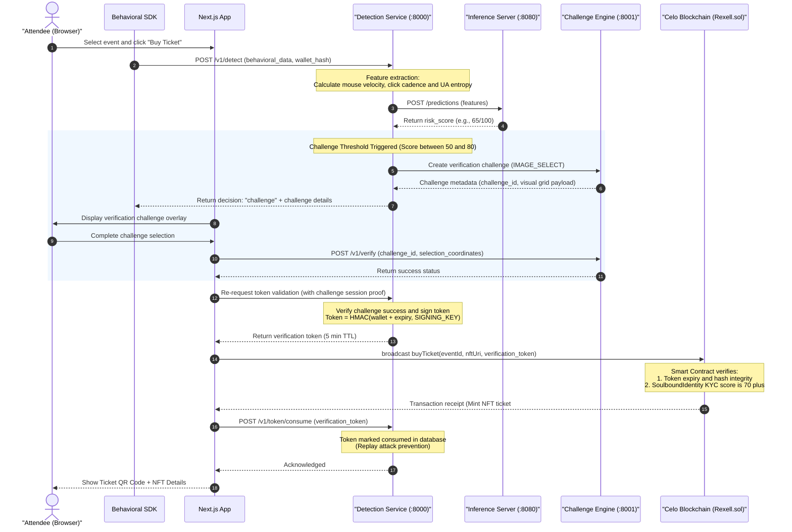

# 💠 REXELL - SYSTEM ARCHITECTURE DIAGRAMS 💠

This document provides a comprehensive view of Rexell's architecture, including its deployment topology, data relationships (on-chain and off-chain), and class-level component definitions. The system combines Next.js frontend clients, a Kubernetes-deployed serverless/containerized AI bot-detection backend, and smart contracts on the Celo EVM blockchain network.

---

## 🚀 1. Deployment Diagram

The deployment diagram illustrates the physical topology of the Rexell platform, detailing the runtime environments for the frontend web application, the EVM-compatible blockchain network, and the server-side AI/ML bot-detection microservices running on a Kubernetes cluster.

> [!NOTE]
> The **Behavioral SDK** records user telemetry (mouse cursor coordinates, clicks, keystrokes, and focus events) at a sample rate of $\ge 20\text{ Hz}$. This telemetry is stored temporarily in a client-side circular buffer (4096 entries max) and transmitted to the `Detection Service` when the user triggers a "Buy Ticket" or "Resale Request" event.

---

## 🗃️ 2. Entity-Relationship (ER) Diagram

This diagram displays the hybrid data storage configuration. It illustrates how the relational SQL database schemas (representing the server-side bot-detection telemetry and states) map conceptually to the decentralized storage schemas on the Celo blockchain.

> [!IMPORTANT]
> The database tracks the user using the `user_hash` (the SHA-256 hash of the public wallet address) to enforce **GDPR/CCPA compliance** and prevent PII (Personally Identifiable Information) leakage. IP addresses are truncated to `/24` subnets (IPv4) or `/48` subnets (IPv6), and User-Agents are normalized before processing.

---

## 🏛️ 3. Class Diagrams

The class diagrams map the programmatic components of the system, divided into client-side browser modules, backend Python microservices, and Solidity smart contracts.

### ⛓️ 3.1 Smart Contracts Class Diagram

This diagram maps the inheritance, fields, and functions of the core smart contracts deployed on Celo.

### 🖥️ 3.2 Client-Side & Browser SDK Class Diagram

This diagram captures classes operating within the attendee's browser environment, including the telemetry tracker and local risk evaluation agents.

### 🐳 3.3 Backend API Services Class Diagram

This diagram displays the server-side microservice controllers responsible for real-time model inference, challenge verification, and active rate-limiting defense.

---

## 🔄 4. End-to-End Multi-Module Decision Flow

To clarify how the modules communicate across the **Client**, **Server-Side AI**, and **Blockchain** boundaries, the sequence chart below shows a typical transaction workflow:

