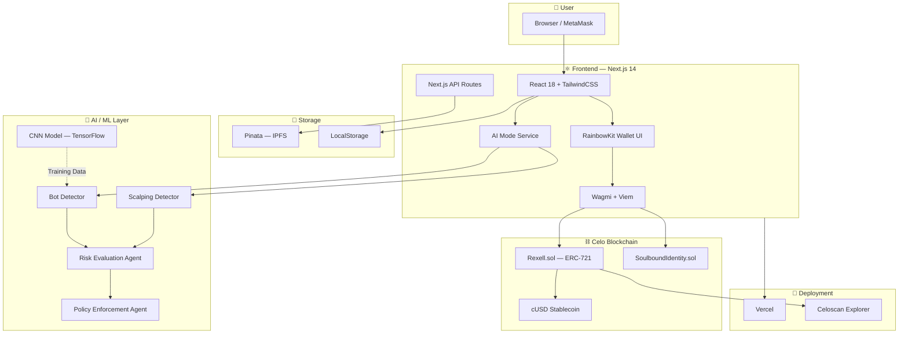
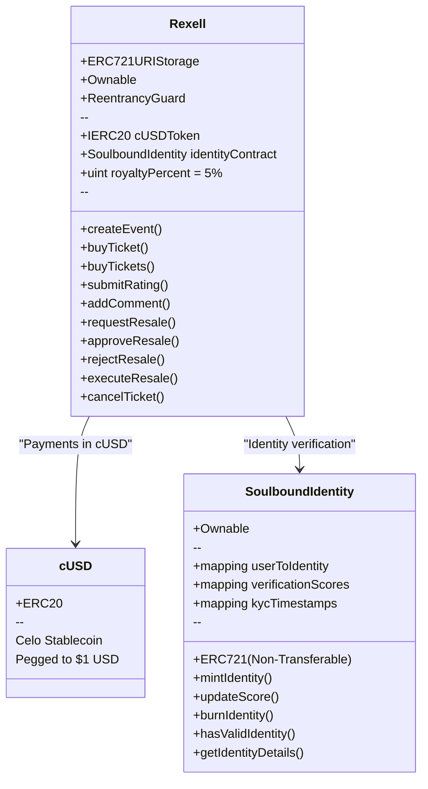
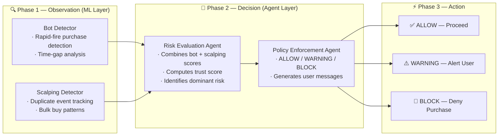
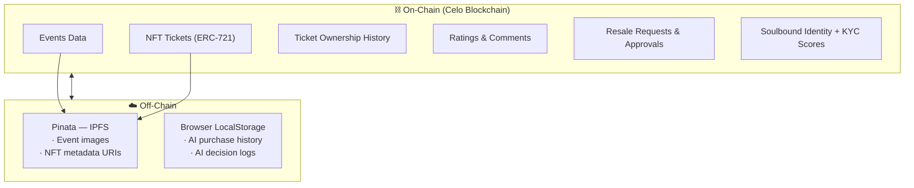
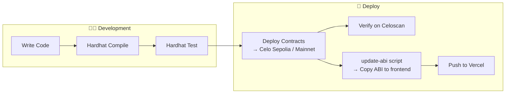
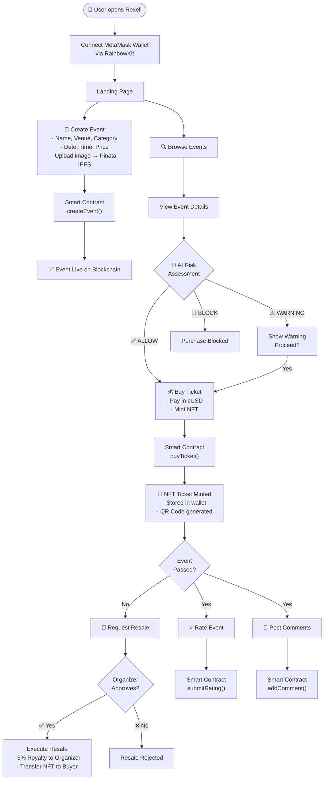

# 💠 REXELL — Technology Stack & Architecture

> **Rexell** is a Web3 event ticketing platform built on the **Celo blockchain**, where users create events, buy NFT tickets, and resell them through an anti-scalping verification system — all powered by AI-driven fraud detection.

---

## 📑 Table of Contents

- [High-Level Architecture](#high-level-architecture)
- [Frontend](#-frontend)
- [Blockchain / Smart Contracts](#-blockchain--smart-contracts)
- [AI / Machine Learning](#-aiml-anti-scalping-engine)
- [Storage & Data Layer](#-storage--data-layer)
- [DevOps & Deployment](#-devops--deployment)
- [Application Flow](#-application-flow)
- [Smart Contract Flow](#-smart-contract-flow)
- [AI Anti-Scalping Pipeline](#-ai-anti-scalping-pipeline)
- [Tech Stack Summary Table](#-tech-stack-summary-table)

---

## High-Level Architecture



---

## ⚛️ Frontend

The frontend is a **Next.js 14** application using the **App Router** pattern with **React 18** and **TypeScript**.

### Core Framework

| Technology | Version | Purpose |
|---|---|---|
| **Next.js** | 14.2.3 | React meta-framework (SSR, API Routes, App Router) |
| **React** | 18.x | Component-based UI library |
| **TypeScript** | 5.x | Static type checking |

### Styling & UI

| Technology | Version | Purpose |
|---|---|---|
| **TailwindCSS** | 3.4.1 | Utility-first CSS framework |
| **Radix UI** (shadcn/ui) | Various | Accessible, unstyled component primitives |
| **Lucide React** | 0.376.0 | Icon library |
| **Sonner** | 1.4.41 | Toast notification system |
| **next-themes** | 0.3.0 | Dark / light theme toggling |
| **class-variance-authority** | 0.7.0 | Component variant management |
| **tailwind-merge** | 2.3.0 | Tailwind class conflict resolution |
| **tailwindcss-animate** | 1.0.7 | Animation utilities |

#### Radix UI Primitives Used

`Accordion` · `Avatar` · `Dropdown Menu` · `Label` · `Menubar` · `Popover` · `Select` · `Slot`

### Web3 / Blockchain Integration

| Technology | Version | Purpose |
|---|---|---|
| **RainbowKit** | 2.0.6 | Wallet connection UI (MetaMask) |
| **Wagmi** | 2.7.1 | React hooks for Ethereum |
| **Viem** | 2.9.29 | Low-level EVM interaction (ABI encoding, contract calls) |
| **@celo/contractkit** | 8.0.0 | Celo-specific transaction helpers |
| **@celo/rainbowkit-celo** | 1.2.0 | Celo chain presets for RainbowKit |
| **ethers.js** | 6.16.0 | Ethereum library (deployment scripts) |
| **web3.js** | 1.10 | Alternative Web3 library |

### Utilities

| Technology | Purpose |
|---|---|
| **@tanstack/react-query** | Async state management & caching |
| **date-fns** | Date formatting and manipulation |
| **qrcode / react-qr-code** | QR code generation for tickets |
| **html-to-image** | Screenshot / export tickets as images |
| **react-day-picker** | Calendar date picker component |
| **react-rating-stars-component** | Star-based event rating |
| **react-icons** | Additional icon sets |
| **@vercel/analytics** | Usage analytics |

### Frontend Directory Structure

```
frontend/
├── app/                    # Next.js App Router
│   ├── (application)/      # Authenticated app pages
│   │   ├── buy/            # Buy tickets
│   │   ├── create-event/   # Create new events
│   │   ├── event-details/  # Event detail view
│   │   ├── events/         # Browse all events
│   │   ├── history/        # Purchase history
│   │   ├── market/         # Marketplace
│   │   ├── my-events/      # Organizer's events
│   │   ├── my-tickets/     # User's tickets
│   │   ├── resale/         # Resale marketplace
│   │   ├── resale-approval/# Organizer approves resale
│   │   └── resell/         # List ticket for resale
│   ├── (marketing)/        # Public landing pages
│   └── api/                # API routes (ai, files)
├── blockchain/             # ABI files & chain config
├── components/             # Reusable React components
│   ├── ui/                 # shadcn/ui primitives
│   ├── landing/            # Landing page sections
│   ├── shared/             # Shared components
│   └── AI/                 # AI mode components
├── lib/                    # Core utilities
│   ├── ai/                 # AI anti-scalping engine
│   │   ├── agents/         # Risk & policy agents
│   │   └── models/         # Bot & scalping detectors
│   ├── web3.ts             # Viem client setup
│   └── celoSepolia.ts      # Custom chain config
├── ml/                     # ML training scripts
├── providers/              # Context providers
│   ├── blockchain-providers.tsx
│   └── theme-provider.tsx
└── public/                 # Static assets
```

---

## ⛓️ Blockchain / Smart Contracts

The project uses **Solidity** smart contracts deployed on the **Celo** blockchain (EVM-compatible, mobile-first, carbon-negative).

### Smart Contract Stack

| Technology | Version | Purpose |
|---|---|---|
| **Solidity** | 0.8.17 | Smart contract language |
| **Hardhat** | 2.22.3 | Development, testing & deployment framework |
| **OpenZeppelin** | 4.9.6 | Audited contract libraries (ERC-721, Ownable, ReentrancyGuard) |
| **@nomicfoundation/hardhat-toolbox** | 5.0.0 | Hardhat plugins bundle |
| **@nomicfoundation/hardhat-ethers** | 3.1.0 | Ethers.js integration for Hardhat |

### Networks

| Network | Chain ID | RPC URL | Explorer |
|---|---|---|---|
| **Celo Mainnet** | 42220 | `https://forno.celo.org` | [celoscan.io](https://celoscan.io) |
| **Celo Sepolia (Testnet)** | 11142220 | `https://celo-sepolia.drpc.org` | [sepolia.celoscan.io](https://sepolia.celoscan.io) |
| **Hardhat (Local)** | 31337 | `http://127.0.0.1:8545` | — |

### Contracts



#### Rexell.sol — Main Contract (742 lines)
- **ERC-721 NFT Tickets** — each ticket is a unique NFT with metadata URI
- **Event CRUD** — create events with name, venue, category, date, price, IPFS image
- **Ticket Purchase** — pay with cUSD (Celo Dollar stablecoin), mint NFT
- **Rating & Comments** — post-event ratings (only after event date) and comments
- **Anti-Scalping Resale** — request → organizer approval → execute with 5% royalty
- **Ownership History** — full on-chain tracking of ticket transfers

#### SoulboundIdentity.sol — Identity Contract (91 lines)
- **Non-Transferable (Soulbound) NFT** — cannot be transferred once minted
- **KYC Verification Score** (0–100) — determines user trustworthiness
- **Identity Validation** — users need score ≥ 70 to be considered verified

---

## 🤖 AI/ML Anti-Scalping Engine

Rexell includes a multi-layered AI system that detects and prevents ticket scalping and bot activity.

### Architecture — Agentic Pipeline



### AI Components

| Component | File | Role |
|---|---|---|
| **Bot Detector** | `lib/ai/models/bot-detector.ts` | Analyzes purchase timing patterns to detect automated bots |
| **Scalping Detector** | `lib/ai/models/scalping-detector.ts` | Flags users buying duplicates or bulk tickets for same event |
| **Risk Evaluation Agent** | `lib/ai/agents/risk-agent.ts` | Combines detector scores into a unified trust score |
| **Policy Enforcement Agent** | `lib/ai/agents/policy-agent.ts` | Makes final ALLOW / WARNING / BLOCK decision |
| **AI Mode Service** | `lib/ai/ai-mode.ts` | Orchestrates the full pipeline per purchase attempt |
| **AI Logger** | `lib/ai/logger.ts` | Logs AI decisions for auditing |

### ML Training Pipeline

| File | Language | Purpose |
|---|---|---|
| `ml/generate_data.py` | Python | Generate synthetic training data |
| `ml/train_model.py` | Python | Train ML model (TensorFlow/scikit-learn) |
| `ml/train_model.js` | JavaScript | Alternative JS-based training |
| `dataset/CNN.ipynb` | Jupyter | CNN model experimentation notebook |
| `dataset/assemble_dataset.py` | Python | Assemble and preprocess raw datasets |
| `dataset/blockchain_ticketing_master.csv` | CSV | 2.3 MB master ticketing dataset |

---

## 💾 Storage & Data Layer

Rexell uses a **decentralized storage** approach — no traditional database.



| Layer | Technology | Data Stored |
|---|---|---|
| **On-Chain** | Celo Blockchain | Events, tickets (NFTs), ratings, comments, resale state, identity |
| **IPFS (Pinata)** | Pinata Cloud Gateway | Event images, NFT metadata JSON, ticket artwork |
| **Client-side** | Browser LocalStorage | AI purchase history, decision logs |

### Pinata Configuration

```
PINATA_API_Key="..."
PINATA_API_Secret="..."
PINATA_JWT="..."
NEXT_PUBLIC_IPFS_GATEWAY="https://olive-labour-earthworm-132.mypinata.cloud"
```

---

## 🚀 DevOps & Deployment

| Tool | Purpose |
|---|---|
| **Vercel** | Frontend hosting (Next.js optimized) |
| **Netlify** | Alternative static hosting (config present) |
| **Hardhat** | Smart contract compilation, testing & deployment |
| **Celoscan** | On-chain contract verification & explorer |
| **pnpm** | Package manager |
| **ESLint** | Code linting |
| **Prettier** | Code formatting |
| **PostCSS** | CSS processing pipeline |

### Deployment Flow



---

## 🔄 Application Flow

### End-to-End User Journey



---

## 📊 Tech Stack Summary Table

| Layer | Technologies |
|---|---|
| **Frontend Framework** | Next.js 14, React 18, TypeScript 5 |
| **Styling** | TailwindCSS 3.4, Radix UI / shadcn/ui, Lucide Icons |
| **State Management** | TanStack React Query, React Context |
| **Web3 Client** | Wagmi 2, Viem 2, RainbowKit 2, Celo ContractKit |
| **Wallet** | MetaMask (via RainbowKit) |
| **Blockchain** | Celo (EVM-compatible, Mainnet + Sepolia Testnet) |
| **Smart Contracts** | Solidity 0.8.17, OpenZeppelin 4.9.6 |
| **Token Standard** | ERC-721 (NFT Tickets), ERC-20 (cUSD Payments) |
| **Identity** | Soulbound NFT (Non-Transferable ERC-721) |
| **Dev Framework** | Hardhat 2.22, Ethers.js 6 |
| **AI/ML** | Custom TypeScript agents, Python (TensorFlow, CNN) |
| **Storage** | Pinata IPFS (images/metadata), Celo (on-chain data) |
| **Deployment** | Vercel (frontend), Celoscan (contract verification) |
| **Package Manager** | pnpm |
| **Linting & Formatting** | ESLint, Prettier |
| **Analytics** | Vercel Analytics |

---

<p align="center"><i>Built with ❤️ on the Celo blockchain</i></p>
