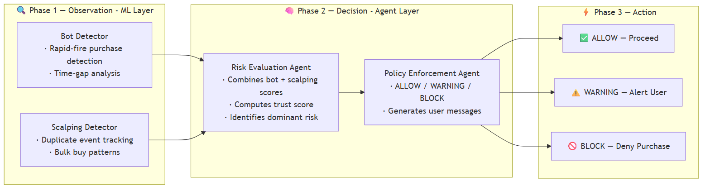
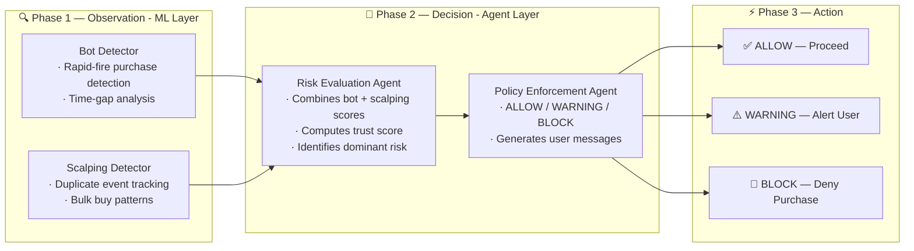

# 🤖 Rexell - AI/ML Agentic Pipeline

This flowchart outlines the three phases of the client-side/in-browser agentic purchase evaluation pipeline: Observation, Decision, and Policy Enforcement.

```mermaid
flowchart LR
    subgraph Observation["🔍 Phase 1 — Observation - ML Layer"]
        BD["Bot Detector<br/>· Rapid-fire purchase detection<br/>· Time-gap analysis"]
        SD["Scalping Detector<br/>· Duplicate event tracking<br/>· Bulk buy patterns"]
    end

    subgraph Decision["🧠 Phase 2 — Decision - Agent Layer"]
        RA["Risk Evaluation Agent<br/>· Combines bot + scalping scores<br/>· Computes trust score<br/>· Identifies dominant risk"]
        PA["Policy Enforcement Agent<br/>· ALLOW / WARNING / BLOCK<br/>· Generates user messages"]
    end

    subgraph Action["⚡ Phase 3 — Action"]
        AL["✅ ALLOW — Proceed"]
        WN["⚠️ WARNING — Alert User"]
        BL["🚫 BLOCK — Deny Purchase"]
    end

    BD --> RA
    SD --> RA
    RA --> PA
    PA --> AL & WN & BL
```
