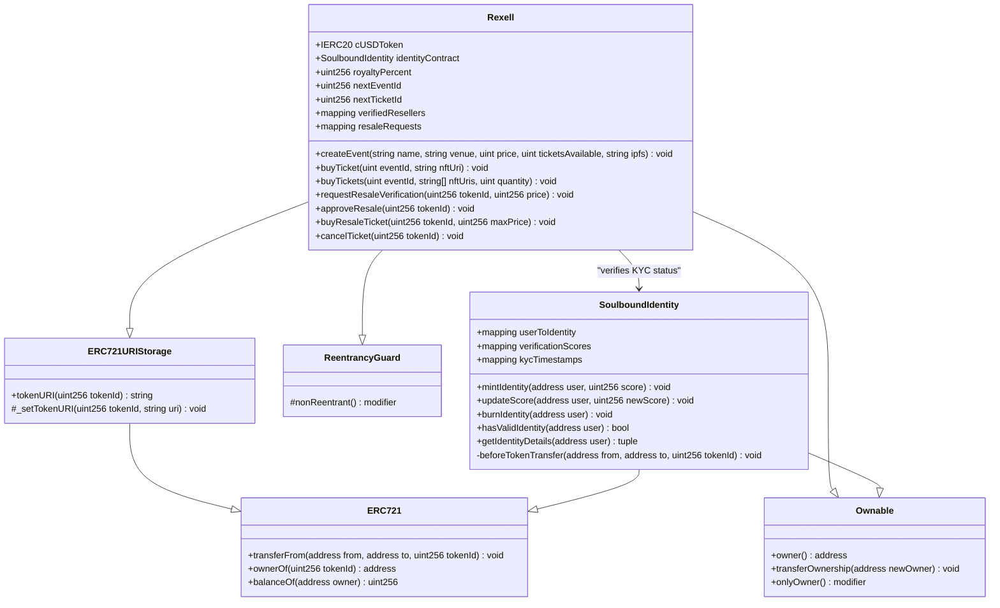
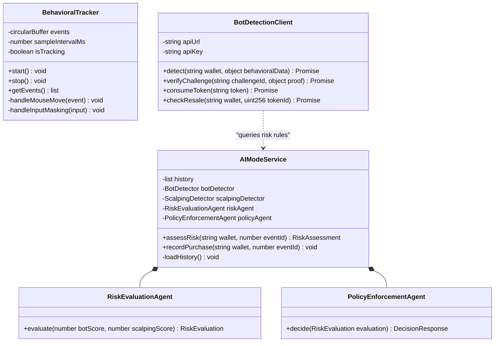
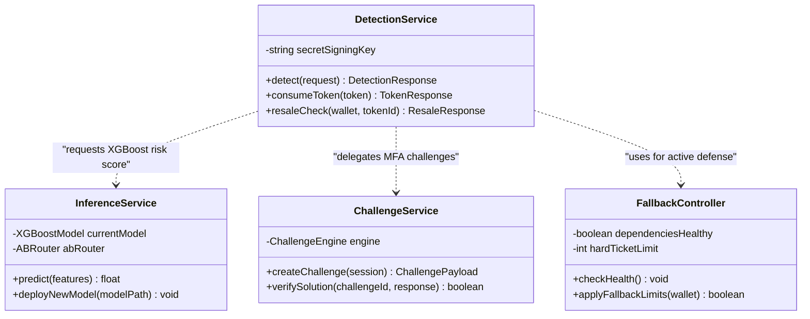

# 🏛️ Rexell - Class Diagram

This UML class diagram defines the software classes, properties, and methods of the Next.js React client modules, Python microservices, and Solidity EVM contracts.

# 🏛️ Rexell - Class Diagrams

This document defines the software classes, properties, and methods of the Next.js React client modules, Python microservices, and Solidity EVM contracts, separated into modular component diagrams.

---

## ⛓️ 1. Smart Contracts Class Diagram

This diagram maps the inheritance, fields, and functions of the core smart contracts deployed on Celo.

---

## 🖥️ 2. Client-Side & Browser SDK Class Diagram

This diagram captures classes operating within the attendee's browser environment, including the telemetry tracker and local risk evaluation agents.

---

## 🐳 3. Backend API Services Class Diagram

This diagram displays the server-side microservice controllers responsible for real-time model inference, challenge verification, and active rate-limiting defense.

