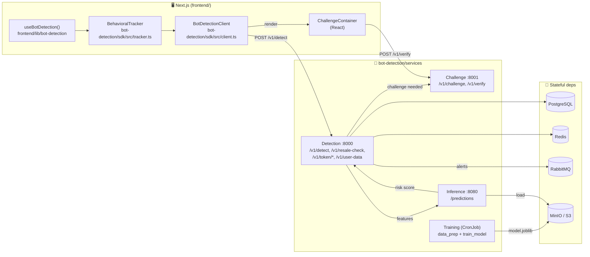

# 🛡️ Rexell - Component Architecture

This diagram details the layout of client browser telemetry SDK files, FastAPI service routes, and stateful backing dependencies.

```mermaid
flowchart LR
    subgraph Browser["🖥️ Next.js (frontend/)"]
        Hook["useBotDetection()<br/>frontend/lib/bot-detection"]
        Track["BehavioralTracker<br/>bot-detection/sdk/src/tracker.ts"]
        Cli["BotDetectionClient<br/>bot-detection/sdk/src/client.ts"]
        Chall["ChallengeContainer<br/>(React)"]
    end

    subgraph Backend["🐳 bot-detection/services"]
        DET["Detection :8000<br/>/v1/detect, /v1/resale-check,<br/>/v1/token/*, /v1/user-data"]
        CHA["Challenge :8001<br/>/v1/challenge, /v1/verify"]
        INF["Inference :8080<br/>/predictions"]
        TRN["Training (CronJob)<br/>data_prep + train_model"]
    end

    subgraph Data["💽 Stateful deps"]
        PG[("PostgreSQL")]
        RD[("Redis")]
        MQ[("RabbitMQ")]
        MINIO[("MinIO / S3")]
    end

    Hook --> Track --> Cli
    Cli -- POST /v1/detect --> DET
    DET -- features --> INF
    INF -- risk score --> DET
    DET -- challenge needed --> CHA
    Cli -- render --> Chall
    Chall -- POST /v1/verify --> CHA
    DET --> PG
    DET --> RD
    DET -- alerts --> MQ
    TRN -- model.joblib --> MINIO
    INF -- load --> MINIO
```
