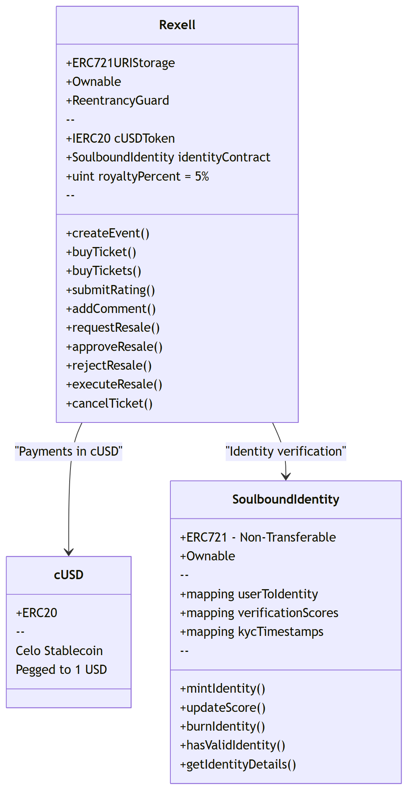
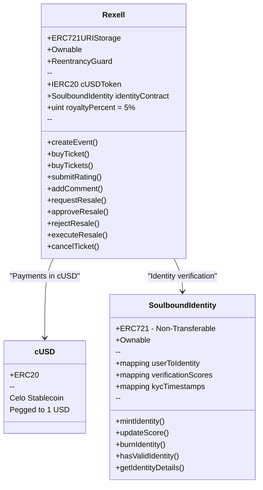

# ⛓️ Rexell - Contracts Architecture Diagram

This diagram displays the relationship and layout of smart contracts deployed on Celo blockchain networks.

```mermaid
classDiagram
    class Rexell {
        +ERC721URIStorage
        +Ownable
        +ReentrancyGuard
        --
        +IERC20 cUSDToken
        +SoulboundIdentity identityContract
        +uint royaltyPercent = 5%
        --
        +createEvent()
        +buyTicket()
        +buyTickets()
        +submitRating()
        +addComment()
        +requestResale()
        +approveResale()
        +rejectResale()
        +executeResale()
        +cancelTicket()
    }

    class SoulboundIdentity {
        +ERC721 - Non-Transferable
        +Ownable
        --
        +mapping userToIdentity
        +mapping verificationScores
        +mapping kycTimestamps
        --
        +mintIdentity()
        +updateScore()
        +burnIdentity()
        +hasValidIdentity()
        +getIdentityDetails()
    }

    class cUSD {
        +ERC20
        --
        Celo Stablecoin
        Pegged to 1 USD
    }

    Rexell --> cUSD : "Payments in cUSD"
    Rexell --> SoulboundIdentity : "Identity verification"
```
