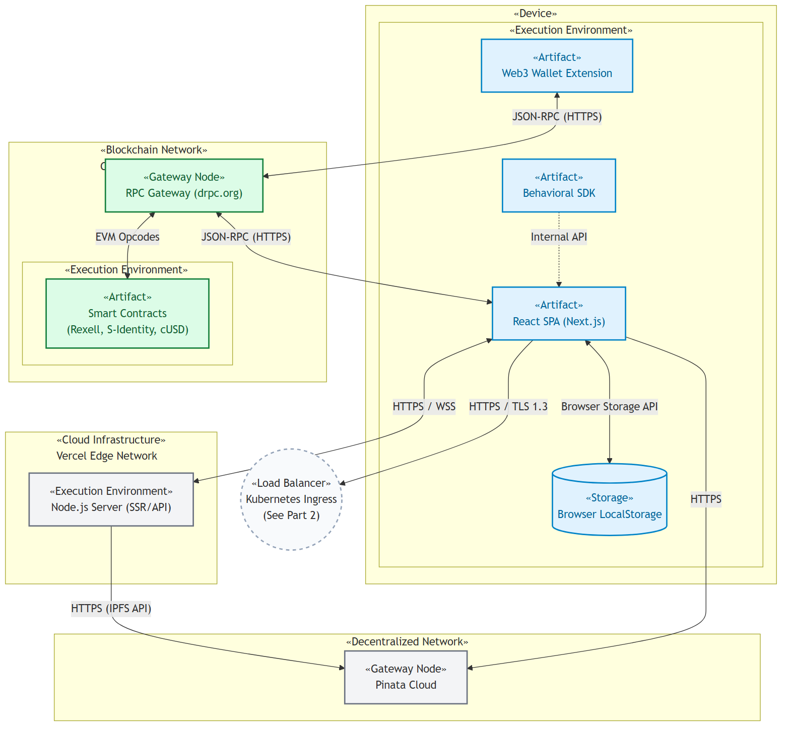
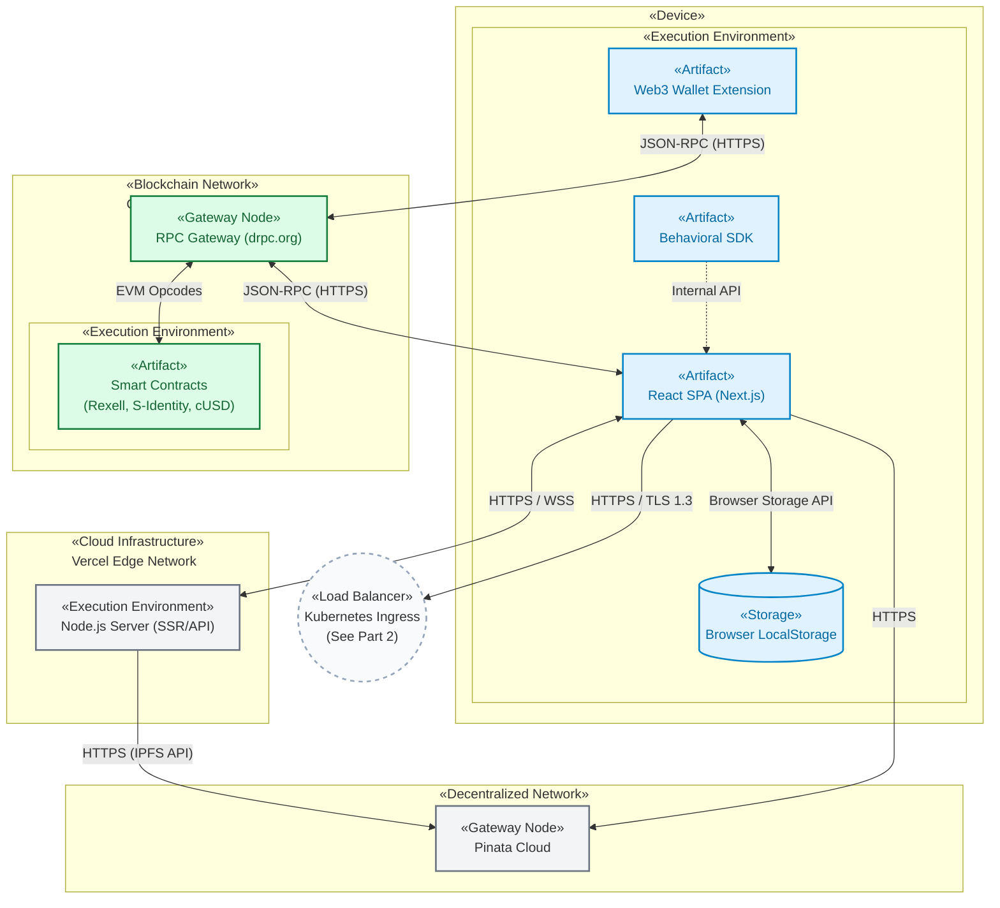

# Client & Decentralized Network Nodes

UML Deployment View: Focuses on physical/logical nodes, execution environments, and communication protocols.

```mermaid
flowchart TB
    %% Nodes and Environments
    subgraph ClientNode ["«Device»<br/>User Client (PC/Mobile)"]
        subgraph BrowserEnv ["«Execution Environment»<br/>Web Browser"]
            FE_Code["«Artifact»<br/>React SPA (Next.js)"]
            SDK["«Artifact»<br/>Behavioral SDK"]
            Wallet["«Artifact»<br/>Web3 Wallet Extension"]
            Local_Store[("«Storage»<br/>Browser LocalStorage")]
        end
    end

    subgraph VercelNode ["«Cloud Infrastructure»<br/>Vercel Edge Network"]
        Next_Server["«Execution Environment»<br/>Node.js Server (SSR/API)"]
    end

    subgraph IPFSNode ["«Decentralized Network»<br/>IPFS Storage Layer"]
        Pinata["«Gateway Node»<br/>Pinata Cloud"]
    end

    subgraph CeloNode ["«Blockchain Network»<br/>Celo EVM (Sepolia/Mainnet)"]
        RPC_Node["«Gateway Node»<br/>RPC Gateway (drpc.org)"]
        subgraph EVM ["«Execution Environment»<br/>Ethereum Virtual Machine"]
            Contracts["«Artifact»<br/>Smart Contracts<br/>(Rexell, S-Identity, cUSD)"]
        end
    end

    Backend_Stub(("«Load Balancer»<br/>Kubernetes Ingress<br/>(See Part 2)"))

    %% Deployment Communication Paths (Protocols)
    SDK -.->|Internal API| FE_Code
    FE_Code <-->|Browser Storage API| Local_Store
    
    FE_Code <-->|HTTPS / WSS| Next_Server
    Next_Server -->|"HTTPS (IPFS API)"| Pinata
    FE_Code -->|HTTPS| Pinata
    
    Wallet <-->|"JSON-RPC (HTTPS)"| RPC_Node
    RPC_Node <-->|"JSON-RPC (HTTPS)"| FE_Code
    RPC_Node <-->|EVM Opcodes| Contracts
    
    FE_Code -->|HTTPS / TLS 1.3| Backend_Stub

    %% Styles
    classDef client fill:#e0f2fe,stroke:#0284c7,stroke-width:2px,color:#0369a1;
    classDef blockchain fill:#dcfce7,stroke:#15803d,stroke-width:2px,color:#166534;
    classDef external fill:#f8fafc,stroke:#94a3b8,stroke-width:2px,stroke-dasharray: 5 5;
    classDef cloud fill:#f3f4f6,stroke:#6b7280,stroke-width:2px;

    %% IMPORTANT: Do not include subgraphs like EVM in node class assignments
    class FE_Code,SDK,Wallet,Local_Store client;
    class RPC_Node,Contracts blockchain;
    class Next_Server,Pinata cloud;
    class Backend_Stub external;
```
