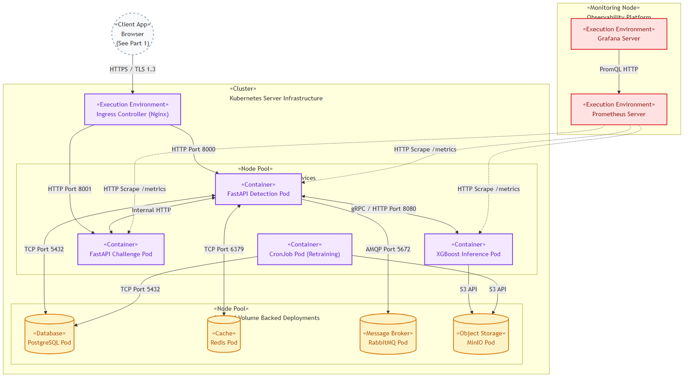
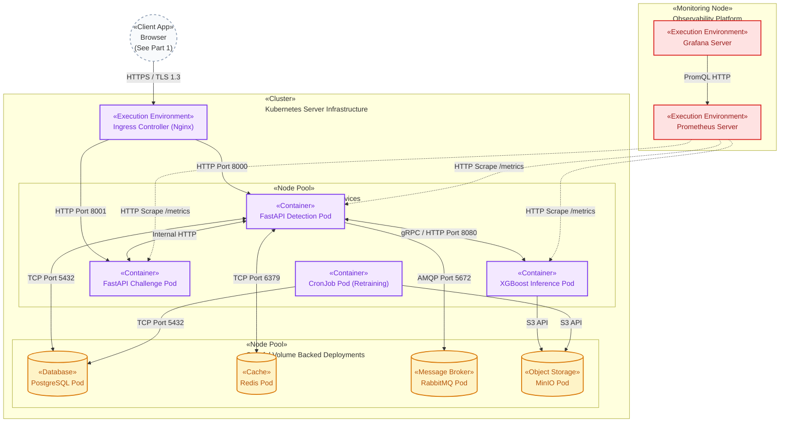

# Kubernetes Cluster & Backend Nodes

UML Deployment View: Focuses on containerized environments, databases, and internal port/protocol mapping.

```mermaid
flowchart TB
    Client_Stub(("«Client App»<br/>Browser<br/>(See Part 1)"))

    subgraph K8sNode ["«Cluster»<br/>Kubernetes Server Infrastructure"]
        Ingress["«Execution Environment»<br/>Ingress Controller (Nginx)"]

        subgraph AI_Node ["«Node Pool»<br/>AI & Bot Detection Services"]
            Det_Service["«Container»<br/>FastAPI Detection Pod"]
            Inf_Service["«Container»<br/>XGBoost Inference Pod"]
            Chal_Service["«Container»<br/>FastAPI Challenge Pod"]
            Train_Job["«Container»<br/>CronJob Pod (Retraining)"]
        end

        subgraph Stateful_Node ["«Node Pool»<br/>Stateful Volume Backed Deployments"]
            Postgres[("«Database»<br/>PostgreSQL Pod")]
            Redis[("«Cache»<br/>Redis Pod")]
            RabbitMQ[("«Message Broker»<br/>RabbitMQ Pod")]
            MinIO[("«Object Storage»<br/>MinIO Pod")]
        end
    end

    subgraph ObsNode ["«Monitoring Node»<br/>Observability Platform"]
        Prometheus["«Execution Environment»<br/>Prometheus Server"]
        Grafana["«Execution Environment»<br/>Grafana Server"]
    end

    %% Communication Paths (Protocols and Ports)
    Client_Stub -->|HTTPS / TLS 1.3| Ingress
    Ingress -->|HTTP Port 8000| Det_Service
    Ingress -->|HTTP Port 8001| Chal_Service

    Det_Service <-->|gRPC / HTTP Port 8080| Inf_Service
    Det_Service <-->|Internal HTTP| Chal_Service
    
    Det_Service <-->|TCP Port 5432| Postgres
    Det_Service <-->|TCP Port 6379| Redis
    Det_Service -->|AMQP Port 5672| RabbitMQ
    
    Inf_Service -->|S3 API| MinIO
    Train_Job -->|TCP Port 5432| Postgres
    Train_Job -->|S3 API| MinIO

    Prometheus -.->|HTTP Scrape /metrics| Det_Service
    Prometheus -.->|HTTP Scrape /metrics| Inf_Service
    Prometheus -.->|HTTP Scrape /metrics| Chal_Service
    Grafana -->|PromQL HTTP| Prometheus

    %% Styles
    classDef server fill:#f3e8ff,stroke:#7c3aed,stroke-width:2px,color:#6d28d9;
    classDef stateful fill:#fef3c7,stroke:#d97706,stroke-width:2px,color:#b45309;
    classDef monitor fill:#fee2e2,stroke:#dc2626,stroke-width:2px,color:#991b1b;
    classDef external fill:#f8fafc,stroke:#94a3b8,stroke-width:2px,stroke-dasharray: 5 5;

    class Ingress,Det_Service,Inf_Service,Chal_Service,Train_Job server;
    class Postgres,Redis,RabbitMQ,MinIO stateful;
    class Prometheus,Grafana monitor;
    class Client_Stub external;
```
