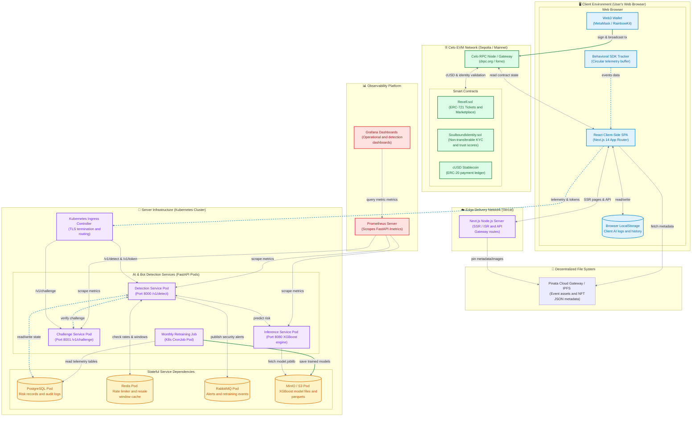

# 🚀 Rexell - Deployment Diagram

This diagram visualizes the system's runtime components, highlighting client environments, edge servers, storage layers, and containerized microservices alongside the Celo EVM blockchain network.

