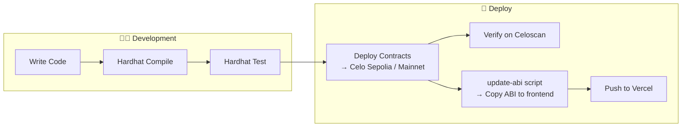

# 🚀 Rexell - Deployment Flow

This flowchart outlines the deployment workflow from writing code to launching smart contracts and Next.js frontend pages.

```mermaid
flowchart LR
    subgraph Dev["👨‍💻 Development"]
        Code["Write Code"]
        Compile["Hardhat Compile"]
        Test["Hardhat Test"]
    end

    subgraph Deploy["🚀 Deploy"]
        DeploySC["Deploy Contracts<br/>→ Celo Sepolia / Mainnet"]
        Verify["Verify on Celoscan"]
        UpdateABI["update-abi script<br/>→ Copy ABI to frontend"]
        DeployFE["Push to Vercel"]
    end

    Code --> Compile --> Test
    Test --> DeploySC --> Verify
    DeploySC --> UpdateABI --> DeployFE
```
