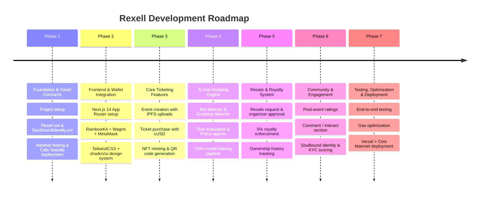

# 📋 Rexell - Development Roadmap Timeline

This timeline describes the 7 development phases of the Rexell platform, highlighting foundation work, ticketing features, anti-scalping AI models, and community interfaces.

