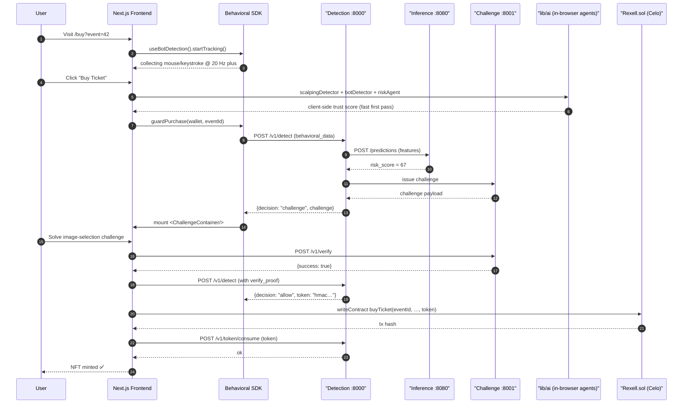

# 🔁 Rexell - End-to-End AI Decision Flow

This sequence diagram traces a single ticket purchase attempt through both client-side and server-side bot-detection systems, ending with contract validation on the Celo network.

