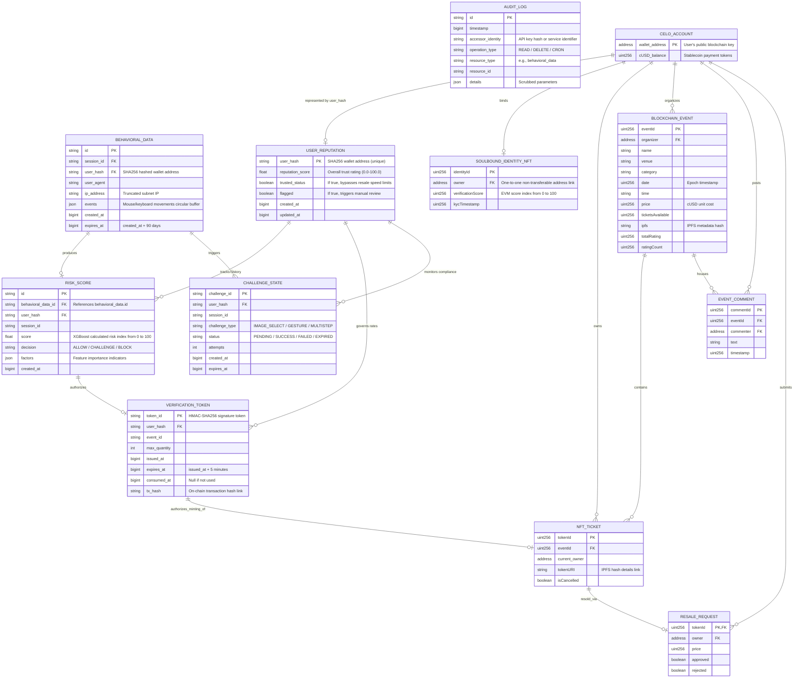

# 🗃️ Rexell - ER Diagram

This diagram maps the schema layouts for both the PostgreSQL database tables (used by server-side bot-detection microservices) and the decentralized Celo blockchain smart contract states.

