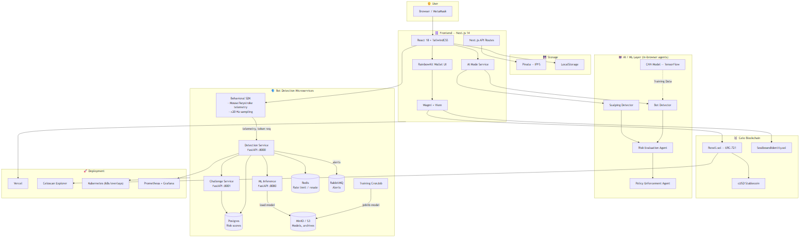
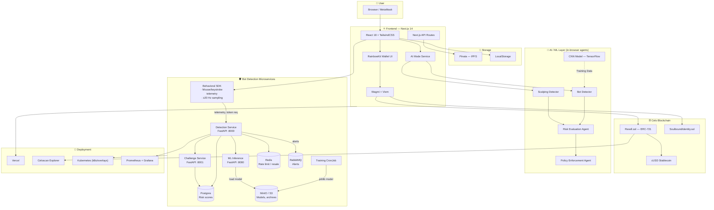

# 🌐 Rexell - High-Level Architecture

This diagram provides a high-level overview of the user browser, the frontend web application layer, the decentralized Celo smart contracts, client-side browser storage, and server-side bot-detection microservices.

