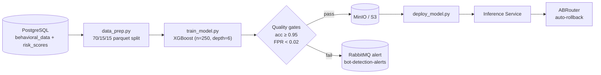

# 🤖 Rexell - ML Lifecycle

This flowchart describes the monthly offline training pipeline for the XGBoost bot-detection model, starting from raw PostgreSQL tables to real-time A/B candidate deployments.

