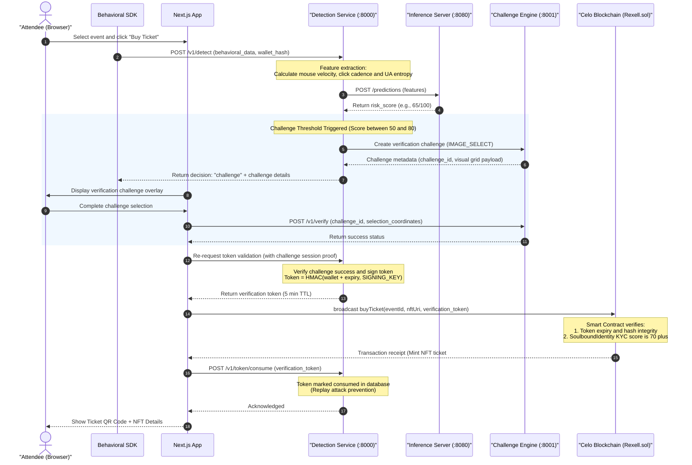

# 🔄 Rexell - Sequence Diagram

This sequence diagram traces the operations that run across client, backend service, and smart contract layers during a secure NFT ticket purchase attempt.

```mermaid
sequenceDiagram
    autonumber
    actor User as "Attendee (Browser)"
    participant SDK as Behavioral SDK
    participant FE as Next.js App
    participant DET as "Detection Service (:8000)"
    participant INF as "Inference Server (:8080)"
    participant CHA as "Challenge Engine (:8001)"
    participant CELO as "Celo Blockchain (Rexell.sol)"

    User->>FE: Select event and click "Buy Ticket"
    SDK->>DET: POST /v1/detect (behavioral_data, wallet_hash)
    Note over DET: Feature extraction:<br/>Calculate mouse velocity, click cadence and UA entropy
    DET->>INF: POST /predictions (features)
    INF-->>DET: Return risk_score (e.g., 65/100)
    
    rect rgb(240, 248, 255)
        Note over DET: Challenge Threshold Triggered (Score between 50 and 80)
        DET->>CHA: Create verification challenge (IMAGE_SELECT)
        CHA-->>DET: Challenge metadata (challenge_id, visual grid payload)
        DET-->>SDK: Return decision: "challenge" + challenge details
        FE->>User: Display verification challenge overlay
        User->>FE: Complete challenge selection
        FE->>CHA: POST /v1/verify (challenge_id, selection_coordinates)
        CHA-->>FE: Return success status
    end

    FE->>DET: Re-request token validation (with challenge session proof)
    Note over DET: Verify challenge success and sign token<br/>Token = HMAC(wallet + expiry, SIGNING_KEY)
    DET-->>FE: Return verification token (5 min TTL)
    
    FE->>CELO: broadcast buyTicket(eventId, nftUri, verification_token)
    Note over CELO: Smart Contract verifies:<br/>1. Token expiry and hash integrity<br/>2. SoulboundIdentity KYC score is 70 plus
    CELO-->>FE: Transaction receipt (Mint NFT ticket #102)
    
    FE->>DET: POST /v1/token/consume (verification_token)
    Note over DET: Token marked consumed in database<br/>(Replay attack prevention)
    DET-->>FE: Acknowledged
    FE-->>User: Show Ticket QR Code + NFT Details
```
