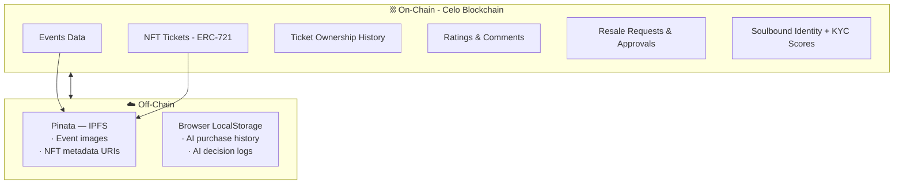

# 💾 Rexell - Storage & Data Layer

This diagram maps the storage boundaries between on-chain blockchain storage and off-chain storage assets.

```mermaid
flowchart TB
    subgraph OnChain["⛓️ On-Chain - Celo Blockchain"]
        Events["Events Data"]
        Tickets["NFT Tickets - ERC-721"]
        Ownership["Ticket Ownership History"]
        Ratings["Ratings & Comments"]
        Resale["Resale Requests & Approvals"]
        Identity["Soulbound Identity + KYC Scores"]
    end

    subgraph OffChain["☁️ Off-Chain"]
        IPFS["Pinata — IPFS<br/>· Event images<br/>· NFT metadata URIs"]
        LS["Browser LocalStorage<br/>· AI purchase history<br/>· AI decision logs"]
    end

    Events --> IPFS
    Tickets --> IPFS
    OnChain <--> OffChain
```
