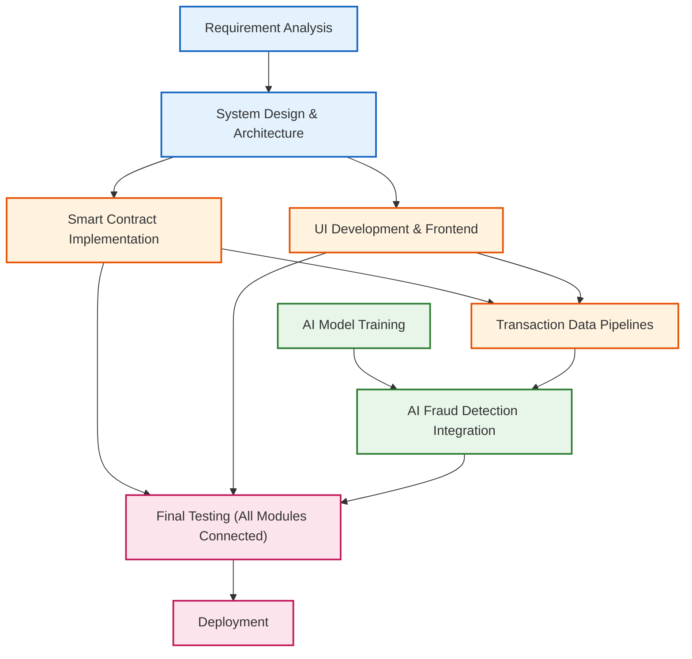
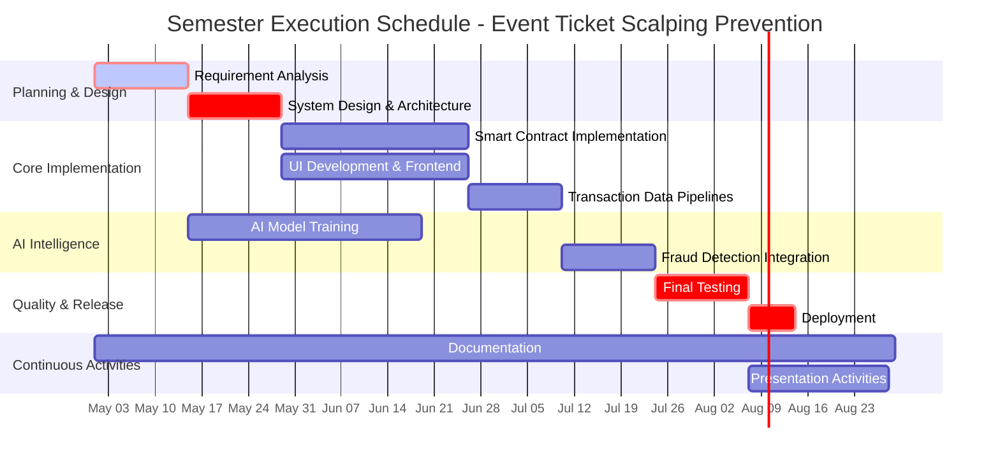

# Chapter 7. Project Schedule

**Project:** Event Ticket Scalping Prevention Using Blockchain and AI

## 7.2 Task Network
The task network for the project defines the dependency chain among major activities such as requirement analysis, smart contract design, frontend integration, AI model training, testing, and deployment. 

- **Requirement Analysis** precedes system design.
- **Smart Contract Implementation** and **UI Development** progress in parallel after architecture finalization.
- **AI-based Fraud Detection** is integrated after transaction data pipelines are prepared.
- **Final Testing** is scheduled only after all modules are connected and verified.

## 7.3 Time-line Charts
The project time-line chart summarizes the execution schedule of each development phase across the semester. These charts help the team track planned milestones, monitor progress, and ensure timely completion of analysis, design, implementation, testing, documentation, and presentation activities.

