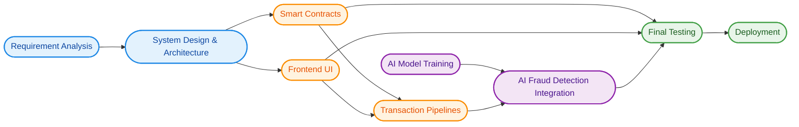
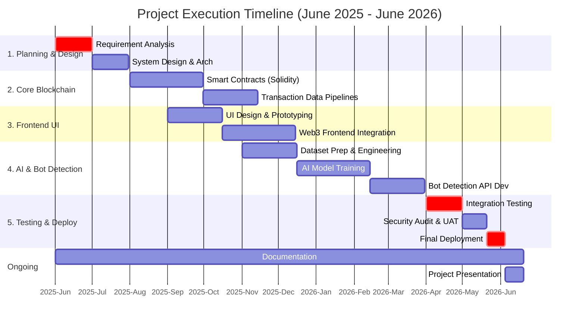

# Chapter 7. Project Schedule

**Project:** Event Ticket Scalping Prevention Using Blockchain and AI

---

## 7.2 Task Network

The task network defines the dependency chain among major activities. By establishing a clear flow from analysis to deployment, the team can ensure modules are integrated in the correct sequence.

### Dependency Rules:
1. **Analysis First:** Requirement analysis precedes system design.
2. **Parallel Development:** Smart contracts and UI develop simultaneously after architecture is finalized.
3. **Data Dependency:** AI fraud detection is only integrated *after* transaction data pipelines are ready.
4. **All Systems Go:** Final testing begins only when all modules (Contracts, UI, AI) are connected.

---

## 7.3 Timeline Charts

The execution schedule helps the team track milestones and ensure timely completion across the project lifecycle (June 2025 to June 2026), reflecting all core workspace components including Blockchain, Frontend, AI, and Bot Detection APIs.

